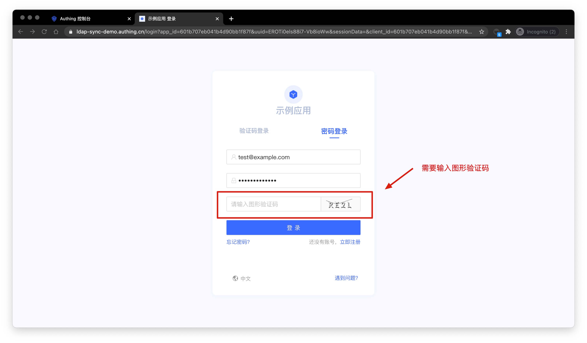
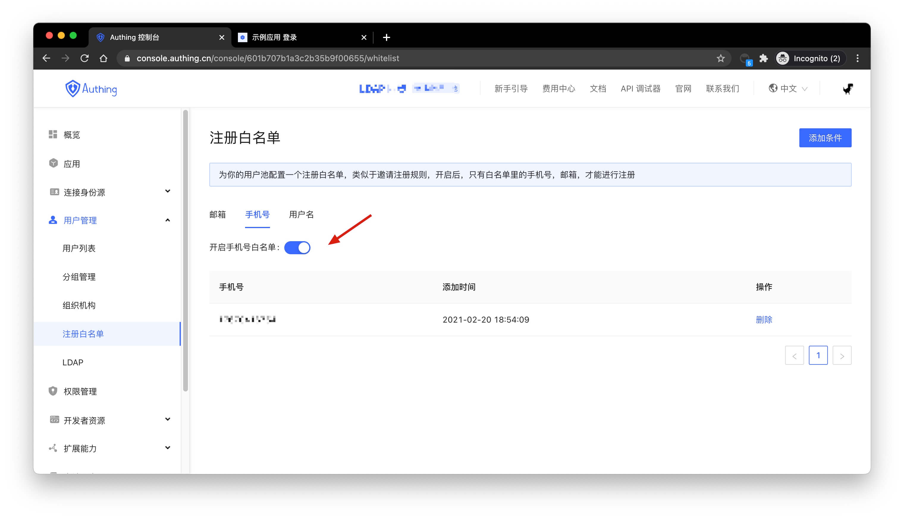
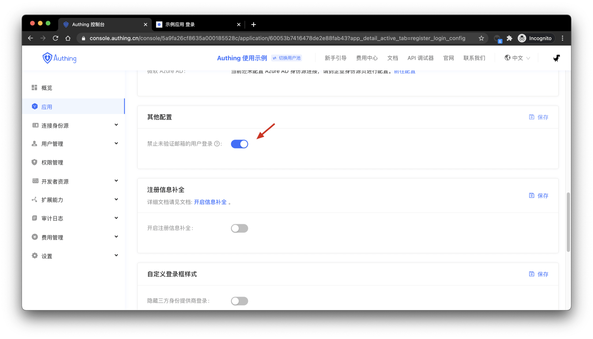
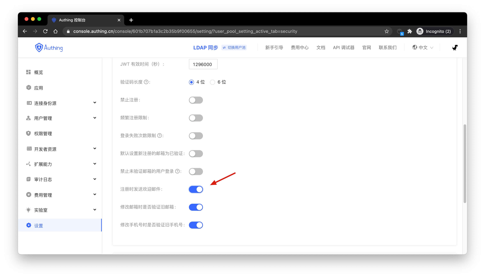

---
meta:
  - name: description
    content: User directory Setting
---

# User Uirectory Setting

<LastUpdated/>

This article introduces some settings related to the user directory, such as registration disabled, restriction on frequent registration, restriction on the number of failed login attempts, registration whitelist, and so on.

## Registration Disabled

You can turn on the **registration disabled** in the console: **setting** -> security information:

After turning on "registration disabled", common users will not be able to register through the login form or API, and only the administrator can manually create an account.

## Restriction on Frequent Registration

You can turn on the **restriction on frequent registration** in the console: **setting** -> **security information**, and limit the number of registrations for the **same IP** within defined number of seconds

## Restriction on the Number of Failed Login Attempts

You can turn on the **restriction on the number of failed login attempts** in the console: **setting** -> **security information**, and limit the number of failed registrations for the **same account** within defined number of seconds

If the number of failed login times is exceeded within the specified time, the user needs to enter the CAPTCHA code to log in again:

## Configure the Registration Whitelist

You can open the white list of email, mobile phone number, and user name in the console: **user management** -> **registration whitelist**. After opening, only the mobile phone number, email address, and user name in the whitelist can be registered (It will not affect administrators manually create accounts).

## Prohibit Login for Users with Unverified Email

By default, accounts with unverified email can log in, and you can also modify the configuration in the **application details**:

## Send Welcome Emails when Registering

When you close **send welcome emails when registering** on the console, there will be no welcome emails.

> You can define the welcome email template on your own.

