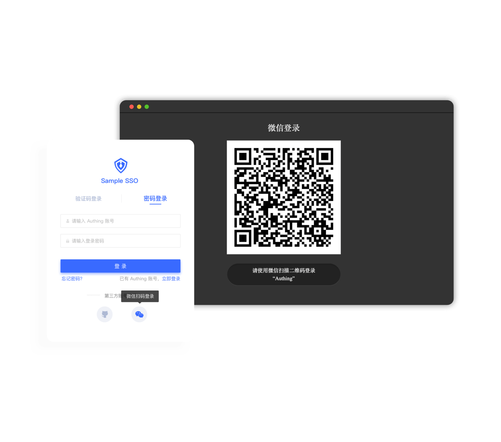
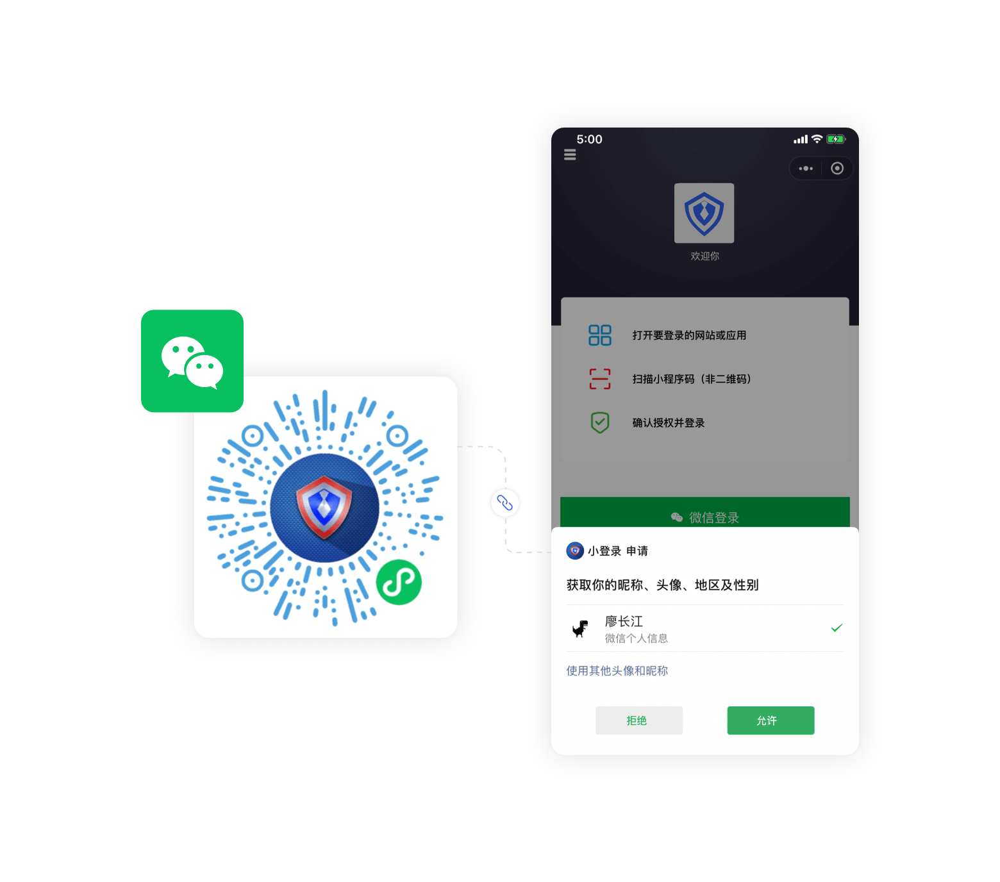
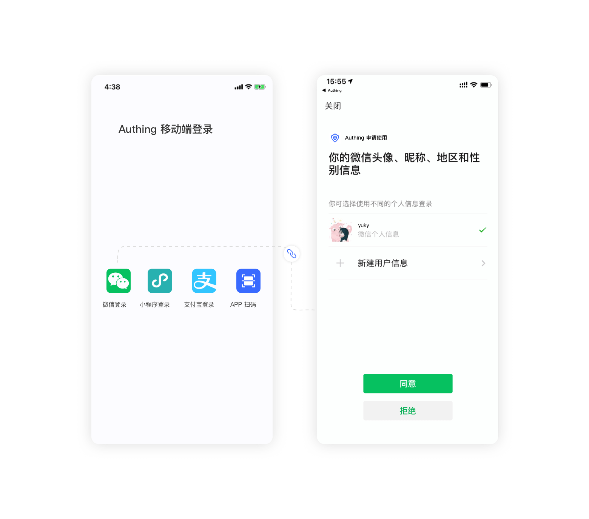

# Call the WeChat Ecological Account System

<LastUpdated/>

How to use the open capabilities of WeChat multi-scene based on WeChat ecology, how to use the open capabilities of WeChat multi-scenes, how to deal with complex [OpenID、UnionID](https://developers.weixin.qq.com/doc/offiaccount/en/User_Management/Get_users_basic_information_UnionID.html)Will be the problem you need to consider. WeChat ecology is very large, there are several ways to log in to the scene (such as PC website scan code, public account ", authorization, etc.), it needs to call completely different interfaces, for developers, undoubtedly increase And development costs.

{{$localeConfig.brandName}} Aiming at the complex scene of WeChat ecology, the front end provides a simple, unified SDK for developers, and automatically handles the same identity identification, account merge, etc. based on OpenID, UNIONID, and mobile phone numbers on the backend. Developers only need to call the front end SDK without having to worry about the complex identity logic,{{$localeConfig.brandName}} Eventually return [standardized user information](/en/guides/user/user-profile.md).

## PC Sign in with WeChat scan code

WeChat PC scan code login allows users to log in to third-party applications or websites using WeChat identity. In {{$localeConfig.brandName}} after the WeChat scan code is logged in, Adoption {{$localeConfig.brandName}} Quickly get the WeChat user basic open information and help users implement the base open function.[check the details](./wechat-pc/README.md).

- Application scenario: PC website;
- Overview: Jump to the WeChat QR code page in the PC website application, then use the WeChat scan code to log in;
- View [WeChat official document](https://developers.weixin.qq.com/doc/oplatform/en/Website_App/WeChat_Login/Wechat_Login.html).

## PC Website uses a small program scan code login

This is {{$localeConfig.brandName}} A pioneering design, {{$localeConfig.brandName}} Open the scan of small login QR code to get the official real-name user information of WeChat official,T he user can authorize the real number to complete the registration or login, and create an account system based on the mobile phone number.

- Application Scene: PC website;
- Overview: Show the applet QR code in the PC website application, then use the WeChat scan code to log in;

## WeChat internal web page uses WeChat Authorized Login

{{$localeConfig.brandName}} The developer provides the developer with a method of obtaining user information in the WeChat web page and completing the login. If the user accesses a third-party web page in the WeChat client, the public account can obtain the basic information of the user through the WeChat webpage authorization mechanism, and then implement business logic.

- Application Scene: WeChat web page, public number;
- Overview: The WeChat Authorization box is popped up within the webpage within the WeChat app. After the user authorizes the current user information;
- View [WeChat official document](https://developers.weixin.qq.com/doc/offiaccount/en/OA_Web_Apps/Wechat_webpage_authorization.html)

## WeChat login in the mini program

{{$localeConfig.brandName}} The developer provides the developer with a method of obtaining user information in a small program and completing the login. By {{$localeConfig.brandName}} The SDK can easily obtain the user identity identifier provided by WeChat, quickly establish an account system based on the mobile phone number.

- Application scenario: mini program;
- Overview: Used in WeChat applets, pop-up WeChat Authorization boxes, and you can get information on the current user after authorization;
- View [WeChat official document](https://developers.weixin.qq.com/miniprogram/en/dev/framework/open-ability/login.html)

## Mobile App Use WeChat Login

{{$localeConfig.brandName}} Providing developers with a way to quickly jump WeChat login to obtain user information in the mobile terminal (iOS or Android) application, Simple call {{$localeConfig.brandName}} Mobile SDK can complete WeChat account access.

- Application scenario: Mobile APP；
- Overview: Pull the WeChat APP in the mobile application to log in;
- View [WeChat official document](https://developers.weixin.qq.com/doc/oplatform/en/Mobile_App/WeChat_Login/Development_Guide.html)

## Mobile App Use Mini Program Login

Launching the WeChat Mini Program on the mobile terminal is a key way to establish a mobile phone number-centric user system. {{$localeConfig.brandName}} greatly reduces the development complexity for developers through the SDK, and one line of code can obtain users through the mobile terminal in the applet. Authorized mobile phone number, establish an account system based on mobile phone number.

- Application scenario: Mobile APP；
- Overview: Launch the WeChat Mini Program in the mobile app to log in.
- View [WeChat official document](https://developers.weixin.qq.com/doc/oplatform/en/Mobile_App/WeChat_Login/Development_Guide.html)

## Summary comparison

|                         name                          | scenes to be used               | Ability to get the mobile phone number directly | Whether it is {{$localeConfig.brandName}} created |
| :---------------------------------------------------: | ------------------------------- | ----------------------------------------------- | ------------------------------------------------- |
|           PC Sign in with WeChat scan code            | PC website                      | yes                                             | no                                                |
|    PC Website uses a mini program scan code login     | PC website                      | yes                                             | no                                                |
| WeChat internal web page uses WeChat Authorized Login | WeChat web page, public account | no                                              | no                                                |
|           WeChat login in the mini program            | mini program                    | yes                                             | no                                                |
|              Mobile app Use WeChat Login              | mobile APP                      | yes                                             | no                                                |
|        Mobile App Use a small program to login        | mobile APP                      | yes                                             | yes                                               |
