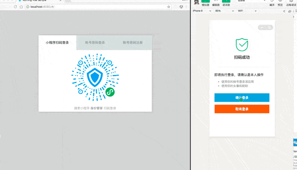

## PC website using WeChat scan code to log in

<LastUpdated/>

This is a pioneering design of Authing. After opening the scan small login QR code in Authing, the official real-name user information of WeChat can be obtained. The user can complete the registration or login with the real number with one-click authorization, and establish a mobile phone for developers. Number-based account system.

- Application scenario: PC website;
- Overview: Display the QR code of the applet in the PC website application, and then use WeChat to scan the code to log in to the application;
- Advantages: The mobile phone number and real-name information of WeChat users can be obtained;

You can [click here to experience the mini program scan code login](https://authing.cn/developer/).

## Sample Code

You can get sample code here: [https://github.com/authing/wechat-eco-solution](https://github.com/authing/wechat-eco-solution)。

## Step 1: Create a mini program on the WeChat public platform (optional)

By default, the Mini Program scan code login will use the default Mini Program provided by Authing. If you need stronger brand customization capabilities, or want to connect the WeChat account of the user who logs in through the Mini Program scan code with your other WeChat public platforms , you need to apply for your own applet. If you fall into one of these two scenarios:

Please go to [WeChat public platform](https://mp.weixin.qq.com/wxopen/waregister?action=step1) Guide to create a WeChat applet, you need to record the **App ID** and **App Secret** of the application , which will be used later.

At the same time, you need to contact us to obtain the source code of the small login. For details, please consult [Authing Contact](csm@authing.cn).

## Configure the WeChat applet scan code application in the Authing console

On the social login configuration page of the console, find **the WeChat applet to scan the code to log in**, and fill in the following configuration:

- Logo: The uploaded logo will be used as the logo in the center of the QR code of the applet;
- Callback link after login: This link usually fills in your business address. If this link is configured, after the user completes the login, the browser will jump to this page with the user information;
- AppID: AppID of the applet, filled in by the user who selects the privatized applet;
- AppSecret: AppSecret of the applet, filled in by users who choose to privatize the applet.

## Step 3: Start developing access

The Mini Program scan code login supports three access methods: using the JavaScript SDK, using the embedded login component, and using the hosted login page. Each access method has its own advantages and disadvantages. You can choose the appropriate method according to your business needs.

Here's a comparison of the pros and cons of each approach:

| Access method                | Advantage                                                                                                                                               | disadvantage                                                                                                                                                                                                                                                                       |
| ---------------------------- | ------------------------------------------------------------------------------------------------------------------------------------------------------- | ---------------------------------------------------------------------------------------------------------------------------------------------------------------------------------------------------------------------------------------------------------------------------------- |
| JavaScript SDK               | Access is simple and only requires a few lines of code. The most customizable.                                                                          |                                                                                                                                                                                                                                                                                    |
| the embedded login component | Access is simple and only requires a few lines of code. This component can be integrated into your application. Relatively high degree of customization |                                                                                                                                                                                                                                                                                    |
| hosted login page            | Simple operation and maintenance, Authing is responsible for operation and maintenance. Each user pool has an independent second-level domain name.     | If you need to embed into your application, you need to use the pop-up mode to log in, that is: after clicking the login button, a window will pop up with the content of the login page hosted by Authing, or the browser will be redirected to the login page hosted by Authing. |
|                              |

<StackSelector snippet="social-login" selectLabel="Type" :order="['sdk', 'embeded-component', 'hosted-page']"/>

## Next

!!!include(en/common/what-to-do-when-you-get-userinfo.md)!!!
