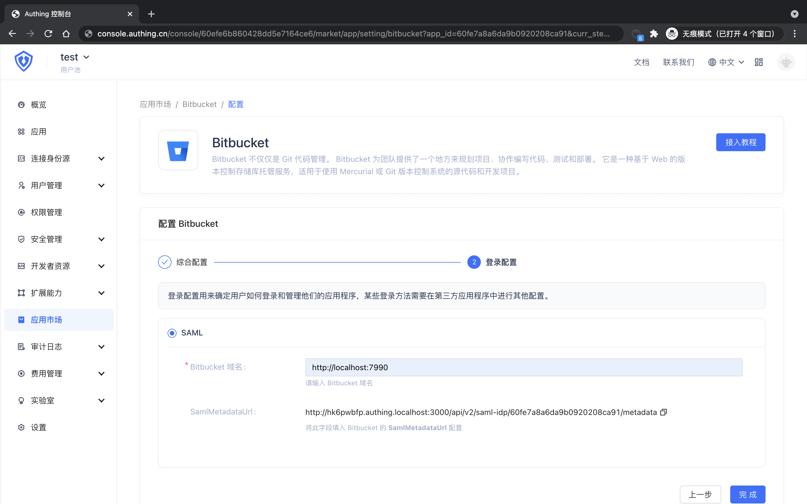

<IntegrationDetailCard :title="`Create an app in ${$localeConfig.brandName}`">

Enter[**console**](https://console.authing.cn) > **Application market**, find **Bitbucket** , Click to enter the details, then click Get Apply.

Enter the app name and click Next.

Enter your **Bitbucket domain**, general format is **http://&lt;SERVER_HOSTNAME&gt;:&lt;PORT&gt;**.

Click Finish, click "Allow all user access" on the Access Authorization Page.

</IntegrationDetailCard>
