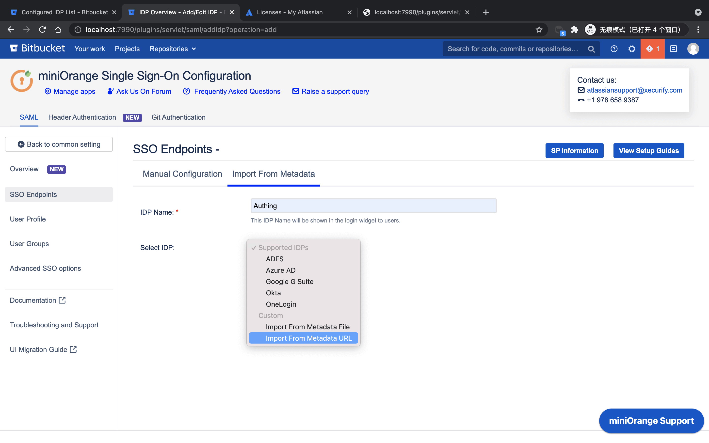
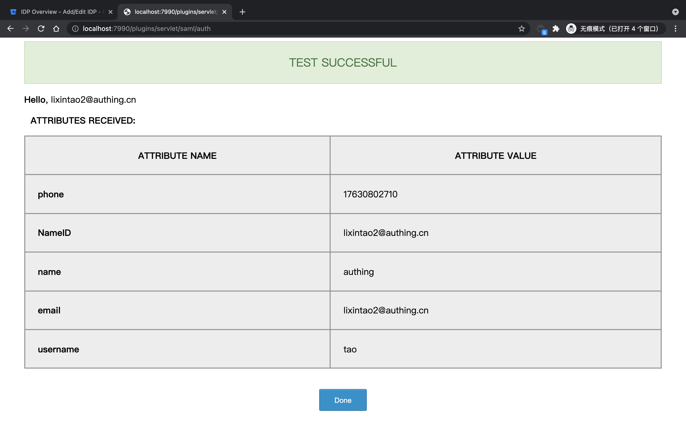

<IntegrationDetailCard title="Configure Bitbucket SSO login">

Configure BitBucket SAML SSO to log in, you need to have administrator privileges. Move to the top Navigation `set`, click **setting**.

Found in the sidebar **Find new apps**。

search `miniorange`, find **mO Bitbucket SAML SSO/Bitbucket SSO/Bitbucket Single Sign On**, click **Free trial**。

Click Plugin Management **Manage**。

Click **Configure**。

Choose **Manual Setup**。

Choose **Import From Metadata**, Fill in your **IDP Name**, choose **Import From Metadata URL**, this URL is from {{$localeConfig.brandName}}, you can **replicate** this value, **complete** fill in.

{{$localeConfig.brandName}} The corresponding application **SamlMetadataUrl** configuration option is shown.

Click **Import**, Complete metadata information acquisition.

Click on **Save**, then click **Test Configuration**.

Enter the {{$localeConfig.brandName}} login page, enter the corresponding **account password** complete the login.

Test success.

</IntegrationDetailCard>
