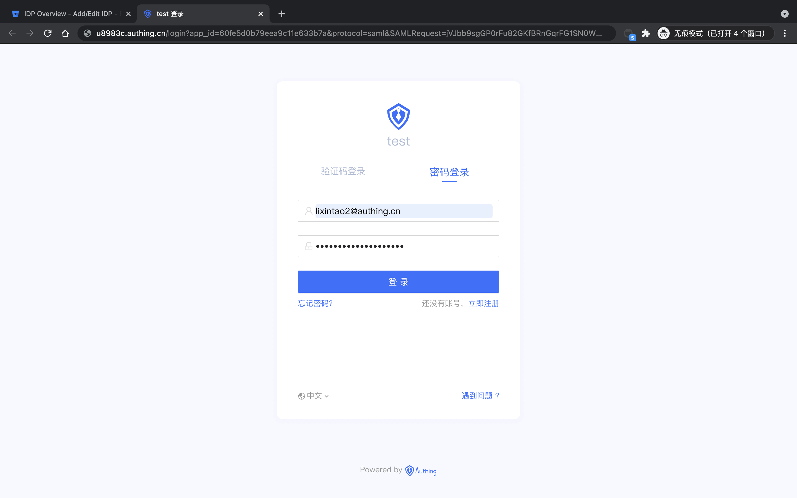

<IntegrationDetailCard title="Experience login">

Exit the current user, enter the login interface, select **Use IDP Login**.

Enter the {{$localeConfig.brandName}} login page.

You can successfully log in to **Bitbucket** before entering the login interface.

Click on the upper right corner **avatar**, enter **View profiles**.

View **User information**.

</IntegrationDetailCard>
