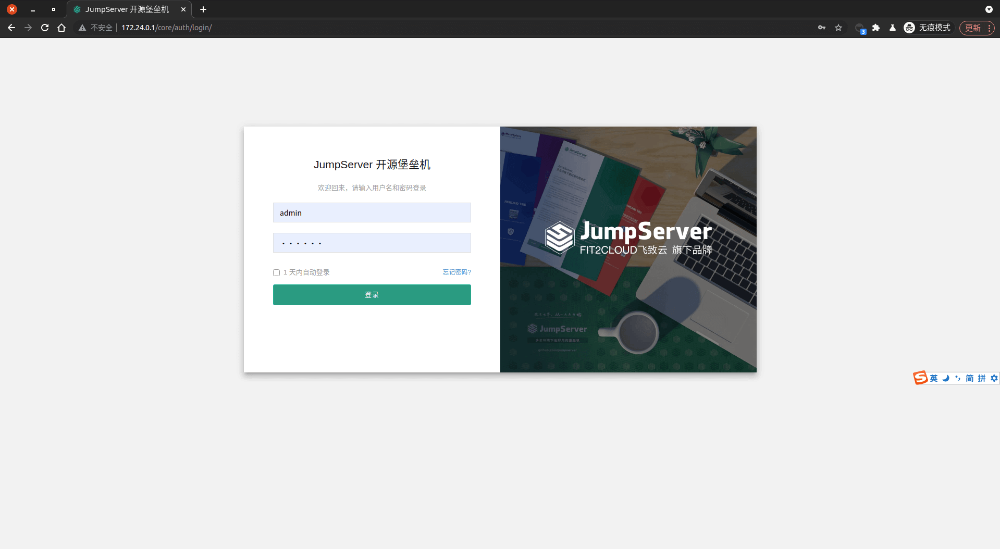
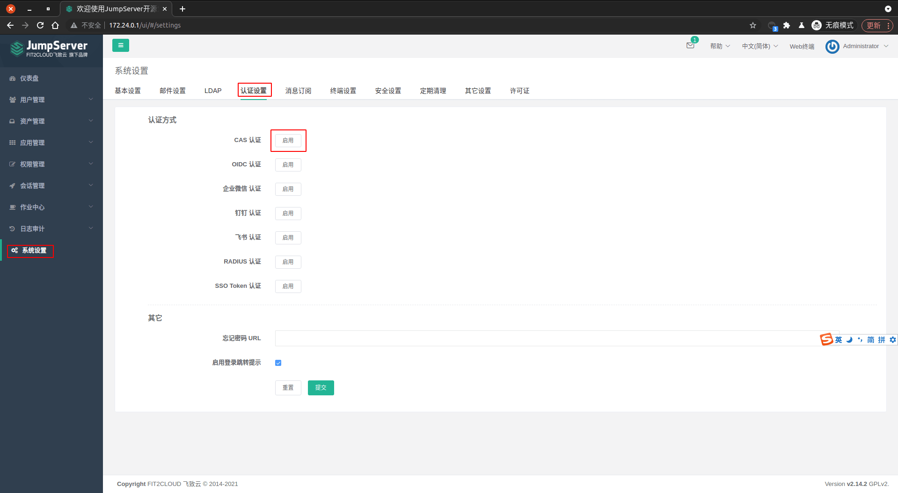
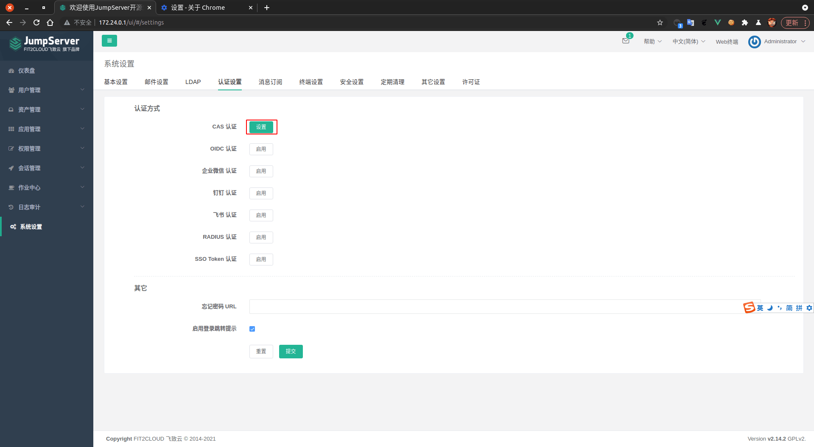
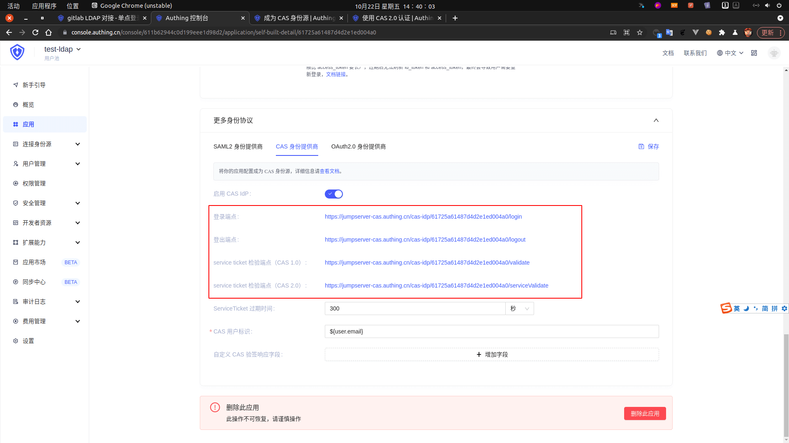
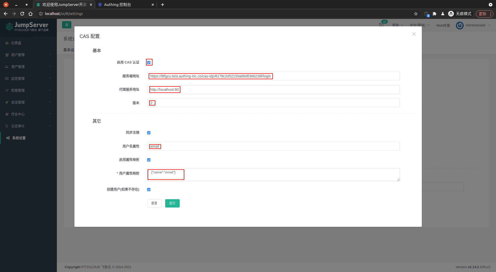
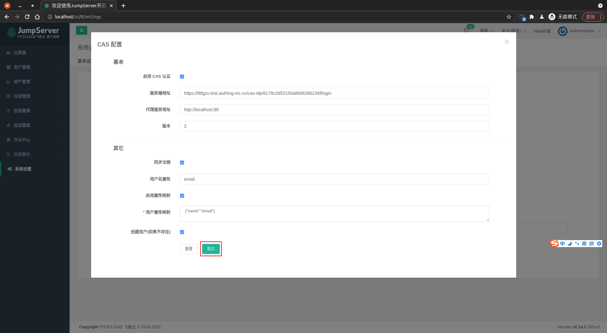

<IntegrationDetailCard :title="`Configuring CAS in JumpServer`">

You can choose a `Custom Apply` or `Application Market` to complete the application creation. Here use `Application Market` as an explanation. `Custom Application` click [here](/guides/federation/cas.md) to become `CAS Identity`.

Configure JumpServer CAS login, you need to have administrator privileges. Log in to JumpServer as `administrator`.

Enter **JumpServer**, click on the left navigation bar **system settings**, click **authentication settings**. Click **Enable** CAS certification.

click **setting**。

`Enable` **CAS certification**,`Service address` Fill in **CAS login endpoint**, the corresponding information can be found in the **CAS application**. `Server Agent Address` Fill in your own server address, [related documentation](https://jumpserver.readthedocs.io/en/master/admin-guide/authentication/cas/), `version information` fill in **2**, you can choose **1** or **2**. Here is a `CAS 2` presentation. `User Name` here you fill in **email**, `User Properties Mapping` Fill in **{"Name": "email"}**. Other configuration items are filled in, as shown in the figure.

Click **Submit**. Complete changes.

</IntegrationDetailCard>
