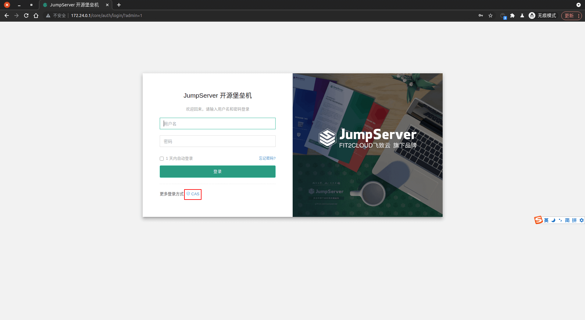
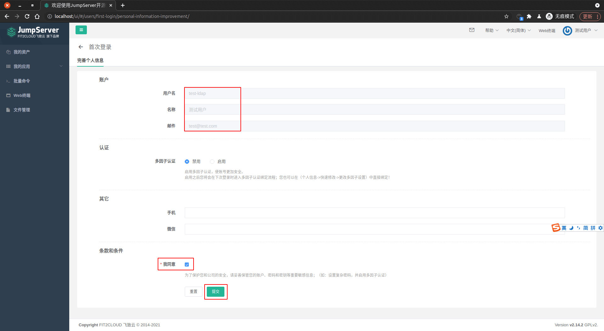
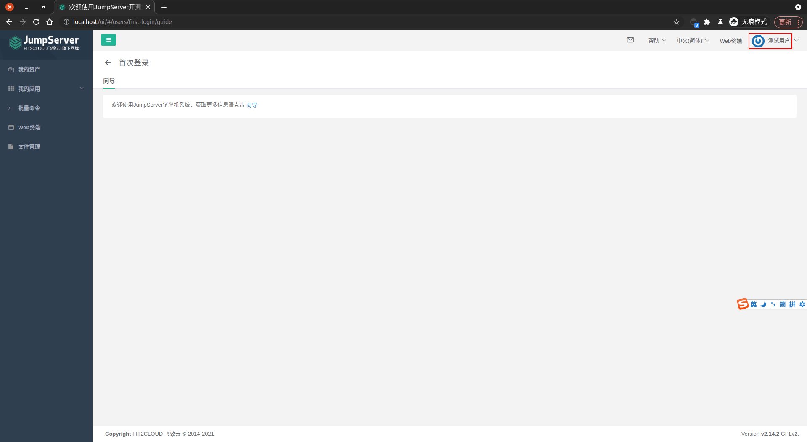

<IntegrationDetailCard :title="`Use ${$localeConfig.brandName} login JumpServer`">

Enter **JumpServer** log in page, `click` Choose more login **CAS**。

::: warning
At this point, if you jump to the {{$localeConfig.brandName}} login page, you encountered the `{"code":400,"message":"The current application is not allowed to call back to ttp://localhost:80/core/auth/cas/login/?next=%2F please in the console > application > URL settings, configure the login callback URL"}`, you can investigate the corresponding **callback address** and the callback address in **CAS application** Whether it is consistent, if inconsistent, you can copy the `service` value in the jump URL to the callback address of the **CAS application** (such as `https://jumpserver-cas.authing.cn/cas-idp/61725a61487d4d2e1ed004a0/login?service=http://localhost:80/core/auth/cas/login/?next=%2F` in `http://localhost:80/core/auth/cas/login/?next=%2F`), You can complete the`login page normally jump`.
:::

Enter the corresponding **test business information**, **Click** login.

Log in **Success**, you can see the relevant prompt information. Click **I agree**, complete the **submit**.

The home page will be entered at this time.

At this point, it has been completed `Use {{$localeConfig.brandName}} CAS service to log in to JumpServer`. : tada:: 100:: tada:: 100:: tada:: 100:

</IntegrationDetailCard>
