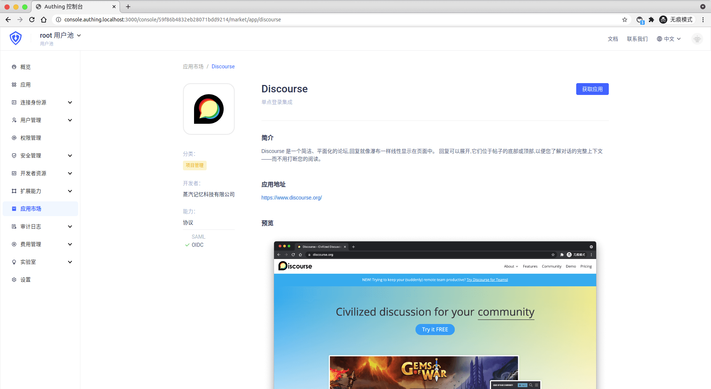
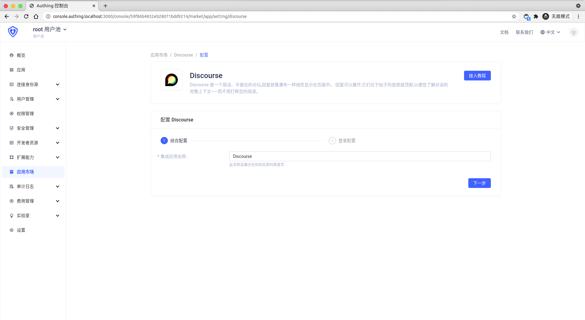
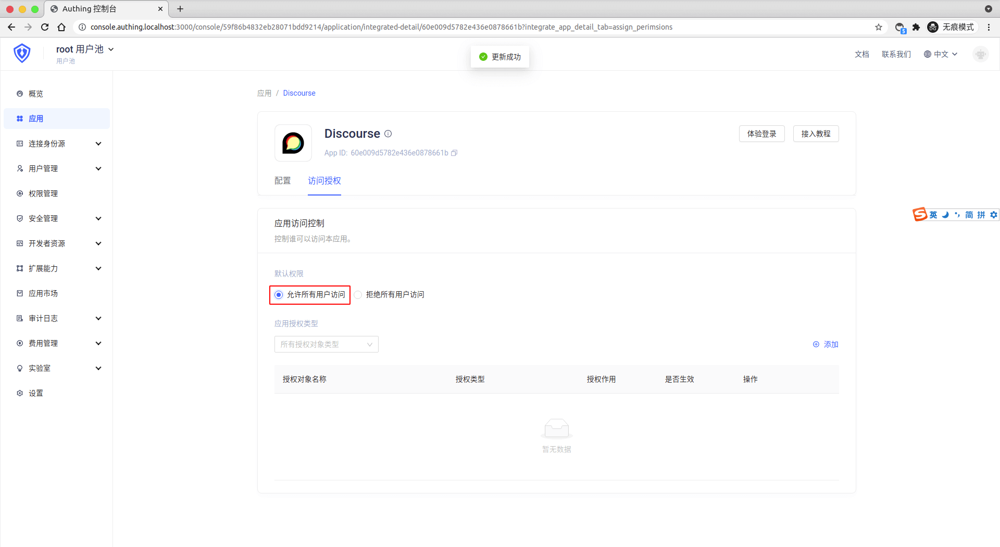

<IntegrationDetailCard :title="`Create an app in ${$localeConfig.brandName}`">

Enter[**console**](https://console.authing.cn) > **Application market**, find **Discourse** , Click to enter the details, then click Get Apply.

Enter the app name and click Next.

Enter your **Discourse redirect URL** ，**Discourse redirect URL**, general format is **https://\<domain\>/auth/oauth2_basic/callback**.

Click Finish, click "Allow all user access" on the Access Authorization Page.

</IntegrationDetailCard>
