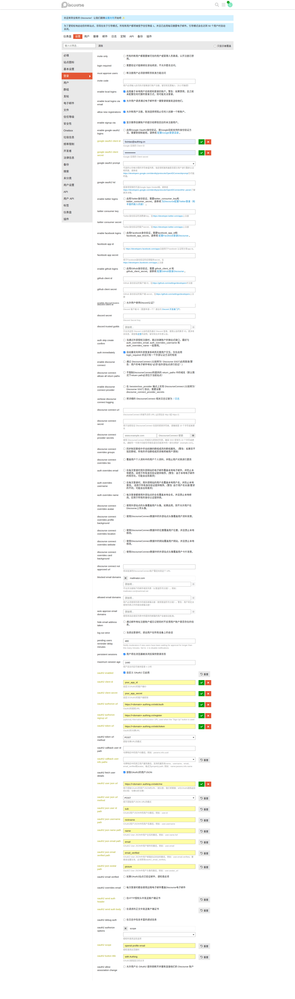

<IntegrationDetailCard title="Configure Discourse SSO Login">

Enter the login setting page of Discourse:`http://<YOUR_DISCOURSE_EXTERNAL_URL>/admin/site_settings/category/login`。

Copy the following configuration to the Discourse configuration:

1. oauth2 client id → `<App ID>`
2. oauth2 client secret → `<App Secret>`
3. oauth2 authorize url → `https://<domain>.authing.cn/oidc/auth`
4. oauth2 token url → `https://<domain>.authing.cn/oidc/token`
5. oauth2 user json url → `https://<domain>.authing.cn/oidc/me`
6. oauth2 json user id path → sub
7. oauth2 json username path → nickname
8. oauth2 json name path → name
9. oauth2 json email path → email
10. oauth2 json avatar path → picture
11. oauth2 enabled → Tick
12. oauth2 authorize options → scope
13. oauth2 scope → openid profile email
14. oauth2 button title → 'with Authing`
15. oauth2 user json url method → POST
16. oauth2 send auth header → Cancel
17. oauth2 callback user info paths → clear
18. oauth2 authorize signup url → `https://<domain>.authing.cn/register`

As shown below:

</IntegrationDetailCard>
