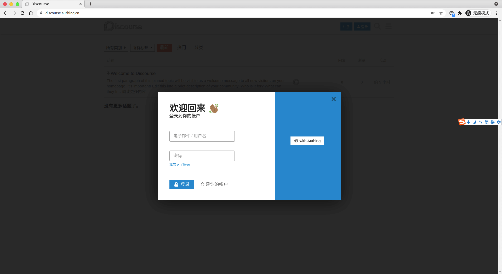
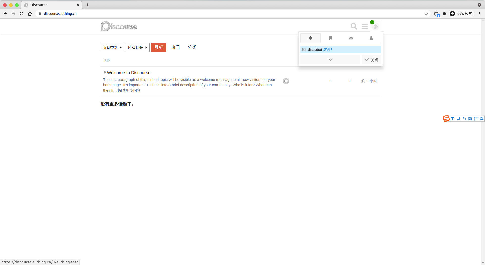

<IntegrationDetailCard title="Experience login">

On the forum homepage, click the login button:

Choose to log in by **Authing**.

Jump to the login page:

Successful login, you can successfully jump to **Discourse**.

</IntegrationDetailCard>
