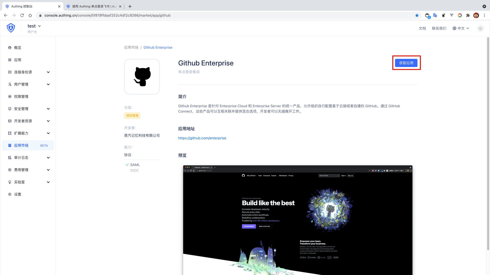
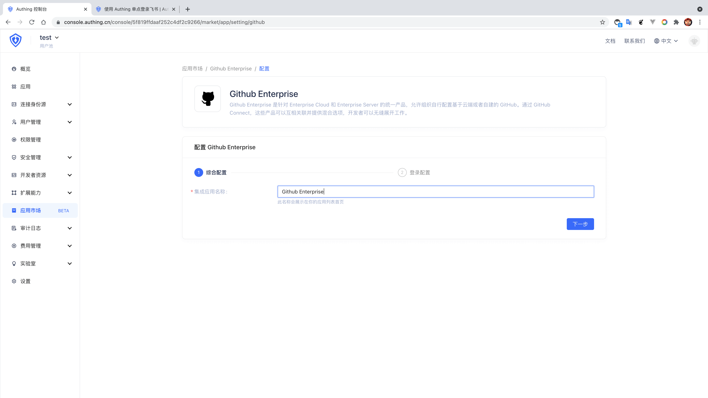
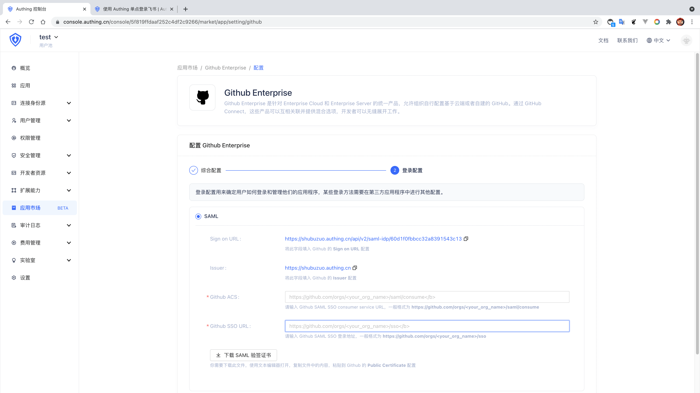
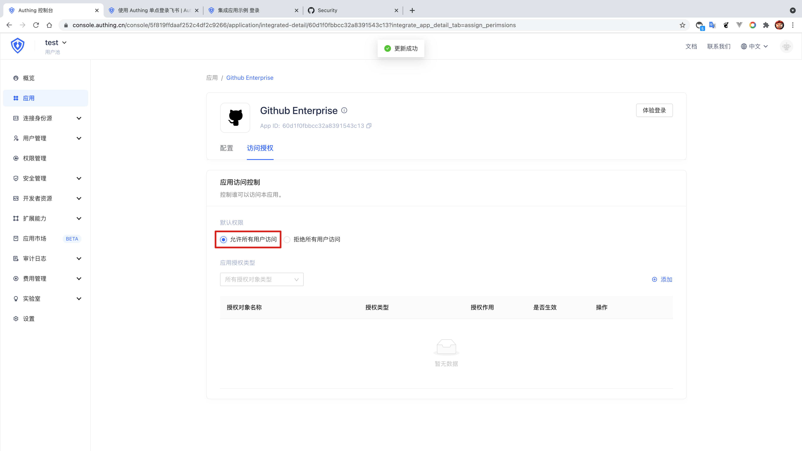
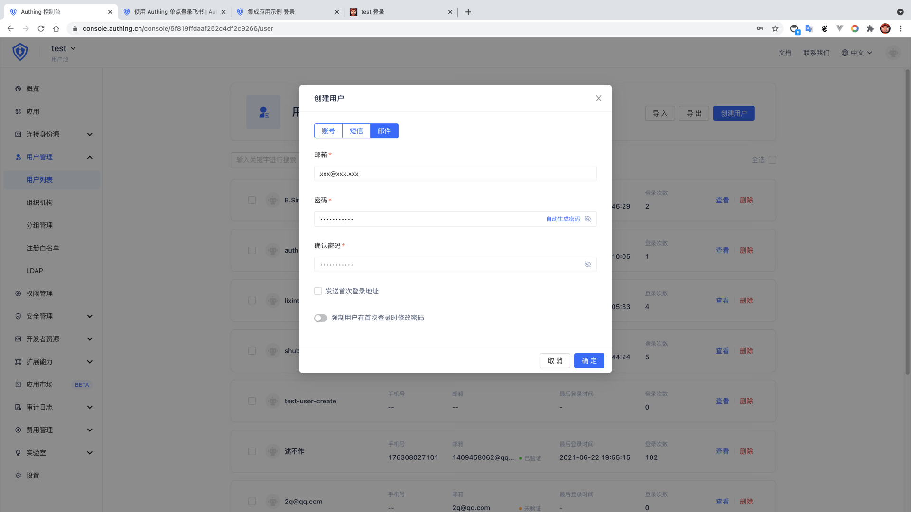

<IntegrationDetailCard :title="`Create an app in ${$localeConfig.brandName}`">

Enter[**console**](https://console.authing.cn) > **Application market**, find **GitHub Enterprise**, Click to enter the details, then click Get Apply.

Enter the app name and click Next.

Input your **GitHub ACS** and **GitHub SSO URL** , **GitHub SAML SSO consumer service URL**, the format is **https://github.com/orgs/<your_org_name>/saml/consume**，**GitHub SAML SSO Login address**, the format is **https://github.com/orgs/<your_org_name>/sso** At the same time, "Download SAML Visa".

Click Finish, click "Allow all user access" on the Access Authorization Page.

Then return to the user list, create a **mailbox already exists in the GitHub Enterprise team**.

</IntegrationDetailCard>
