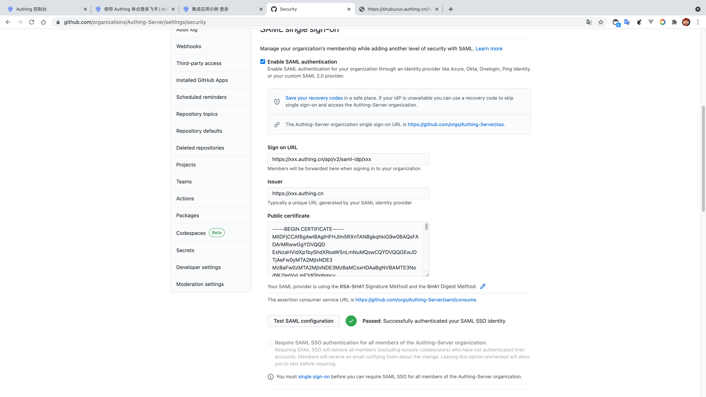

<IntegrationDetailCard title="Configure GitHub Enterprise SSO Login">

配置 GitHub Enterprise SSO 登录，你需要有管理员权限。进入 **setting**，切换组织到目标组织，找到 **Organization security** -> **SAML single sign-on**，点击 **Enable SAML authentication**，允许 **SAML 单点登录配置**。
Configure Github Enterprise SSO login, you need to have administrator privileges. Enter **setting**, switch organization to the target organization, find **Organization security** -> **SAML single-on**, click on **Enable SAML authentication**, allow **SAML single sign-on configuration**.

Fill in {{$localeConfig.brandName}} corresponding **Sign on URL**、**Issuer**; additionally, open the previous download **SAML test visa message with text editor**, copy **-----BEGIN CERTIFICATE-----** and **-----END CERTIFICATE-----** content, paste **GitHub Enterprise** and **Public Certificate** Field, click on "Test Saml Configuration".

Enter the user's account password for the user created on the login interface, click Login.

After the login is complete, call to the Github Enterprise SSO configuration page, display the verification success, then click **sSave** to save the SSO configuration.

</IntegrationDetailCard>
