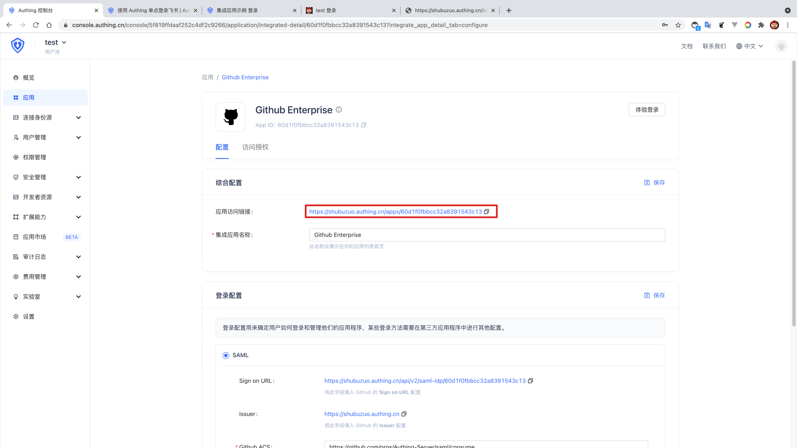
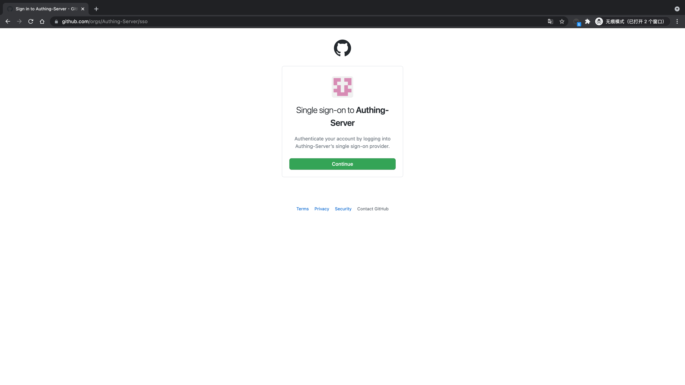
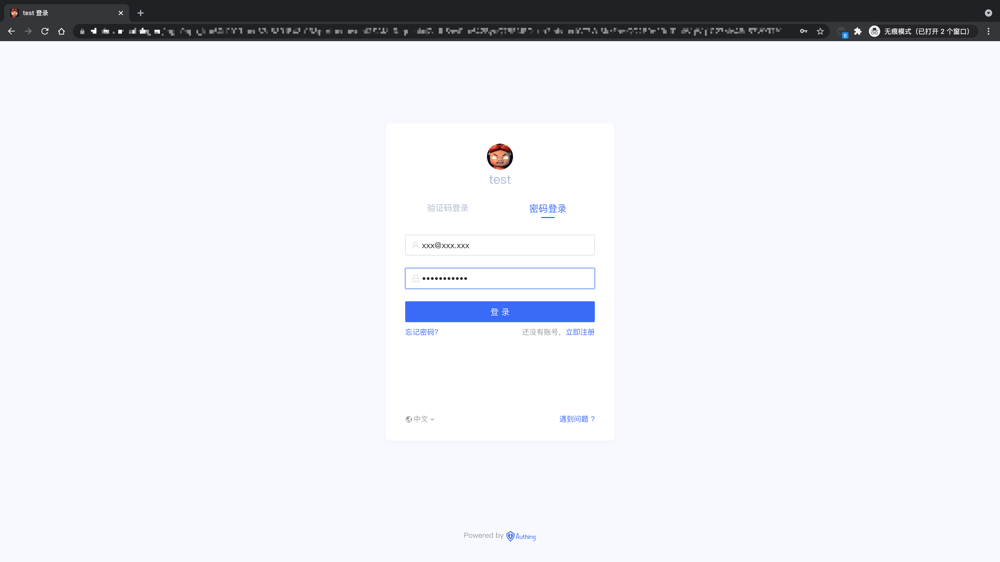
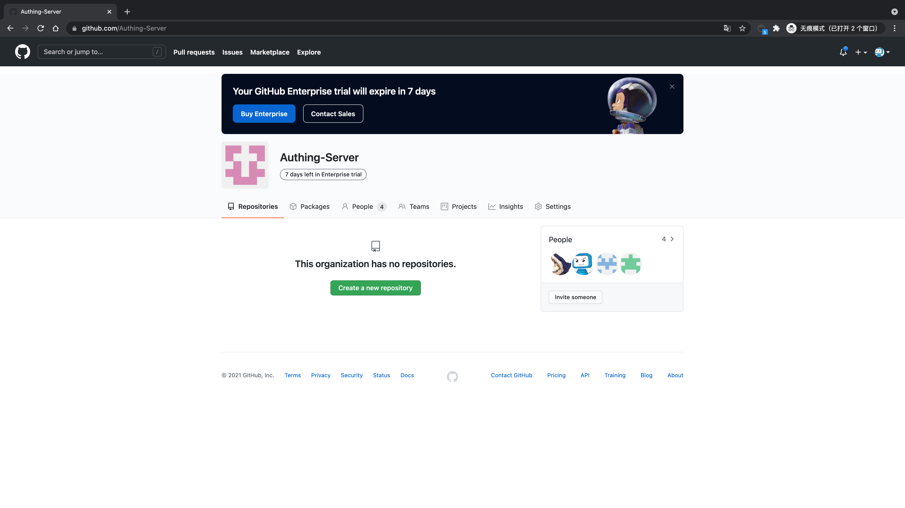

<IntegrationDetailCard title="Experience login">

Copy the application access link, open in the new browser stealth window.

Jump to the **Github Enterprise** login page, click "Continue".

Enter the **Authing** login page.

The user account password created before the login interface is entered, you can successfully log in to **GitHub Enterprise**.

Select the corresponding policy to join the **GitHub Enterprise** correspondence, becoming members (only for the first time).

</IntegrationDetailCard>
