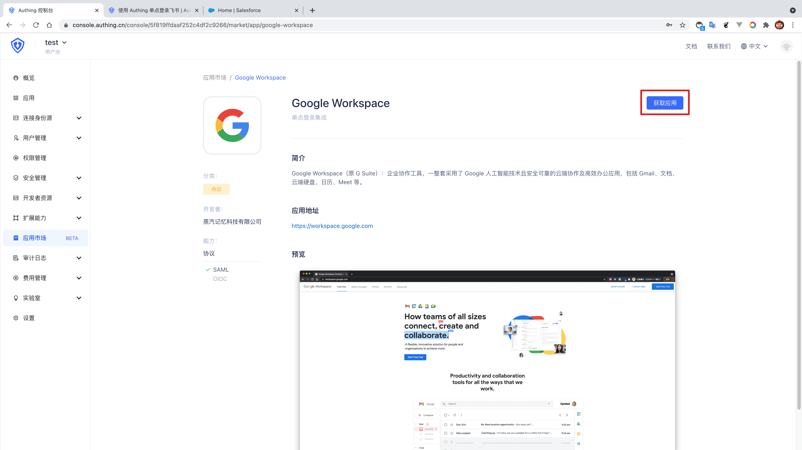
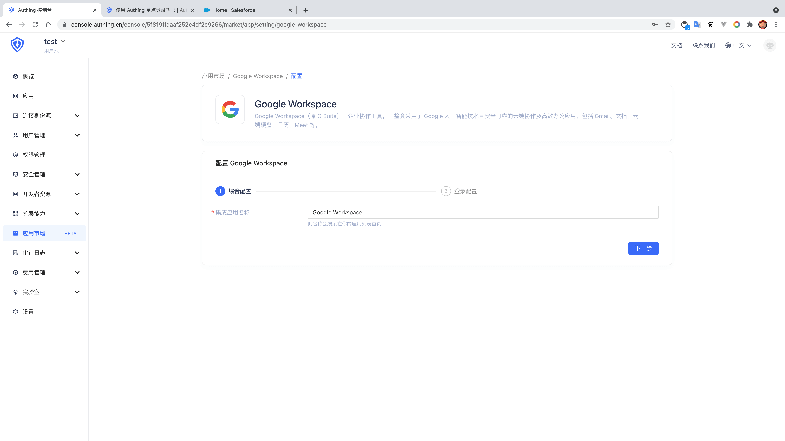
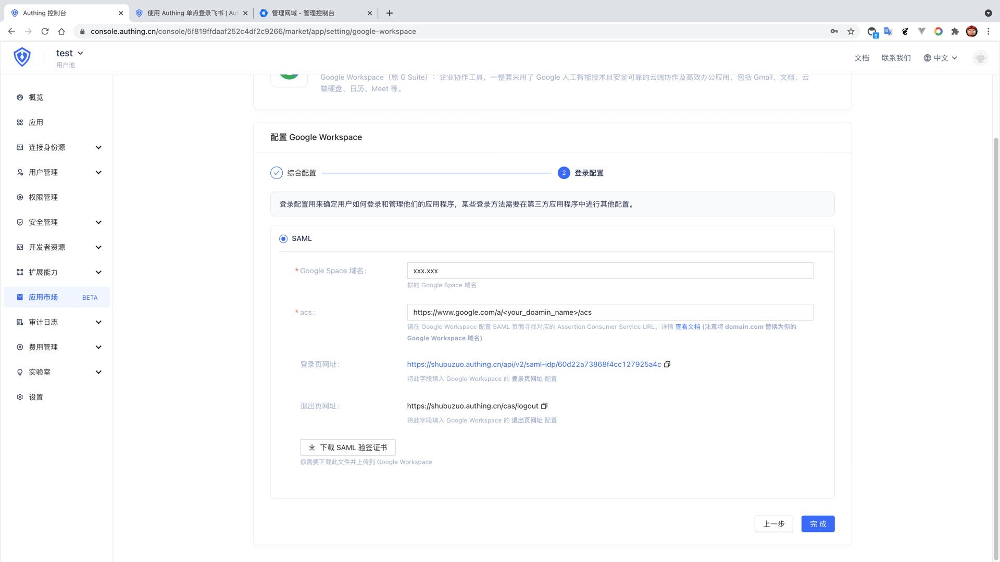
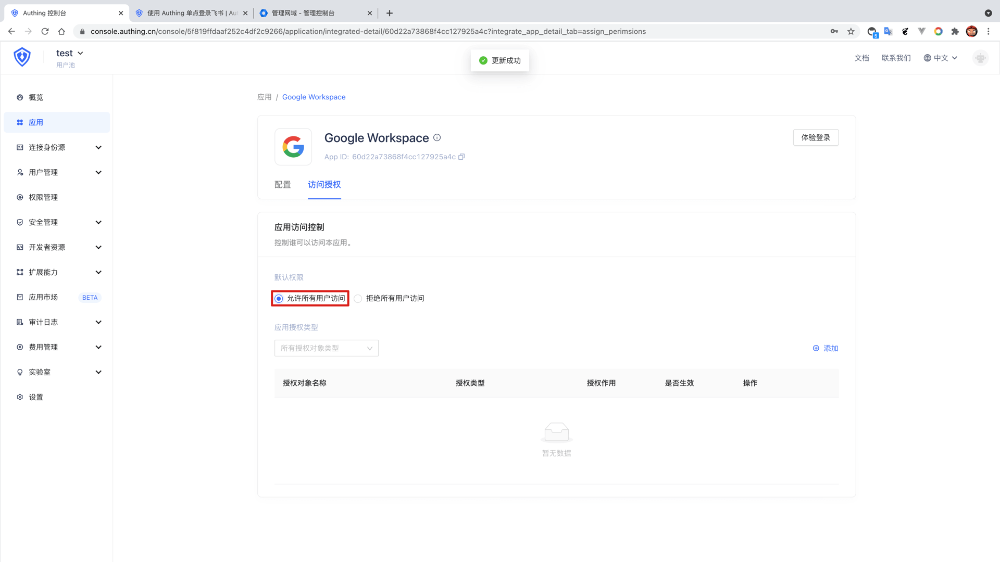
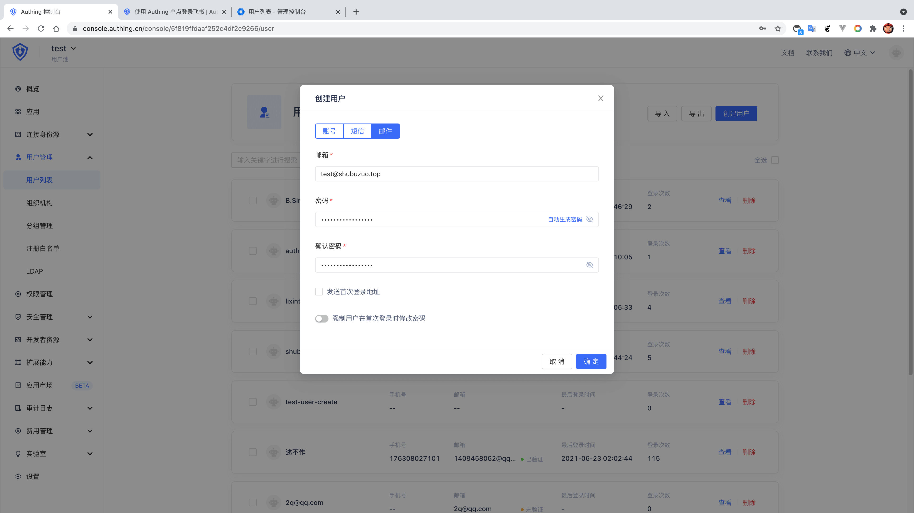

<IntegrationDetailCard :title="`Create an app in ${$localeConfig.brandName}`">

Enter[**console**](https://console.authing.cn) > **Application market**, find **Google Workspace** , Click to enter the details, then click Get Apply.

Enter the app name and click Next.

Input your **Google Workspace domain** and **acs** , **Google Workspace SAML SSO consumer service URL**, the format is **https://www.google.com/a/<your_domain_com>/acs**,at the same time, "Download SAML Visa".

Click Finish, click "Allow all user access" on the Access Authorization Page.

Then return to the user list, create a **mailbox already exists in the Google Workspace team**.

</IntegrationDetailCard>
