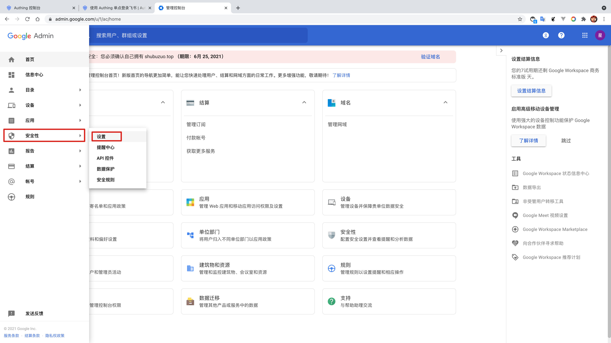
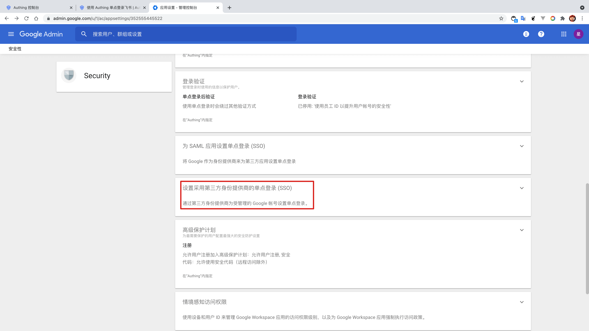
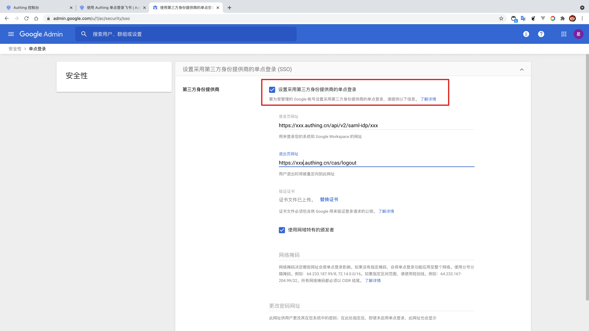
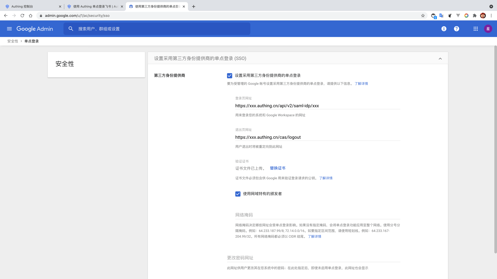
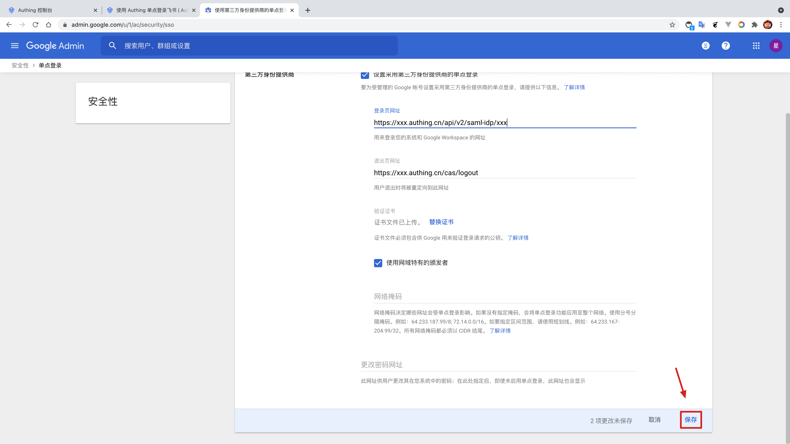

<IntegrationDetailCard title="Configure Google Workspace SSO Login">

Configure Google Workspace SSO login, you need to have administrator privileges. Enter the **Management Console**, enter the **setting directory**, find **security** -> **settings**.

click **Set the single sign-on (SSO) using a third party identity provider (SSO)**。

allow **Set single sign-on using third-party identity providers**。

Fill in {{$localeConfig.brandName}} **login page URL**, **Exit page URL**; In addition, download **SAML visa book**, upload to **verification certificate**.

Click **save**.

</IntegrationDetailCard>
