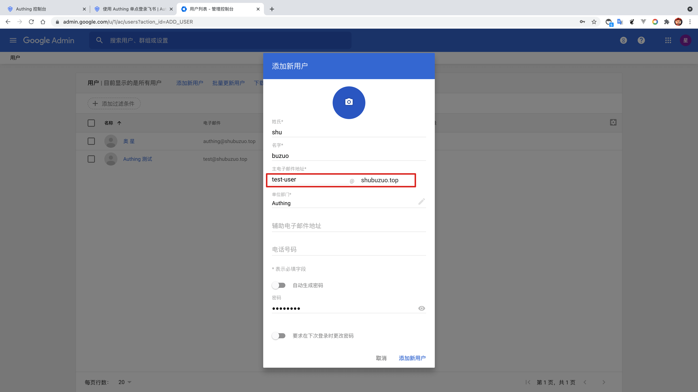
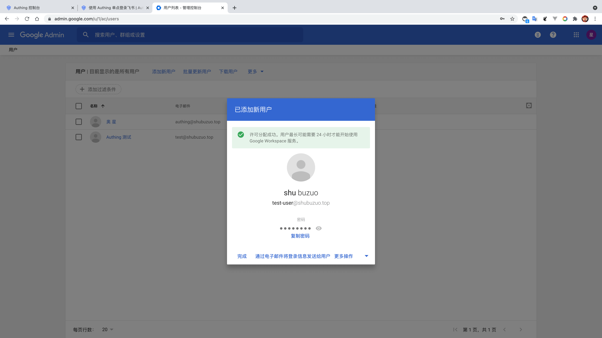
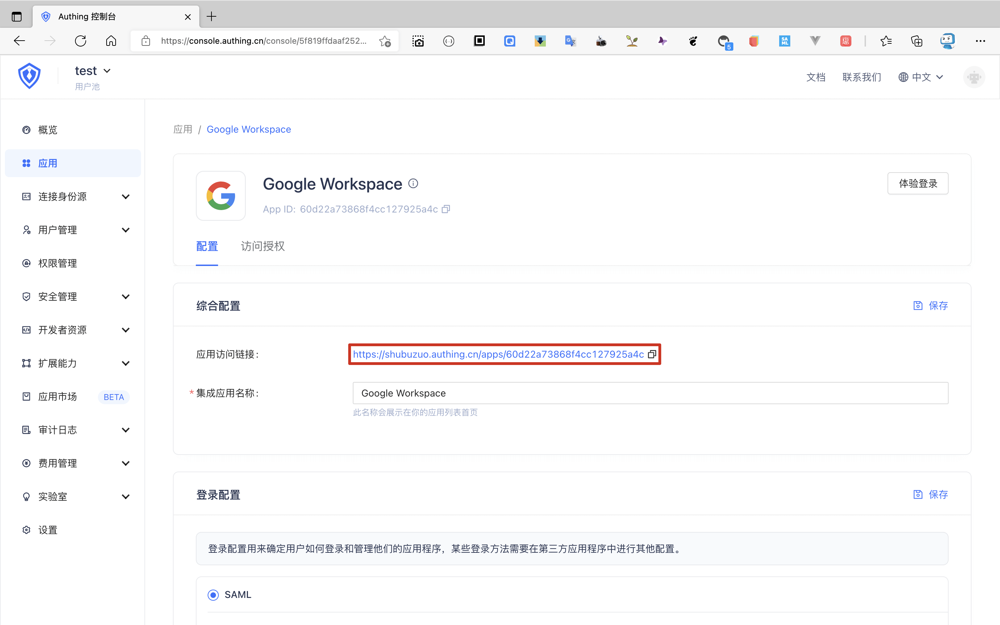

<IntegrationDetailCard title="Experience login">

Enter the **user panel** in **Google Workspace**, add users, pay attention to the user's **mailbox address**.

Click **add new users**, new success.

Copy the application access link, open in the new browser stealth window.

Enter **Authing** login page.

You can successfully log in to **Google Workspace** before entering the login interface.

</IntegrationDetailCard>
