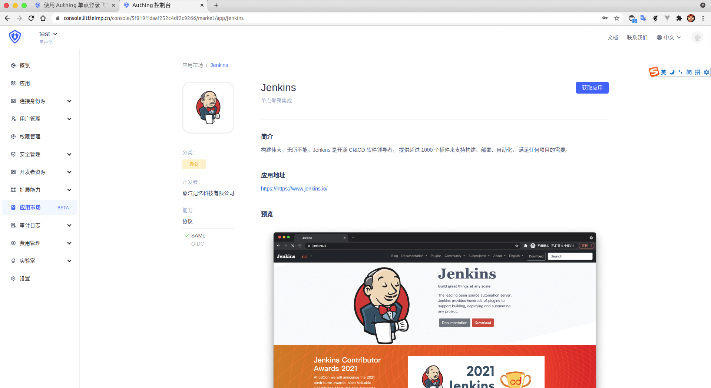
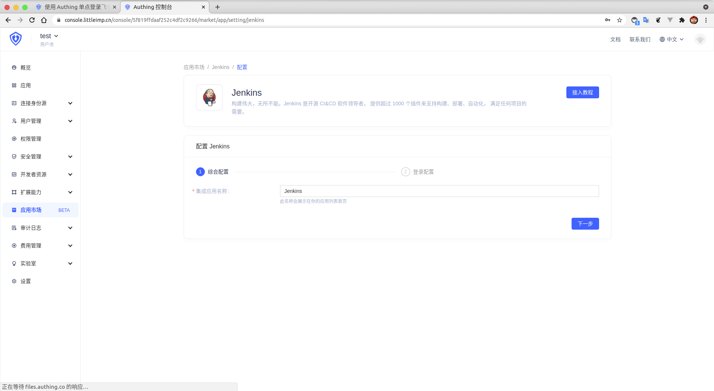
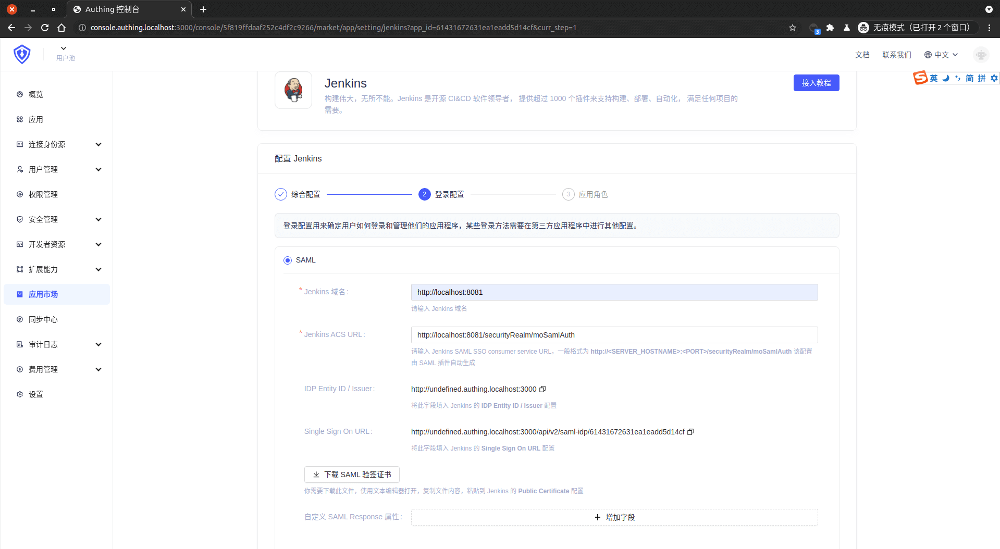
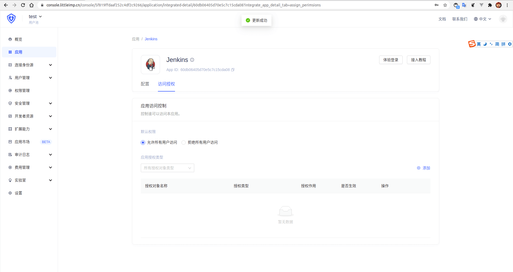

<IntegrationDetailCard :title="`Create an app in ${$localeConfig.brandName}`">

Enter[**console**](https://console.authing.cn) > **Application market**, find **Jenkins**, Click to enter the details, then click Get Apply.

Enter the app name and click Next.

Enter your **Jenkins domain name** and **Jenkins ACS URL**, **Jenkins ACS URL** is **SAML SSO consumer service URL**, the format is **http://&lt;SERVER_HOSTNAME&gt;:&lt;PORT&gt;/securityRealm/moSamlAuth**（Note that this configuration item is automatically generated by Jenkins SAML plugin）,At the same time, "**downloads the SAML certificate**".

Enter **Application Role**, if you need to configure role mapping to jump directly to **Current Document Fourth Step**, and perform **Add** operation and follow-up. If you don't need, click Direct click.

Click "Allow all user access" in the Access Authorization Page.

</IntegrationDetailCard>
