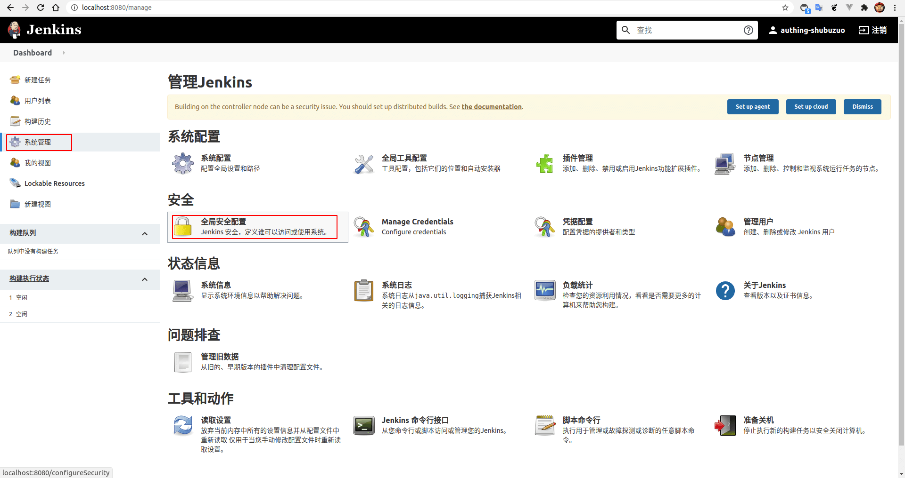
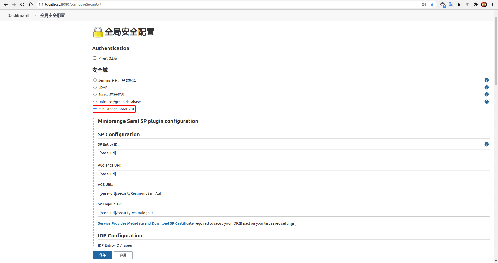
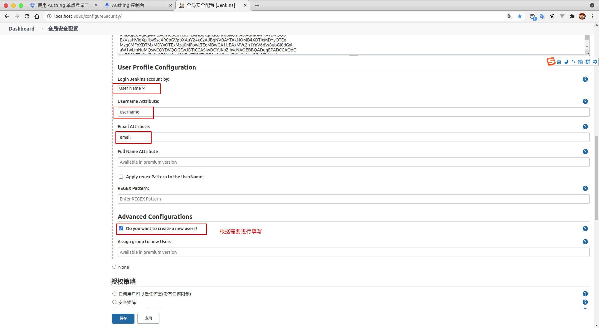

<IntegrationDetailCard title="Configure Jenkins SSO Login">

Configure Jenkins SSO login, you need to have administrator privileges. Enter **Dashboard**, click **system settings**, find **plug-in management**.

Select **optional plugin**, **Search box** Enter **SAML**, you can get two search results, select the plugin shown in the figure **SAML Single Sign On(SSO)**.

After the download is successful, it will be received, if you want to enable the plugin, you need to **restart** `Jenkins` (this may be a dangerous operation, you need to consider the specific scene).

Enter **Dashboard**, click on **system settings**, find **global security configuration**.

**Enable** `miniOrange SAML 2.0`。

Fill in {{$localeConfig.brandName}} **IDP Entity ID / Issuer**，**SAML Single Sign On URL**; select **Name ID Format** for `urn:oasis:names:tc:SAML:1.1:nameid-format:unspecified`, additional, copy **certificate**, paste to **Jenkins 的 IDP Signing Certificate**。

for **User Profile Configuration**， **Login Jenkins account by** select **User Name**，**Username Attribute** fill **username**，**Email Attribute** fill **email**， **Advanced Configurations** select **Whether to create a new user** (select as needed).

Click **application**, **save**.

</IntegrationDetailCard>
