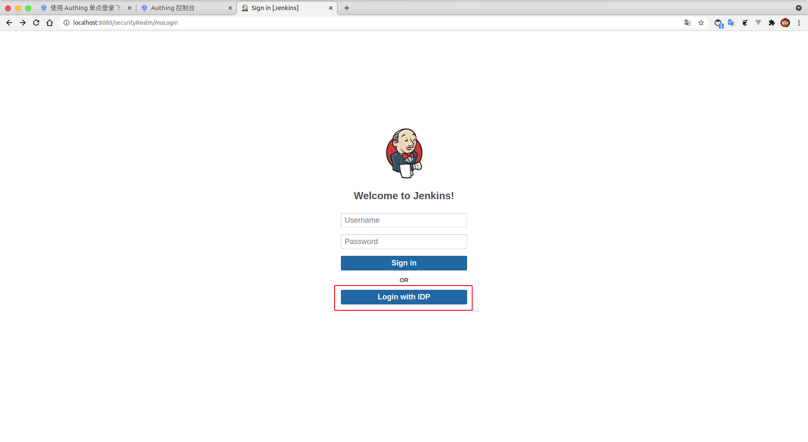
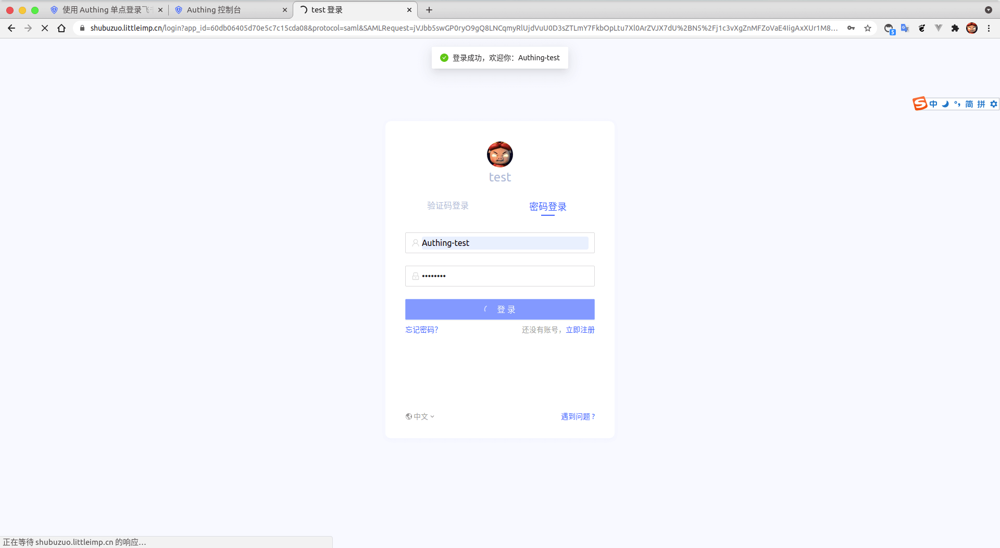

<IntegrationDetailCard title="Experience login">

Enter **Jenkins**, click on the upper right corner **Logout**, enter the **login** page.

Click on **Login with IDP**, enter the **Authing** login screen, and enter the user account password entered in the login interface to complete the verification.

Then jump to **Jenkins**, that is, successfully realize the login **jenkins**.

</IntegrationDetailCard>
