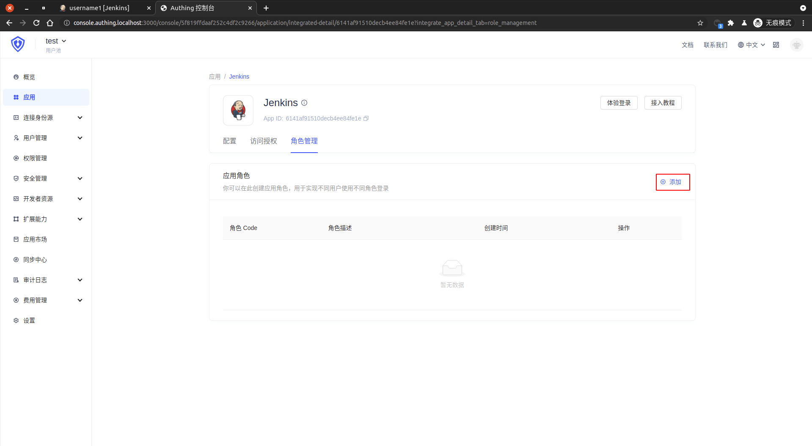
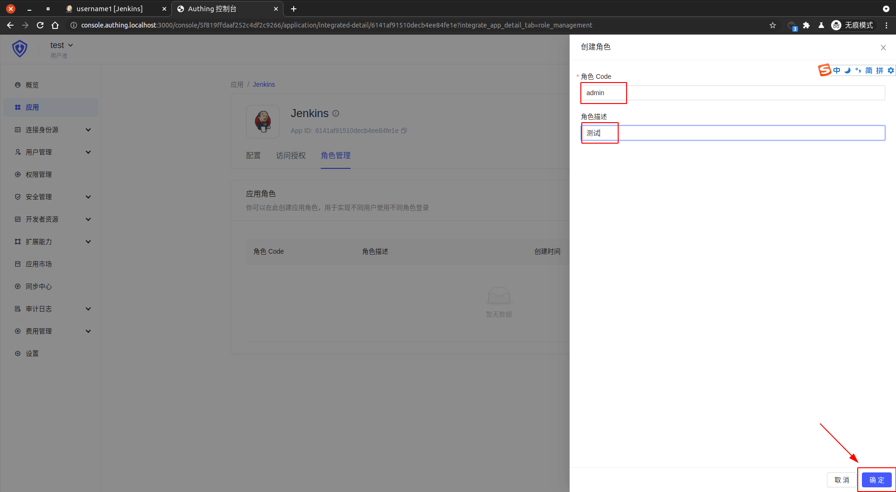
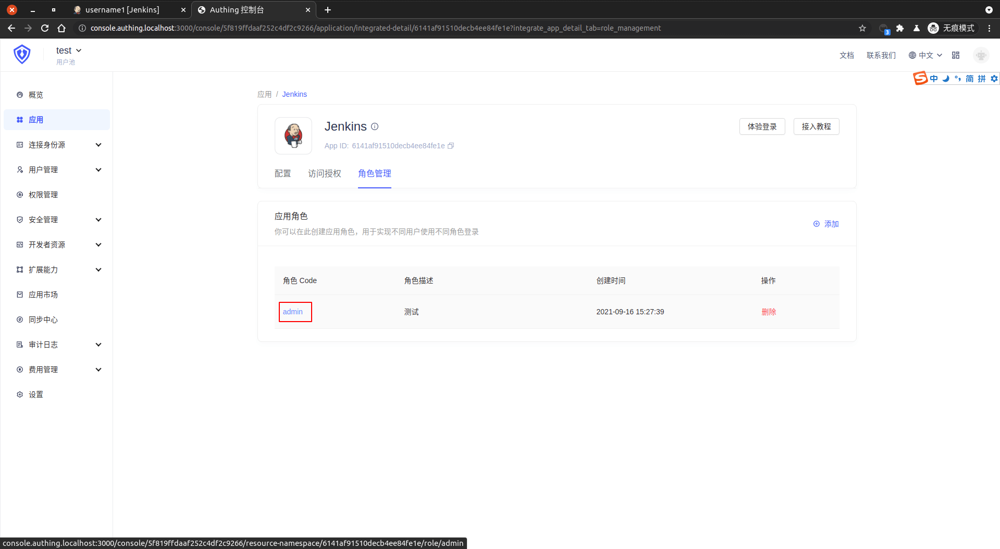
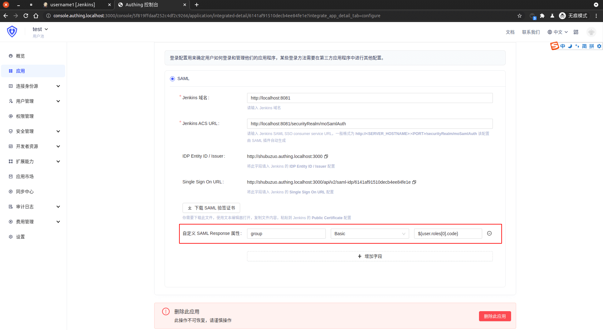
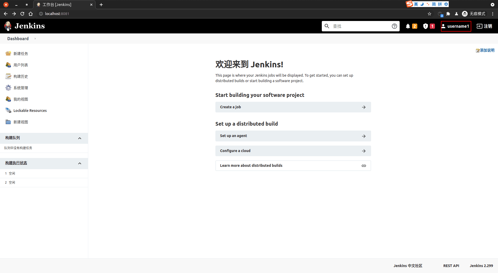
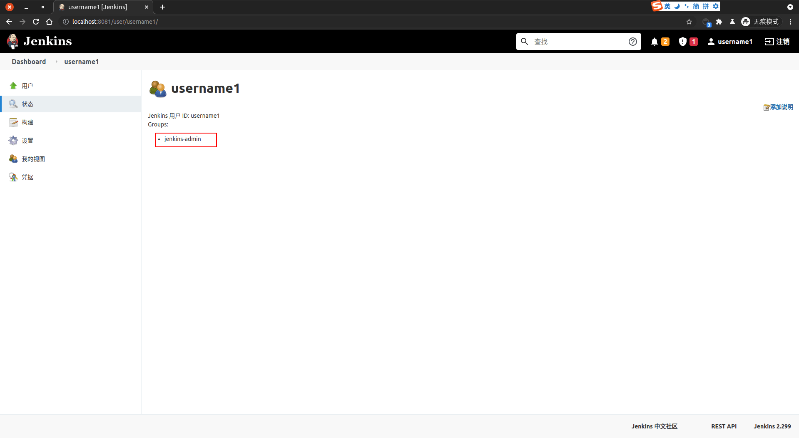
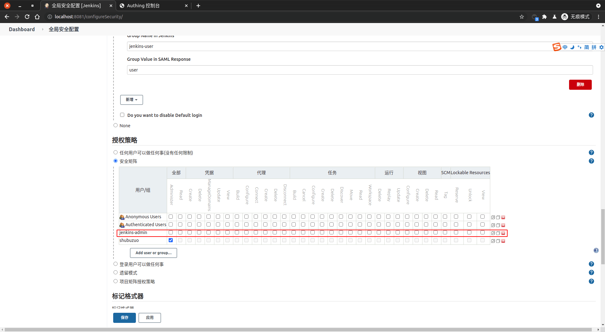

<IntegrationDetailCard title="Jenkins Security matrix login">

Enter {{$localeConfig.brandName}} `Jenkins Application Configuration`, select `Role Management`, click Add.

Create a role, character code is `admin`, click `Determine` Save. The mapping relationship between the `admin` with the previously `Jenkins` is the group where it is created here is the group that needs to be mapped.

Click Apply Role Name **admin** to enter the application role details.

Click **Authorization**.

**Add** corresponding to the user, click **confirm**.

进入 {{$localeConfig.brandName}} 中 `Jenkins 应用配置`，选择 `配置`， `自定义 SAML Response 属性`， 添加 **group** 属性，类型为 **Basic**，值为 **\${user.roles[0].code}**。
Enter {{$localeConfig.brandName}} in `Jenkins Application Configuration`, Select`Configuration`, `Custom SAML Response property`, add **group** property, type **Basic**, value **\${user.roles[0].code}**.

**Click** to save, complete the changes.

Enter **Jenkins**, click on the upper right corner **Logout**, enter the **login** page. Click on **Login with IDP**, enter the **Authing** login screen, and enter the user account password entered in the login interface to complete the verification. Here you should enter the account and password to join the corresponding role user. Then jump to **Jenkins**, that is, successfully realize the login **Jenkins**.

Click the `user name` to view personal information. You can see the logged in user automatically mapped to `jenkins-admin` user group.

Modify the `jenkins-admin` permission, cancel all permissions. Send **Click** `App` ->`Save`.

Refresh the page, you will see the prostate insufficient instructions.

At this point, complete the **Authing** and the **Jenkins security matrix** permission mapping.

</IntegrationDetailCard>
