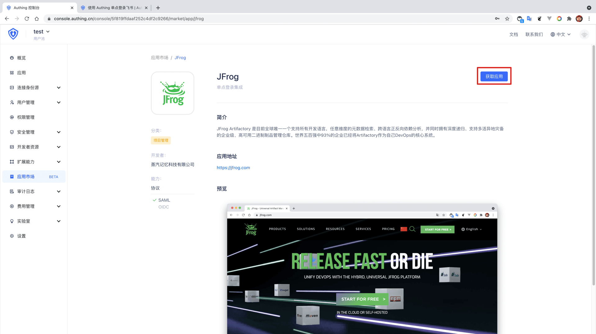
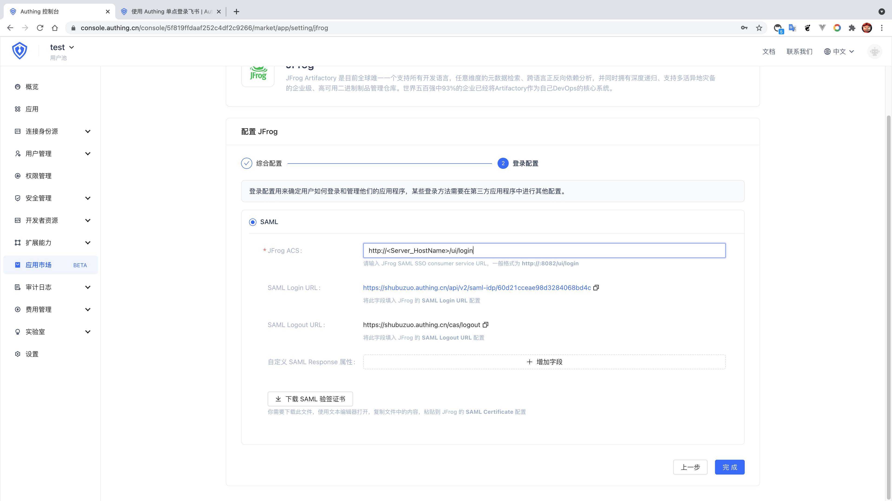
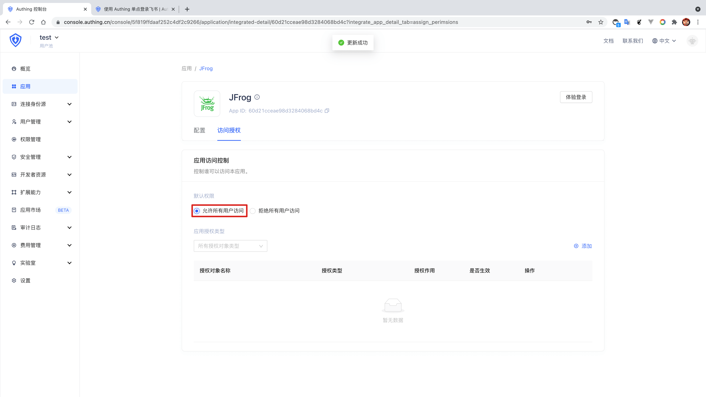
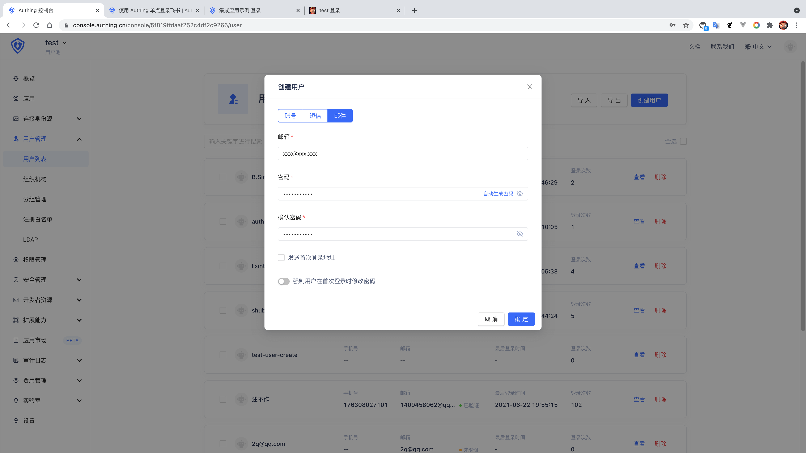

<IntegrationDetailCard :title="`Create an app in ${$localeConfig.brandName}`">

Enter [**console**](https://console.authing.cn) > **Application market**, find **JFrog** , Click to enter the details, then click Get Apply.

Enter the app name and click Next.

Input your **JFrog ACS** ，**JFrog SAML SSO consumer service URL**, format is **https://<Server_HostName>/ui/login**, at the same time, "Download SAML Visa".

Click Finish, click "Allow all user access" on the Access Authorization Page.

Then return to the user list, create a **mailbox already exists in the JFrog team**. (If **SAML configuration** is selected in **JFrog** **New SAML user (Auto Create Artifactory)** No need to consider the **mailbox already in the JFrog team**).

</IntegrationDetailCard>
