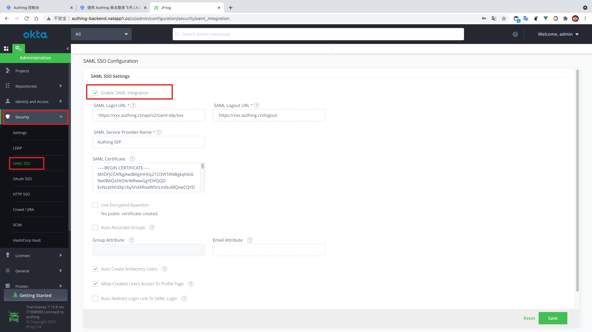
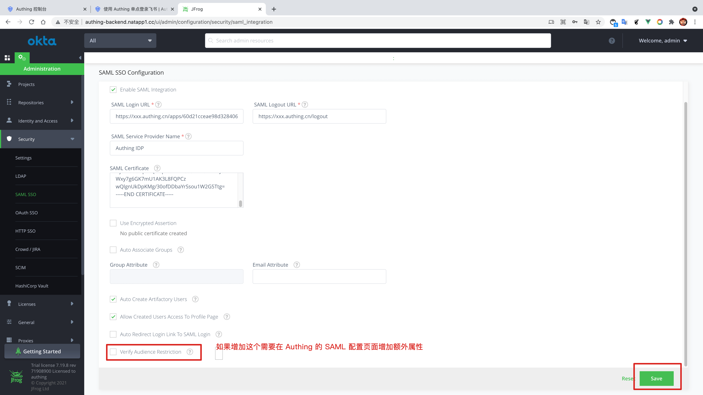

<IntegrationDetailCard title="Configure JFrog SSO Login">

Configure JFrog SSO login, you need to have administrator privileges. Enter **Management Console**, enter **security**, find **SAML SSO**, allow **Enable SAML Integration**.

Fill in {{$localeConfig.brandName}} **SAML Login URL**、**SAML Logout URL**；additional, download **SAML visa book**, copy its content to **SAML Certificate**, according to the corresponding **SAML 选项**, click Save.

Successfully saved **SAML configuration**.

</IntegrationDetailCard>
