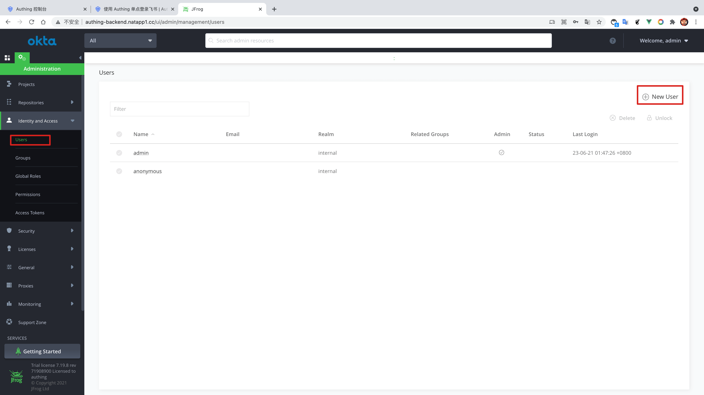
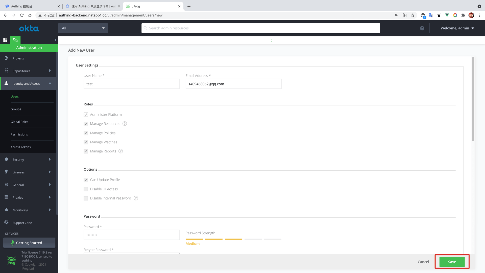
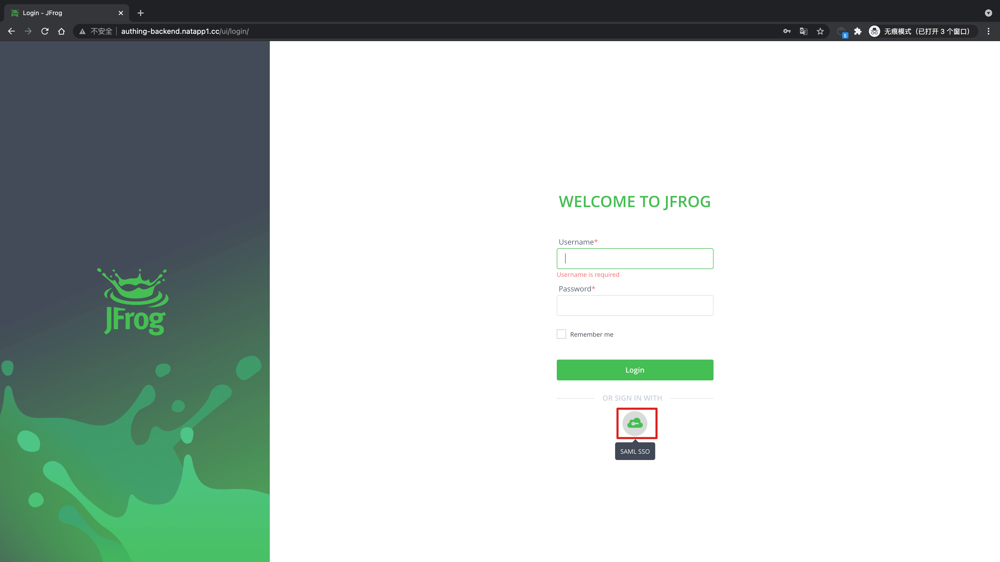
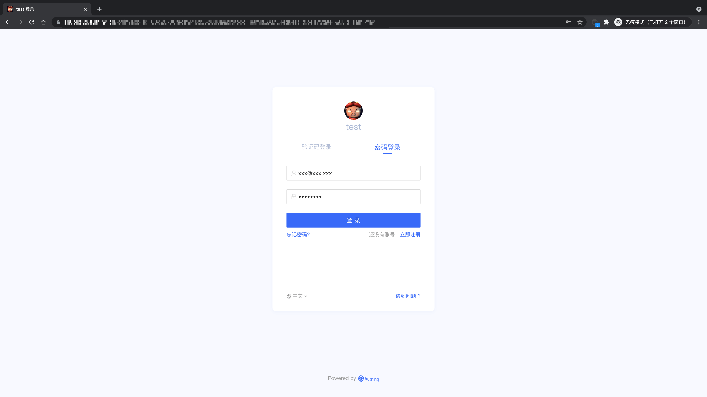

<IntegrationDetailCard title="Experience login">

in **JFrog** enter **Identity and Access** -> **Users**, add users.

Fill in the user-related information, pay attention to the user's **email address**, click **save**.

**Add user success**.

Exit the current user login, enter the login interface, select **SAML SSO**。

Enter the **Authing** login page.

You can successfully log in to \*JFrog\*\* in the user account password created before the login interface.

</IntegrationDetailCard>
