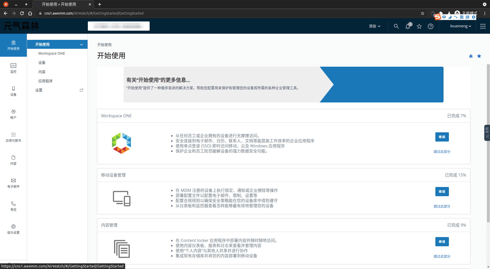
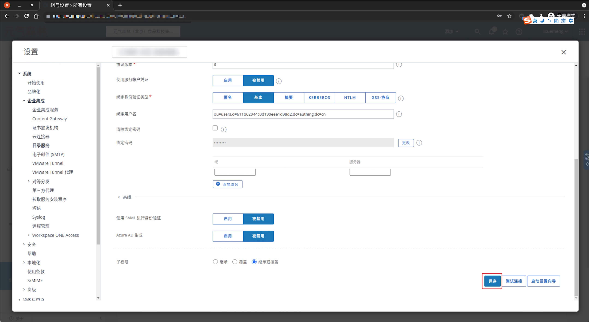
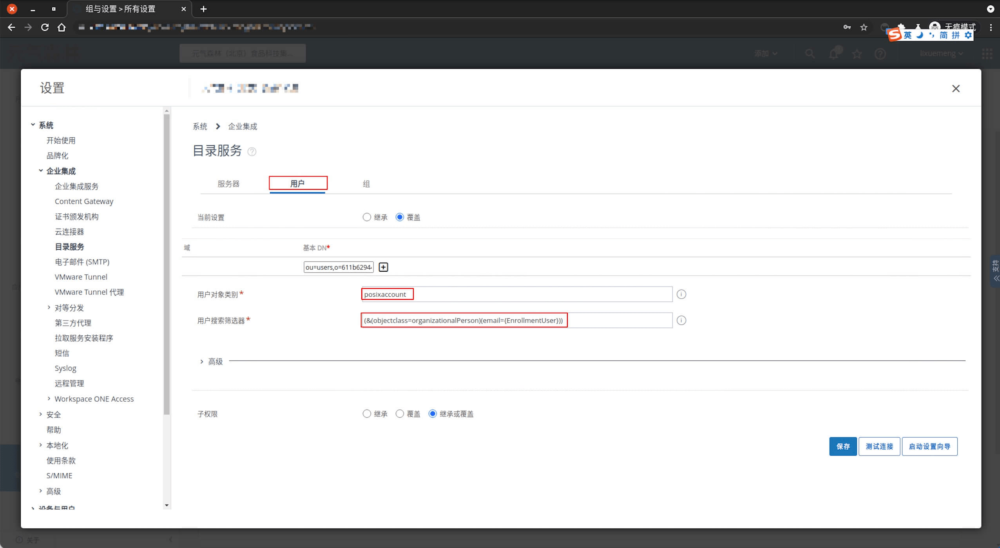
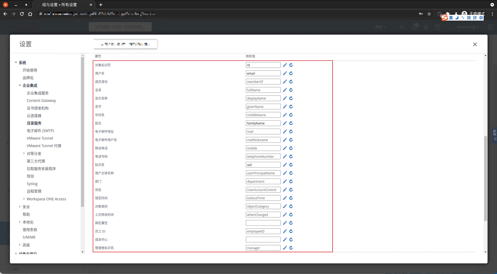
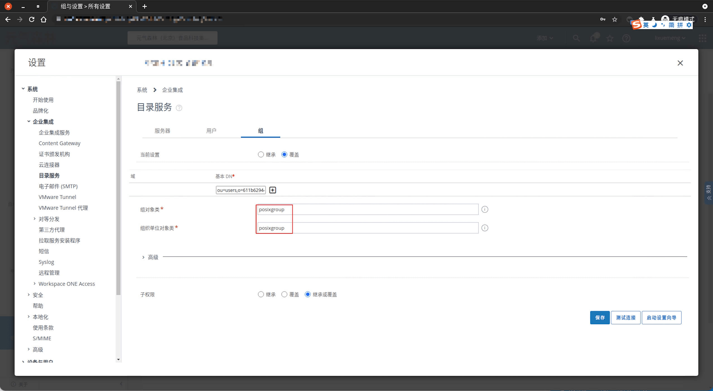
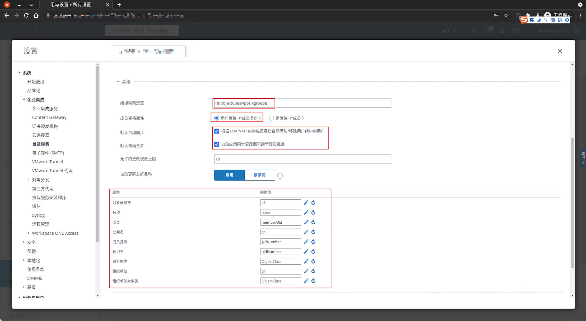
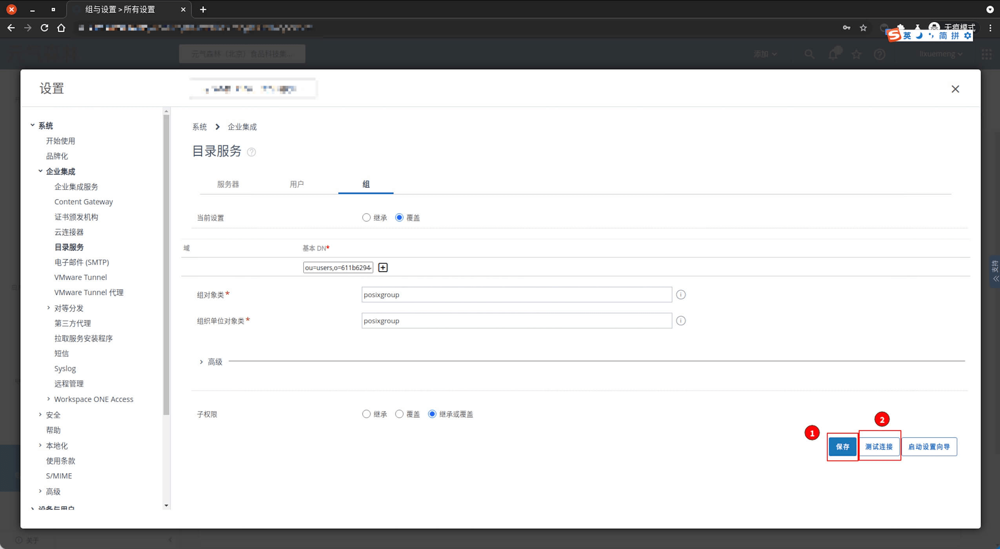

<IntegrationDetailCard :title="`Configure LDAP in AirWatch`">

Configure AirWatch LDAP, you need to have administrator privileges. Enter **AirWatch**.

Click on the sidebar `group with setup` -> `all set`.

Click the `system` -> `business integration` -> `directory service`

select `Directory Type` is **LDAP-other LDAP**, `server` is **LDAP URL**，`Encryption type` is **without**，`port` is **Port**，`Protocol version` is **3**，`Use service account credentials` is **Disabled**，`Bind authentication type` is **Basic**，`Bind username` is **Bind DN**，`Binding password` is **Password**。`LDAP URL`、`Port`、`Bind DN` Information can be **{{$localeConfig.brandName}}** 控制台上查看，对应位置如图。 `Password` 则为 **{{$localeConfig.brandName}}** 控制台 `设置 -> 用户池秘钥`。

click `save`, complete the configuration item saved.

Click the `user`, configure the`user` Related information, `User object category` to **posixAccount**, `user search filter` is **(&(objectclass=organizationalPerson)(email={EnrollmentUser}))**, Click the `Advanced` Configuration **field mapping rules**.

The following is a **field mapping rule** default reference.

click `group`, config `group` related information, `Group object category` is **posixGroup**，`Organizational unit object category` is **posixGroup**。

Click on `advanced` continue configuration, `Group Search Filter` is **(&(objectClass=posixgroup))**，`member qualification property` is **User attribute ("member identity")**, Check **The default automatic merge**, **The default automatic merge**. Configure **Field mapping rules**. The following is a **field mapping rule** default reference.

click **save**, click **Test connection**。

</IntegrationDetailCard>
