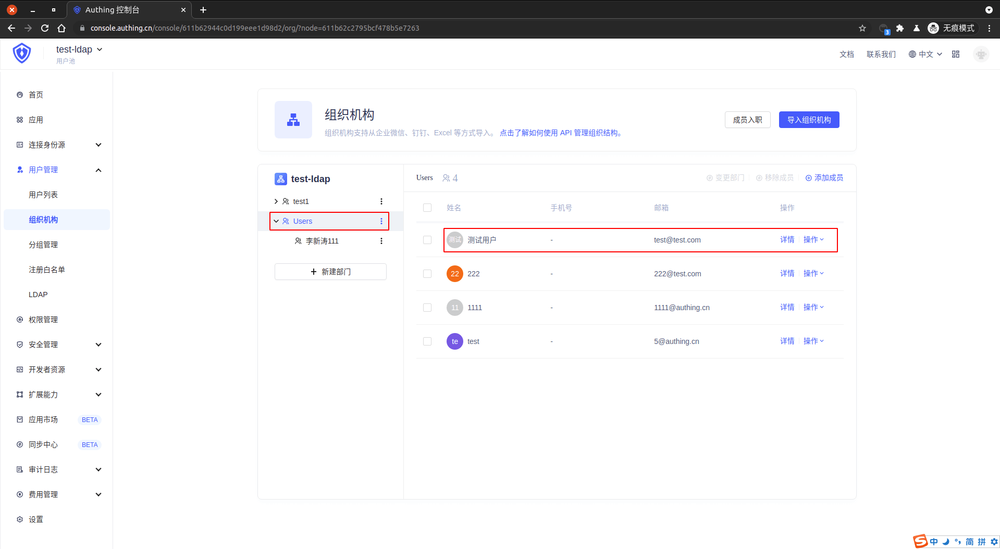

<IntegrationDetailCard :title="`Create an LDAP test user in ${$localeConfig.brandName}`">

Enter **{{$localeConfig.brandName}}** console, enter `User Management -> user list`, click **Create a user**。

Select **mailbox** Create a user, enter the corresponding `mailbox` with the`password`, click **save**.

Enter the **user list**, find the **user** before, click **to view**.

Click **Edit**, populate the relevant information.

Fill the relevant information, click **to save**.

Considering the organizational structure related information synchronization , it also needs to create a new organization node `Users` ( to name Users for example ) in an organization , add the user to the next node .

</IntegrationDetailCard>
