<IntegrationDetailCard :title="`Import users and groups to AirWatch with ${$localeConfig.brandName}`">

Enter the **AirWatch** LDAP user test page, enter the corresponding **user name**, **Click** to check the user.

**AirWatch** LDAP groups into the test page , select `external type` is **Organizational Unit**, Input corresponding to **node name**，**click** check the group.

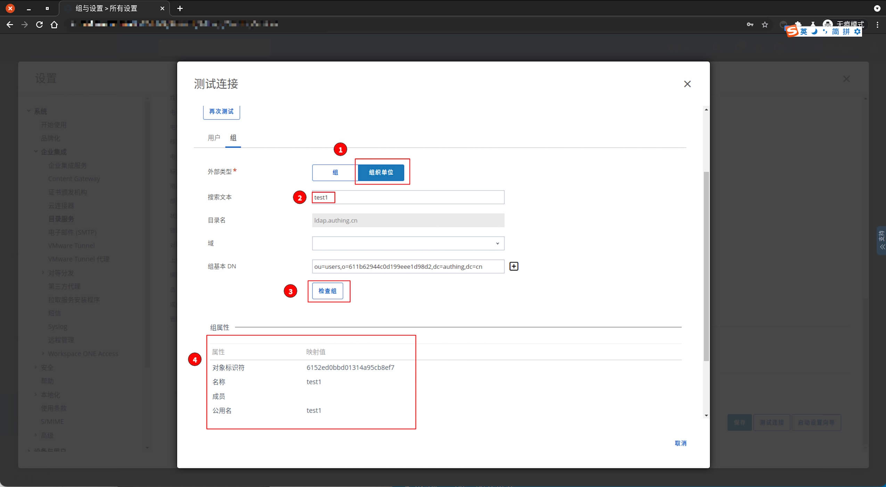

Click on the left navigation `account` -> `user` -> `list view`.

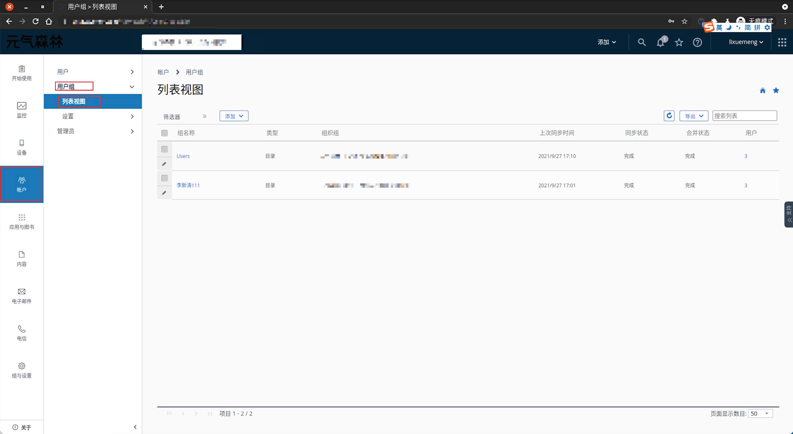

click **add**, click **add user**, select **contents**, input **username**。

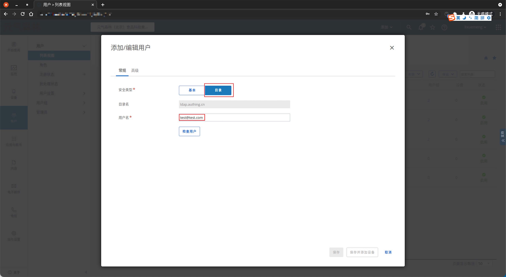

Click **to retrieve user**, supplement the necessary user information. Click **to save**.

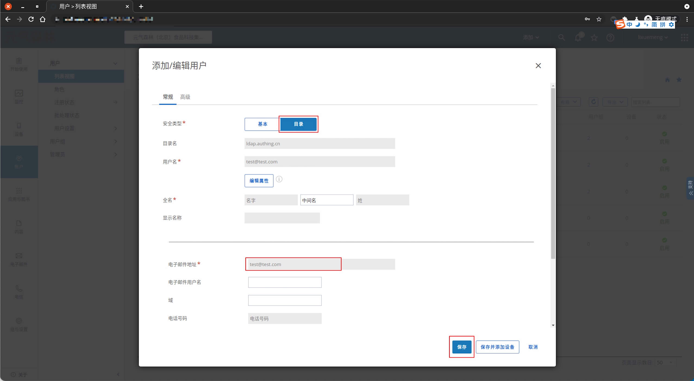

Add completion, automatically jump to `list view`, you can see the previously added users.

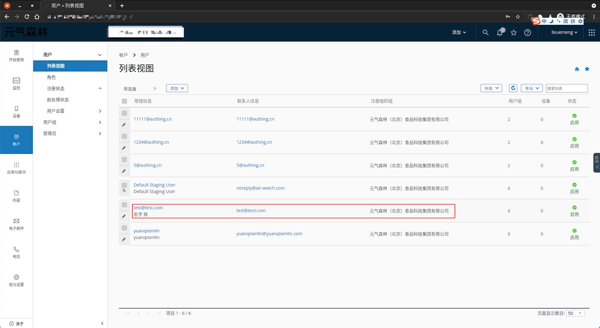

Similarly, click on the left navigation `account` -> `user group` -> `list view`.

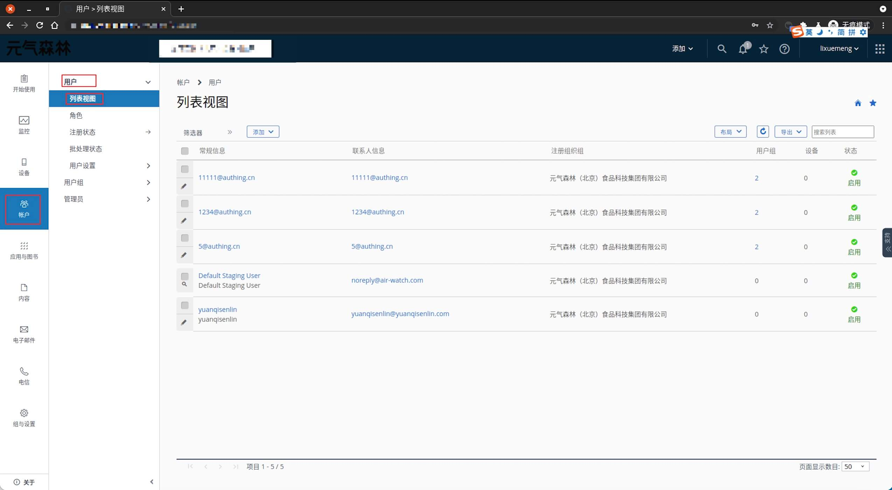

Click **Add**, click **Add user group**.

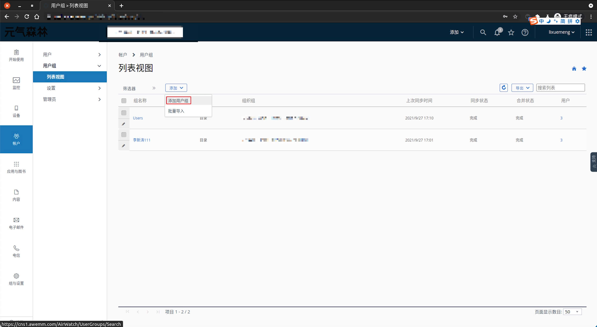

`type` select **contents**，`External type` select **Organizational Unit**，`Search text input` group name.

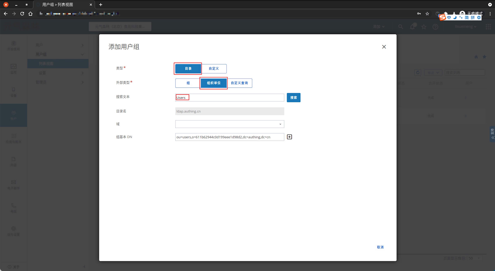

click **check**, complete **group information query**, click **save**, complete **new group**.

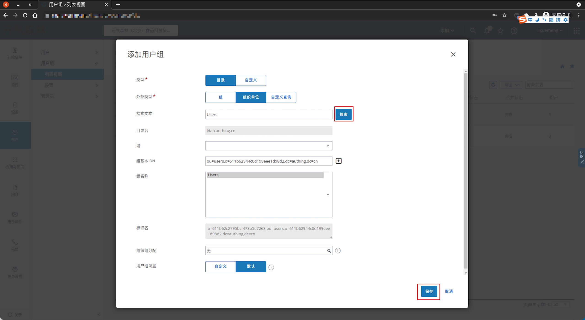

Add completion, automatically jump to `list view`, you can see the previously added user group.

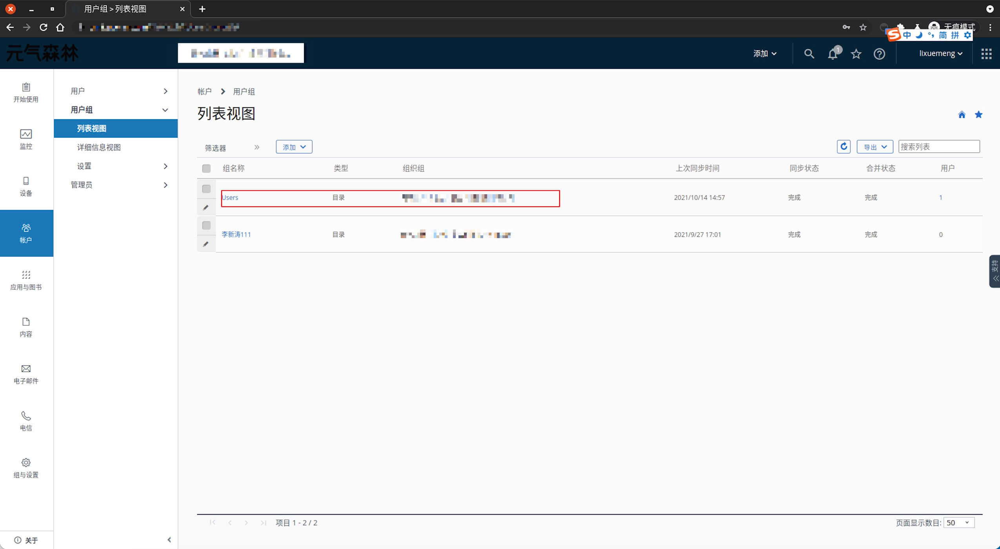

Click on the previous **Users** group to enter the group details. Click **Synchronize**, and the group-related information is synchronized.

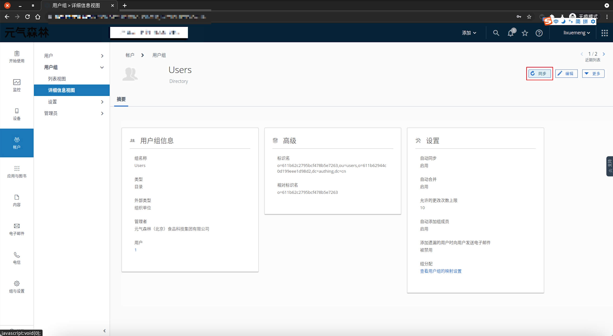

**confirm** synchronization.

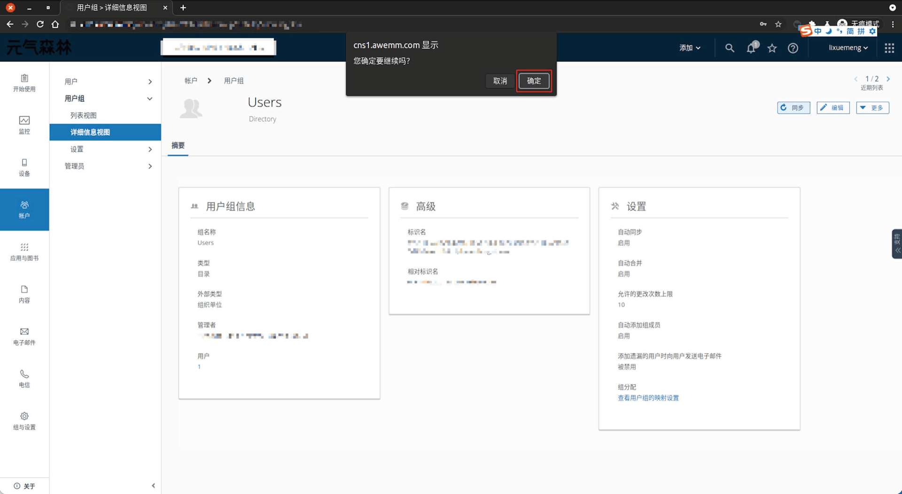

**synchronization is complete** will automatically jump to the `list view`, you can see the latest status of the user group.

Click on the previous **Users** group to enter the group details. Click **Users** .

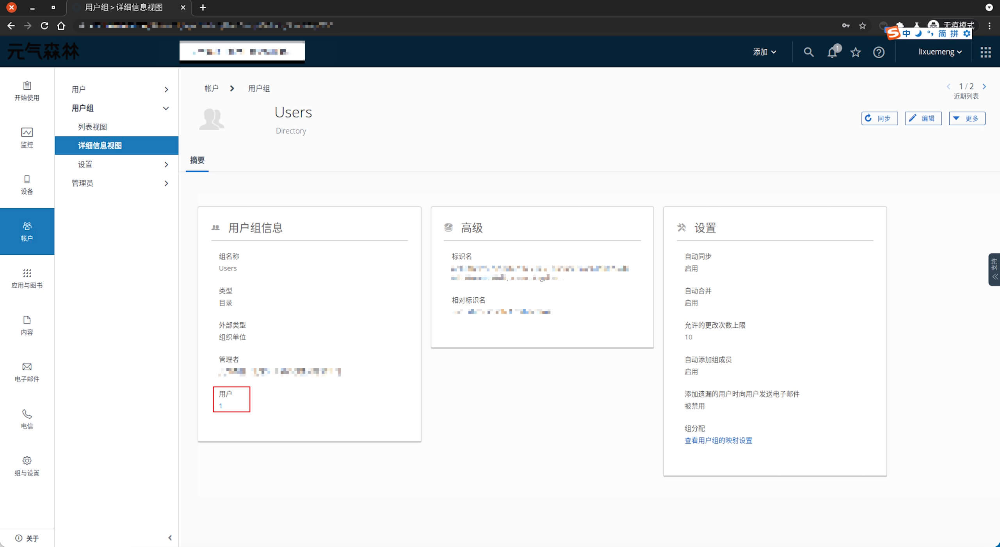

View **Member users Details**.

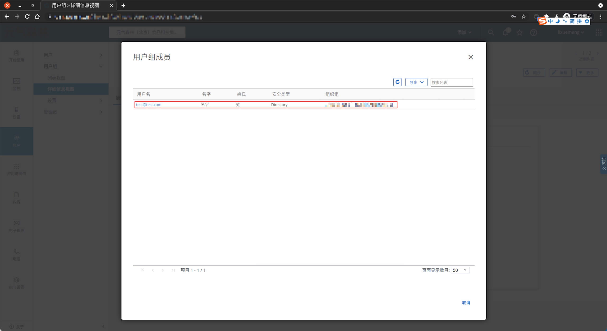

It has been completed **AirWatch user and group** nformation related to import, for the AirWatch single sign-on will use `SAML 2.0`.

</IntegrationDetailCard>
