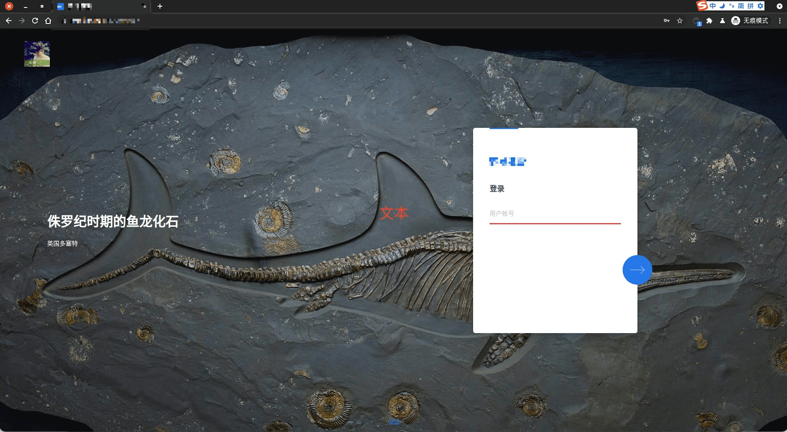
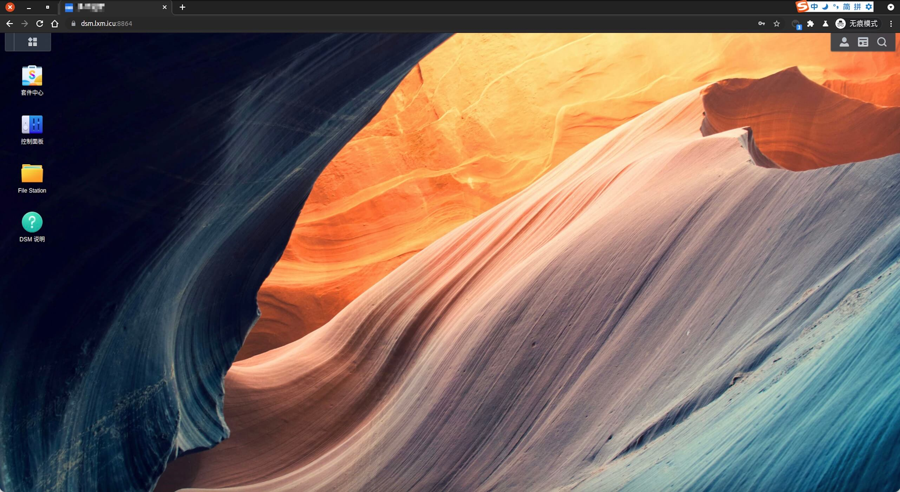
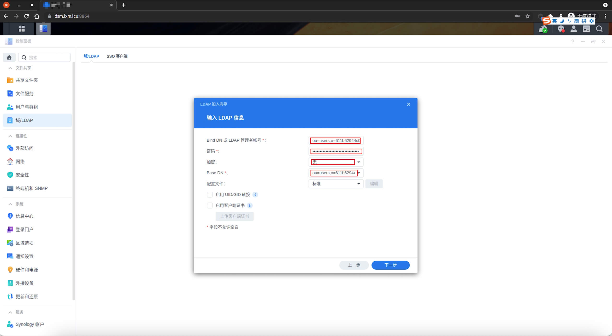
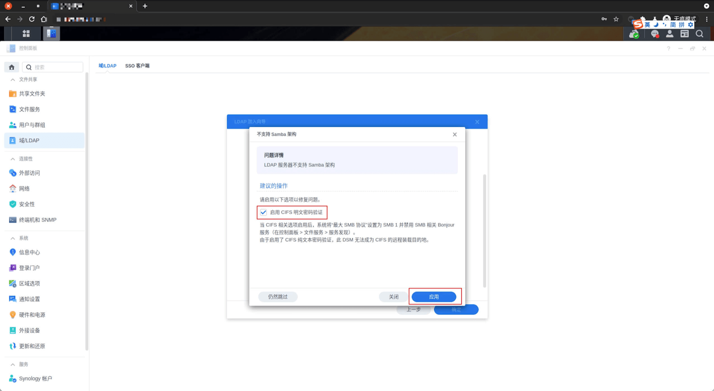
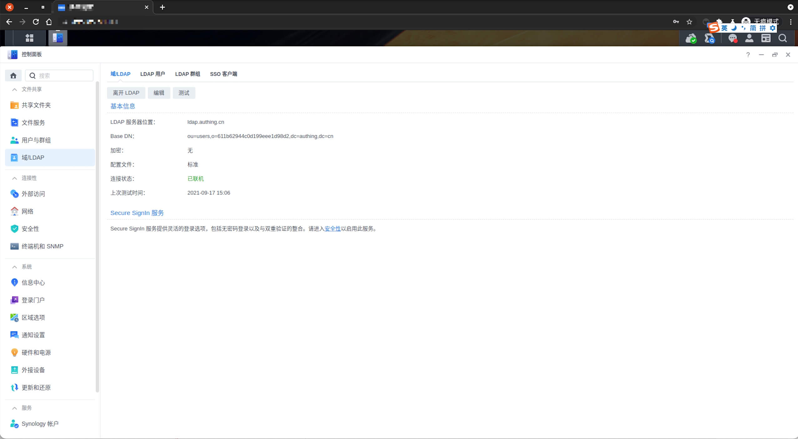

<IntegrationDetailCard :title="`Configure LDAP in DSM`">

Configure DSM LDAP login, you need to have administrator privileges. Go to the administrator page.

click **control panel**。

click **domain/LDAP**。

click **join**。

select `Server type` is **LDAP**, enter `server address`, click `next`.`server address` allowable **{{$localeConfig.brandName}}** View on the console, the corresponding location is followed.

Fill in `Bind DN or LDAP administrator account`,`password`, `Base DN`. This information can be viewed on the **{{$localeConfig.brandName}}** console, the corresponding position is shown. `Encryption` Select **No**, `Profile` default selection **Standard**. `Click` **Next**.

Detect the relevant configuration information, found **does not support Samba architecture**, `Click` **Details**.

Click **Enable GIFS plaintext password authentication**, then click **application**.

Click **to confirm**, complete the configuration item saved.

After the configuration shown in FIG .

</IntegrationDetailCard>
