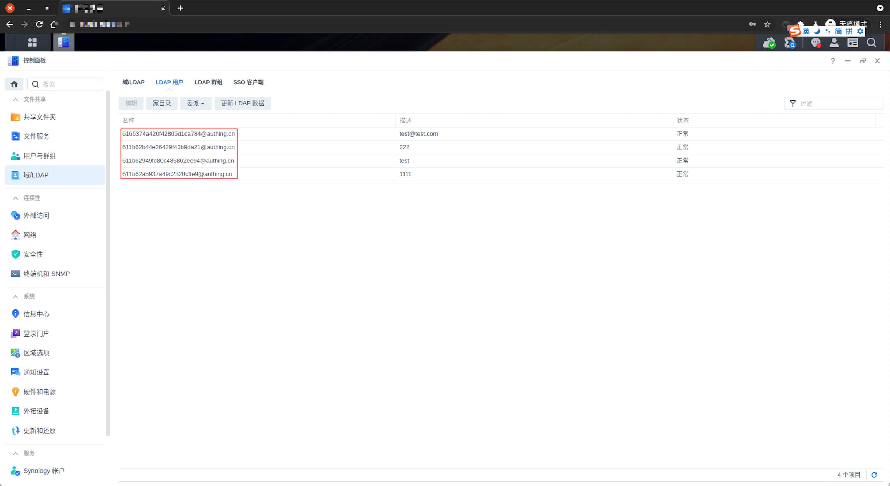
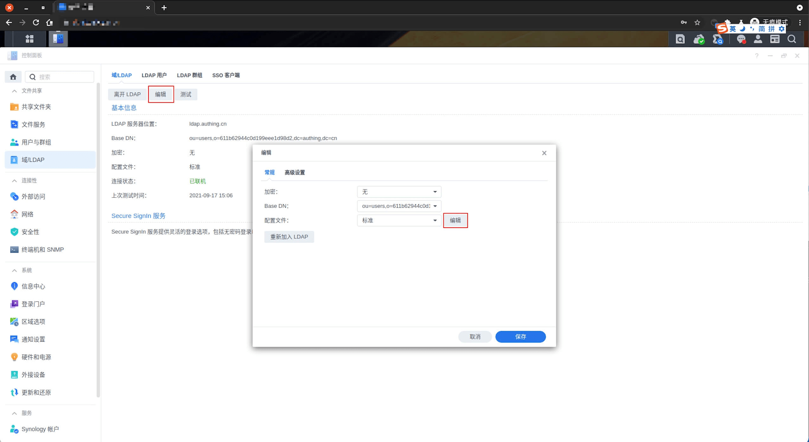
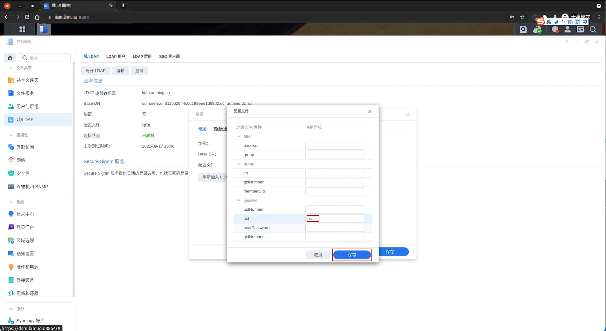
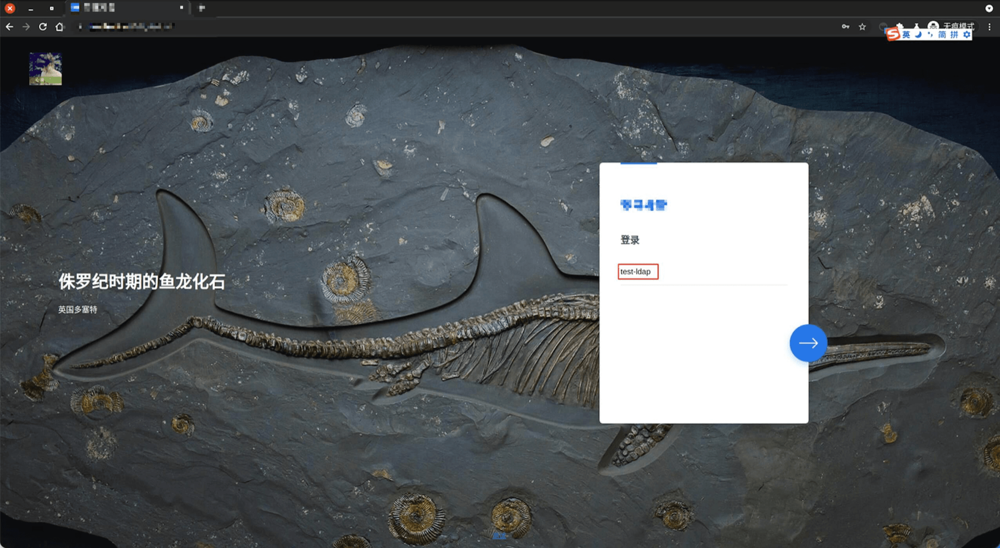
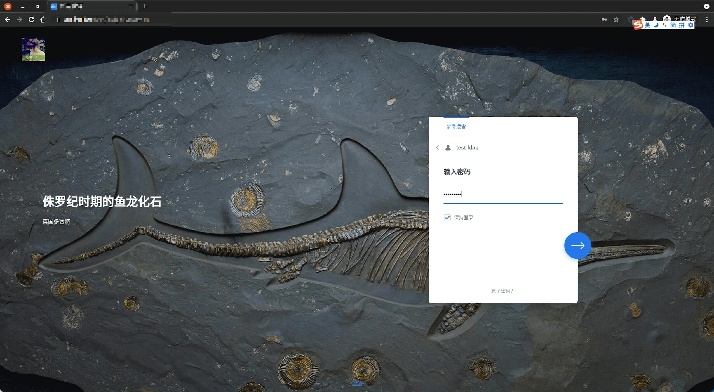
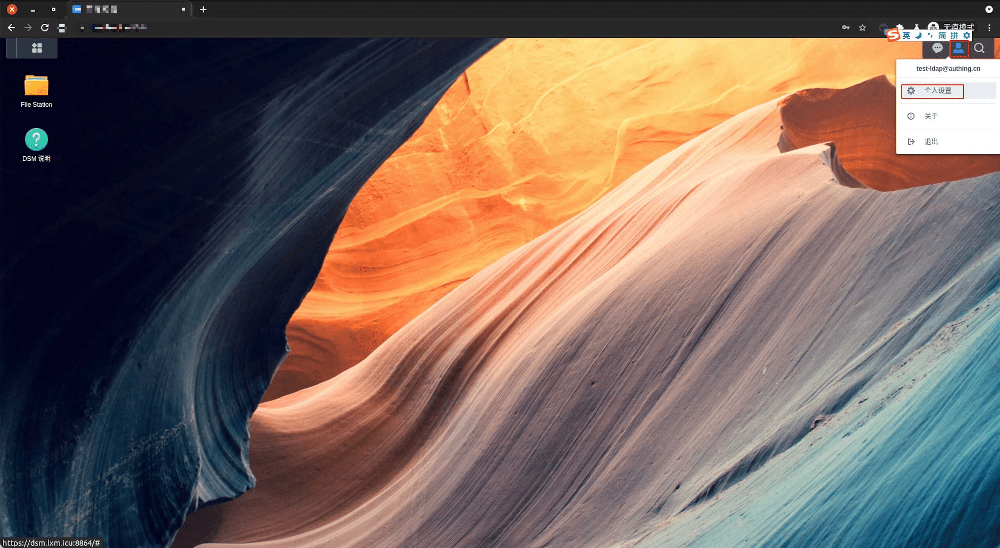
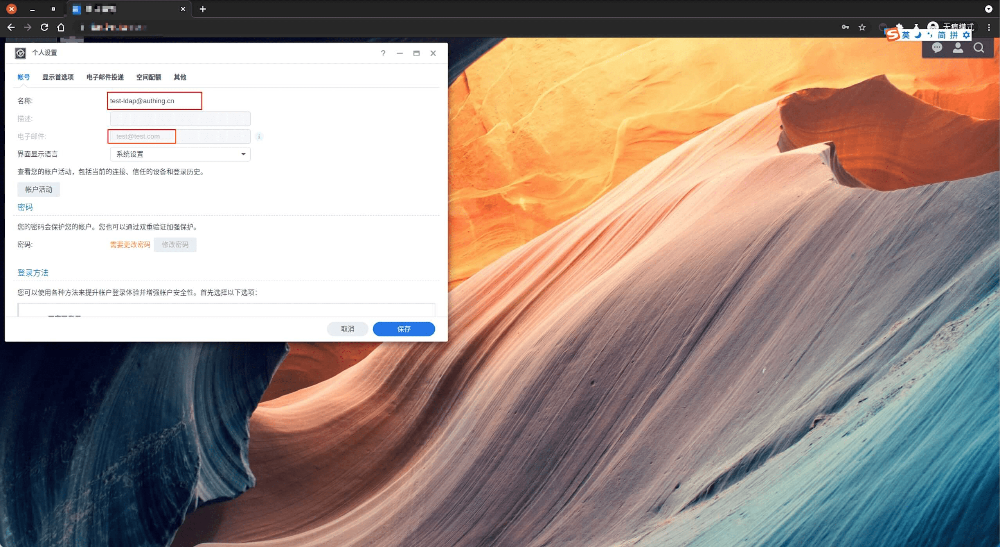

<IntegrationDetailCard :title="`Use ${$localeConfig.brandName} login DSM`">

Enter the **DSM** LDAP configuration page, click on `LDAP user`.

At this time, the user information configured for **default**, now enter the `domain/LDAP`, click **edit**, `configuration file` Click **Edit**.

Corresponding **password -> uid** Modified to **cn**, click **save**.

Click **LDAP user**, and find that the corresponding user information has changed.

Enter **DSM** login page, enter the corresponding **test account information**.

Enter password information, **Click** login.

Enter password information, **Click** login.

Click the `The upper right corner user icon -> Personal Settings`, check the current **user information**.

View **Current login user** related information.

</IntegrationDetailCard>
