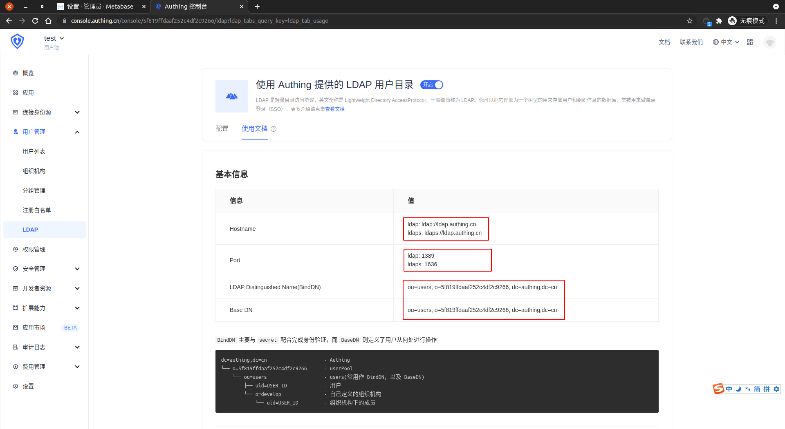

<IntegrationDetailCard :title="`Configure LDAP in gitlab`">

Suppose the **GitLab** running environment In **docker**, the operation deployed in **system** is basically consistent. Here is a demo in the **docker** environment.

```bash
# Find Gitlab container
docker ps | grep gitlab
# 33d67179a633   gitlab/gitlab-ce            "/assets/wrapper"        6 weeks ago   Up 4 hours (healthy)    0.0.0.0:9922->22/tcp, :::9922->22/tcp, 0.0.0.0:9980->80/tcp, :::9980->80/tcp, 0.0.0.0:9443->443/tcp, :::9443->443/tcp   gl

# Enter the container
docker exec -it 33d67179a633 /bin/bash
vi /etc/gitlab/gitlab.rb
```

**Add** as follows, if there is already possible to make the corresponding changes as required. Where `host`, `port`, `bind_dn`, `base` information can be viewed on the **{{$localeConfig.brandName}}** console, the corresponding position is shown. `password`, **{{$localeConfig.brandName}}** console`set -> user pool secret key`

```yaml
# Enable LDAP authentication configuration
gitlab_rails['ldap_enabled'] = true
# LDAP related configuration information
gitlab_rails['ldap_servers'] = YAML.load <<-'EOS'
  main: # 'main' is the GitLab 'provider ID' of this LDAP server
    label: 'Authing LDAP'           # Display the name on the login page
    host: 'ldap.authing.cn'      # LDAP Service address => console -> User Management -> LDAP -> Use documentation Hostname
    port: 1389               # LDAP service port, if the LDAP is based on SSL in the port is usually 636 => console -> User Management -> LDAP -> Use documentation Port
    uid: 'email'   # The attribute corresponding to the username in the LDAP is usually 'sAMAccountName', you can customize other fields.
    method: 'plain'
    bind_dn: 'ou=users,o=5f819ffdaaf252c4df2c9266,dc=authing,dc=cn' # The account format of synchronous user information is 'domain\username' => console -> User Management -> LDAP -> Using Document BindDN
    password: '06eca4ed85c807db9fc6a9d5483a4dc7'     # Synchronize user information account password => console -> set -> userpool secret key
    smartcard_auth: false
    encryption: 'plain'     # 'start_tls' or 'simple_tls' or 'plain'
    verify_certificates: false  # If you use SSL, set to true
    active_directory: false     # If it is Active Directory LDAP Server, set to true
    allow_username_or_email_login: false  # Whether to allow Email login
    lowercase_usernames: false            # Whether to turn your username to lowercase
    block_auto_created_users: false       # Whether locked automatically created users
    base: 'ou=users,o=5f819ffdaaf252c4df2c9266,dc=authing,dc=cn' # Search for LDAP users is BaseDN => Console -> User Management -> LDAP -> Using Document BaseDN
    user_filter: '(objectclass=users)'
    attributes:
      username: 'email'
      email: 'email'
      name: 'nickname'
      first_name: 'givenName'
      last_name: 'familyName'
EOS
```

Corresponding to {{$localeConfig.brandName}}.



After executing `gitlab-rake gitlab:ldap:check` Check **LDAP** configuration.

```bash
gitlab-rake gitlab:ldap:check
# Output as follows
# Checking LDAP ...

# LDAP: ... Server: ldapmain
# LDAP authentication... Success
# LDAP users with access to your GitLab server (only showing the first 100 results)
#         DN: uid=60dac28f724e17b263414a3a,ou=users,o=5f819ffdaaf252c4df2c9266,dc=authing,dc=cn    email: test@test.com
#         ....
#         DN: uid=60d1c8e148dfeeaeb9d1e4b7,ou=users,o=5f819ffdaaf252c4df2c9266,dc=authing,dc=cn    email: b.simon@yelexinhotmail.onmicrosoft.com

# Checking LDAP ... Finished
```

Update **GitLab** configuration to take effect.

```bash
gitlab-ctl reconfigure
```

</IntegrationDetailCard>
