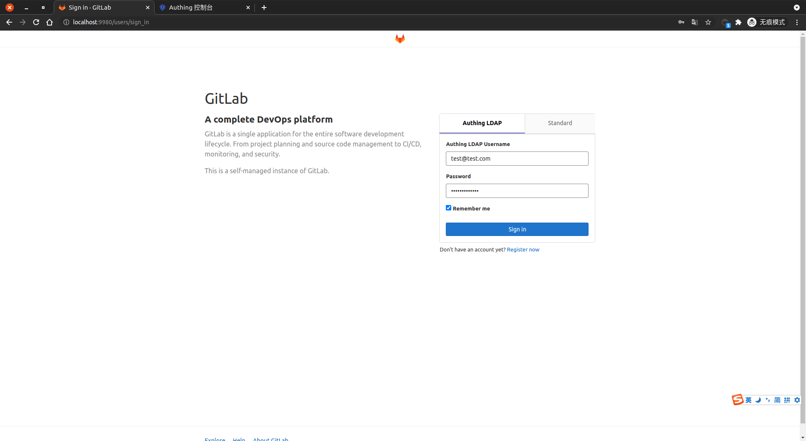
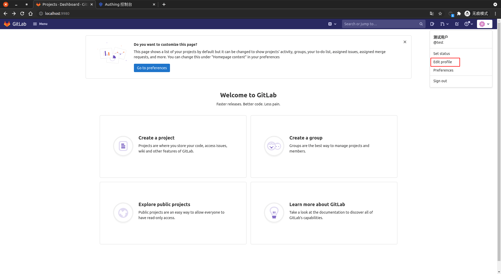
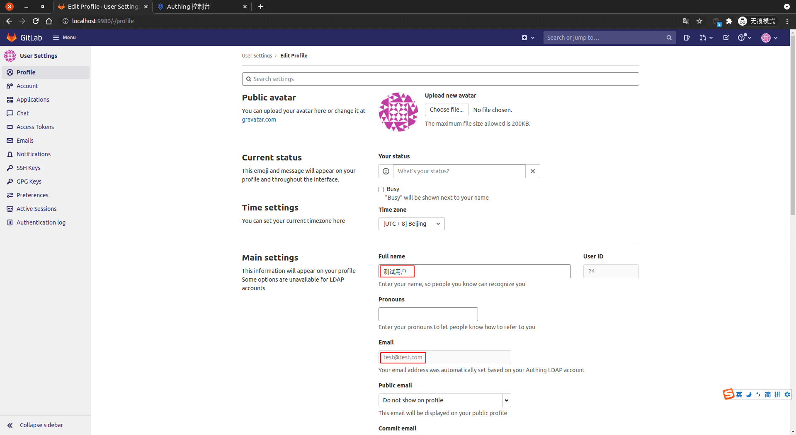

<IntegrationDetailCard :title="`Use ${$localeConfig.brandName} login GitLib`">

Enter the **GitLib** login page, enter the corresponding **test account information**, **Click** to log in.

Log in **Success**, you can see the relevant prompt information.

Click on the `user avatar -> Edit Profile`, check the current **user information**.

View **Current login user** related information.

</IntegrationDetailCard>
