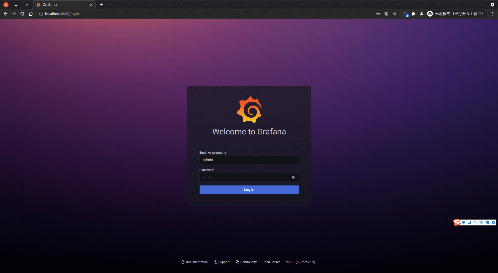
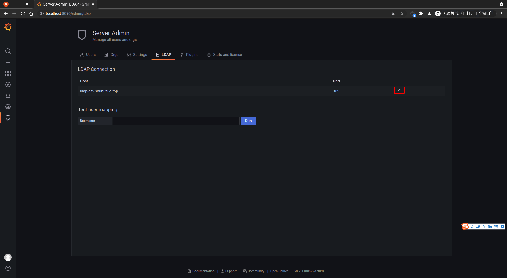
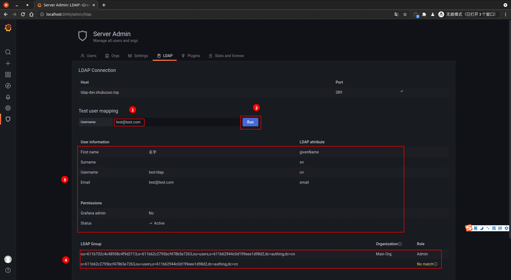
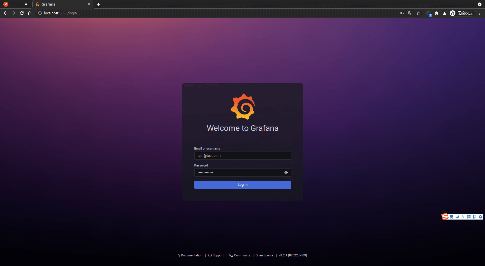
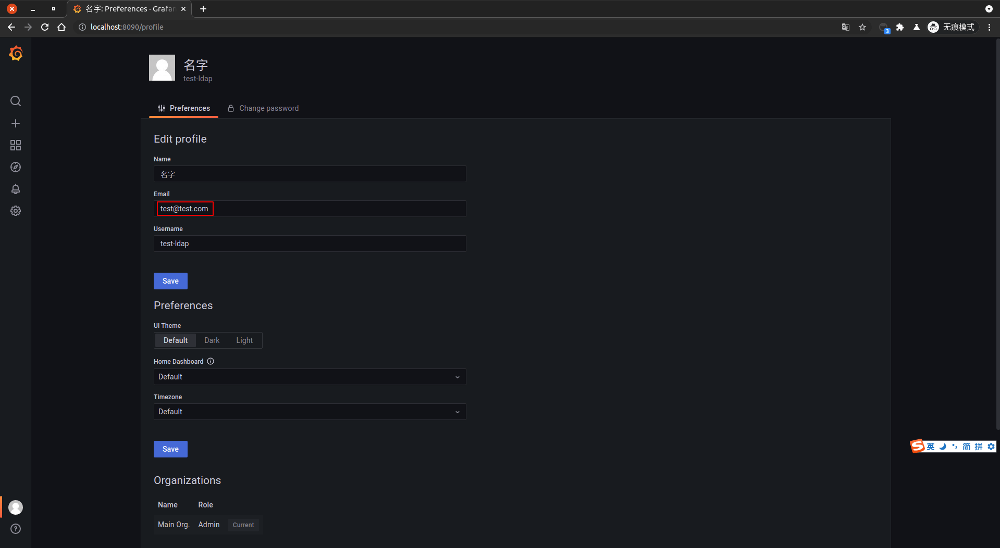

<IntegrationDetailCard :title="`Use ${$localeConfig.brandName} login Grafana`">

Use the administrator to log in to **Grafana**, enter the corresponding **account**, **click** login.

Move to the left **Server Admin**, click on **LDAP**.

View the corresponding **connection status**, display normal.

In **Test user mapping**, fill in the corresponding **test mailbox**, click on **Run**, perform related queries, wait for the results of the query, the result contains the `user information`, the`user owned group information`.

Admin **logout**, enter the **Grafana** login page, enter the corresponding **test account information**, click **login**.

Login **Success**, you can see the relevant prompt information.

Click on the `user avatar -> Preferences`, check the current **user information**.

View **Current login user** related information.

</IntegrationDetailCard>
