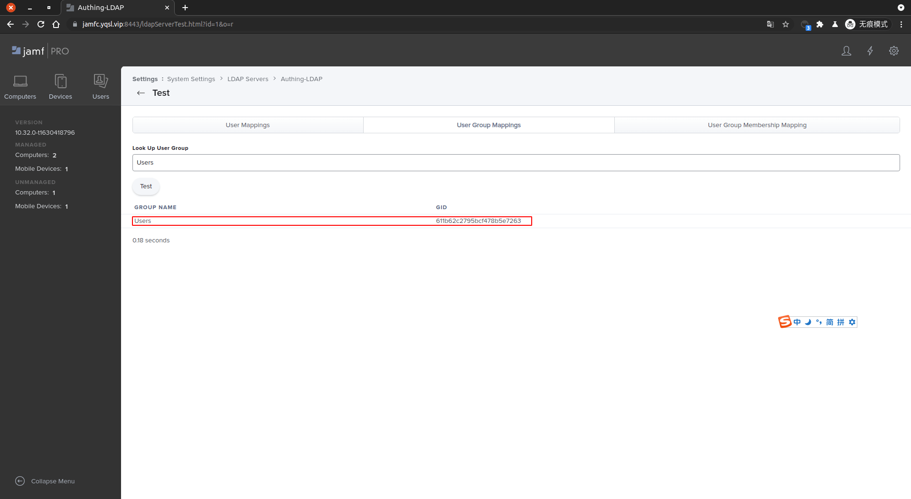
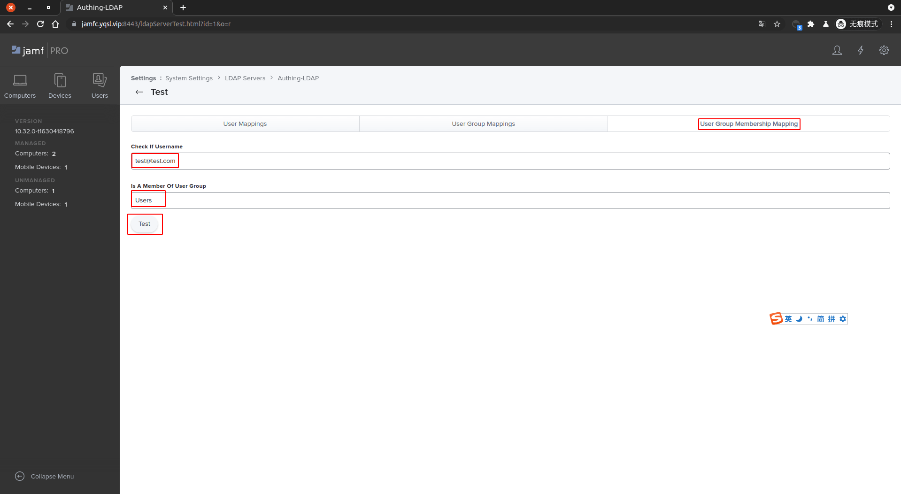
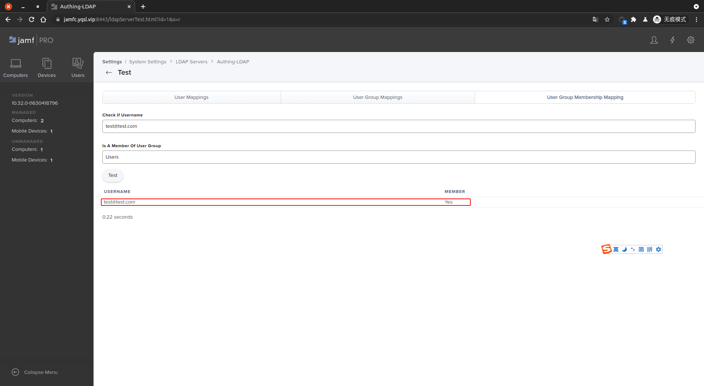

<IntegrationDetailCard :title="`Use  ${$localeConfig.brandName} 登录 Jamf`">

进入 **Test** 页面，进入 **User Mappings**，测试用户。点击 **Test**。

即可看到当前用户信息。

进入 **User Group Mappings**，测试用户组。点击 **Test**。

即可看到当前用户组信息。

进入 **User Group Membership Mapping**，测试用户以及用户组。点击 **Test**。

即可看到当前用户与用户组信息。

</IntegrationDetailCard>
