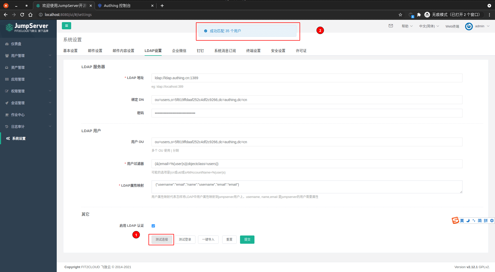
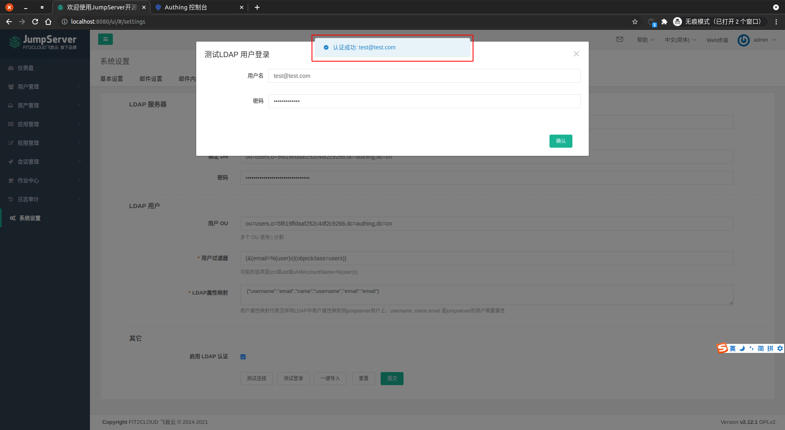

<IntegrationDetailCard :title="`Configure LDAP in JumpServer`">

Configure JumpServer LDAP login, you need to have administrator privileges. Enter **JumpServer**, Click on the left navigation bar **System settings**, Click **LDAP settings**.

Fill in the corresponding **LDAP Configuration information**, in `LDAP address`、`Bind DN`、`user OU` Information can be **{{$localeConfig.brandName}}** View on the console, the corresponding position is shown. `password` Be **{{$localeConfig.brandName}}** Console `set up -> Userpool key`. `User filter` Can be filled in `(&(email=%(user)s)(objectclass=users))`， `LDAP Property map` Can be filled in `{"username":"email","name":"username","email":"email"}`.

Enable **LDAP Authentication**。

Click **Test connection**。

**submit** LDAP set up, by **Test login**。

Test login.

View the certification result.

</IntegrationDetailCard>
