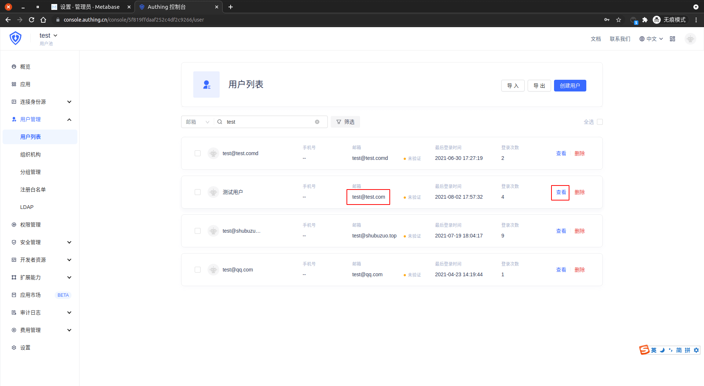
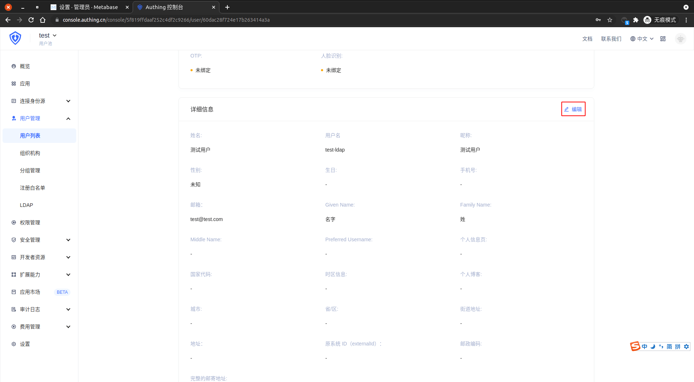

<IntegrationDetailCard :title="`Create an LDAP test user in ${$localeConfig.brandName}`">

Enter **{{$localeConfig.brandName}}** Console, enter `User Management -> user list`, Click **Create a user**。

choose **Mail** Create a user, enter the corresponding `Mail` and `password`, Click **save**.

Enter **user list**, Find it before **user**, Click on **to view**.

Click **Edit**, populate the relevant information.

Fill the relevant information, click **to save**.

</IntegrationDetailCard>
