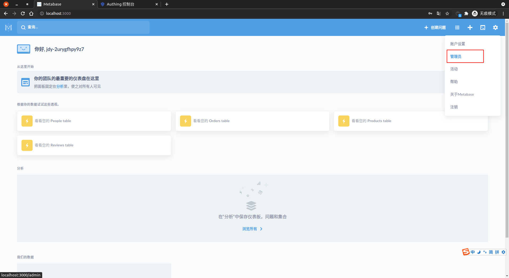
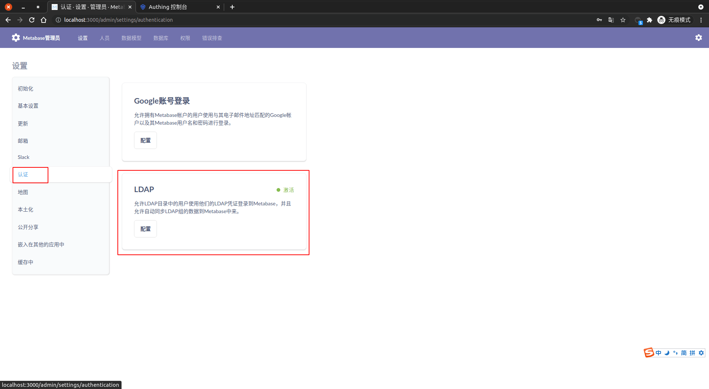
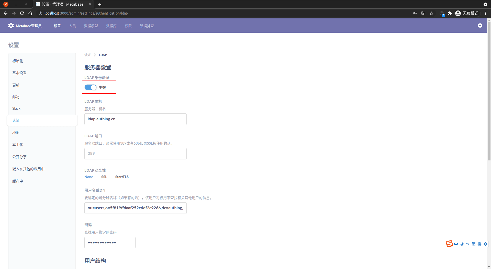
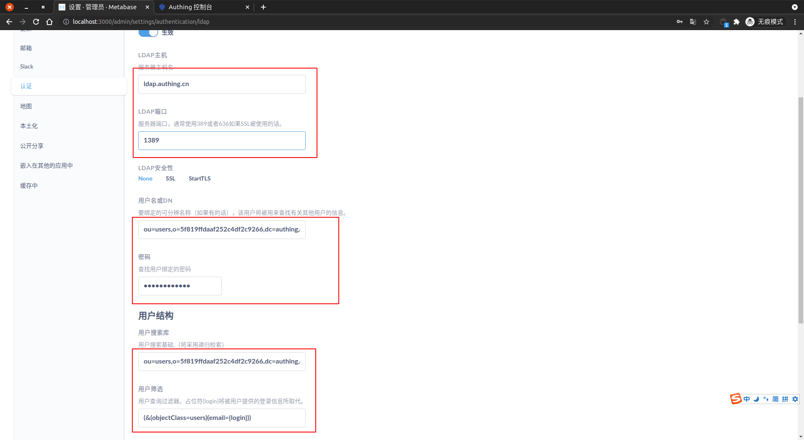
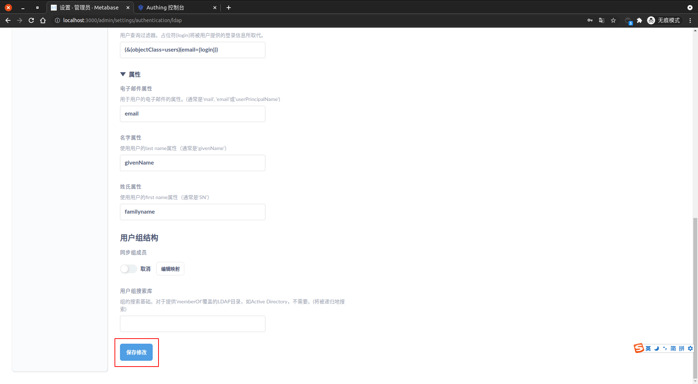

<IntegrationDetailCard :title="`in Metabase Configure LDAP`">

Configure Metabase LDAP login, you need to have administrator privileges. Enter **Metabase**, Click on the upper right corner **set up** Icon, click **administrator**, Go to the administrator page.

Click **Certification**, choose **LDAP**, Click **Configure**.

Enter **Server settings**, Click to take effect **LDAP Authentication**.

Fill in `Server host name`, `LDAP port`, `Username or DN`, `User search library`, `User screening`. in `Server host name`、`LDAP port`、`Username or DN`、`User search library` Information can be **{{$localeConfig.brandName}}** view on the console, the corresponding position is shown.
`User screening` Fill in **(&(objectClass=users)(email={login}))**, Can customize according to your own needs `filter`。

Fill in **Attributes**, You can customize the relevant property mapping according to your needs.

Click **Save the Modification** Complete the configuration save.

</IntegrationDetailCard>
