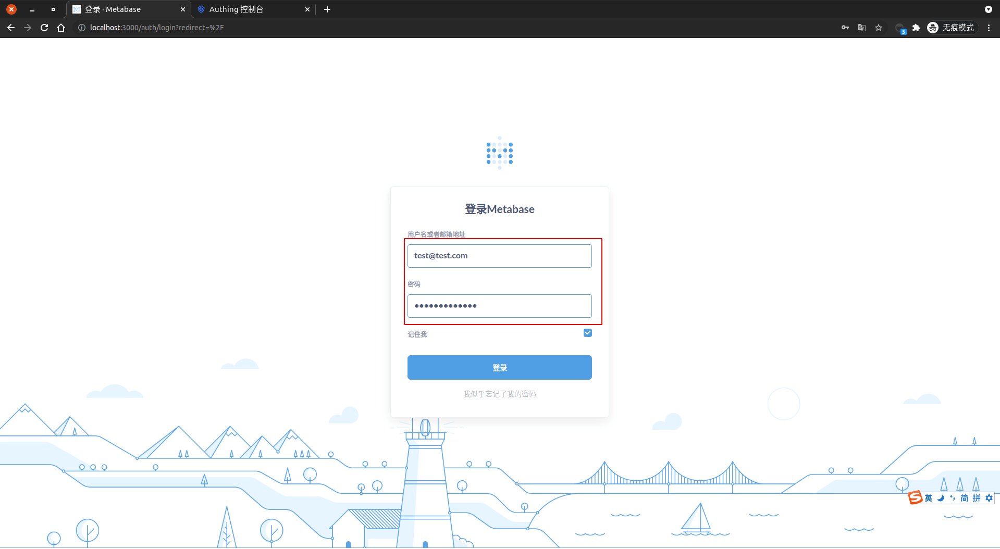
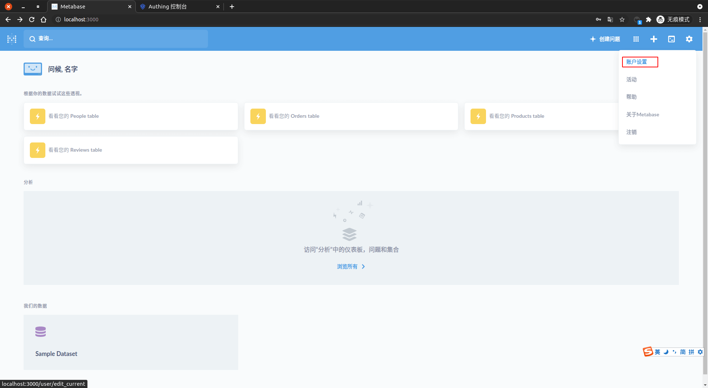
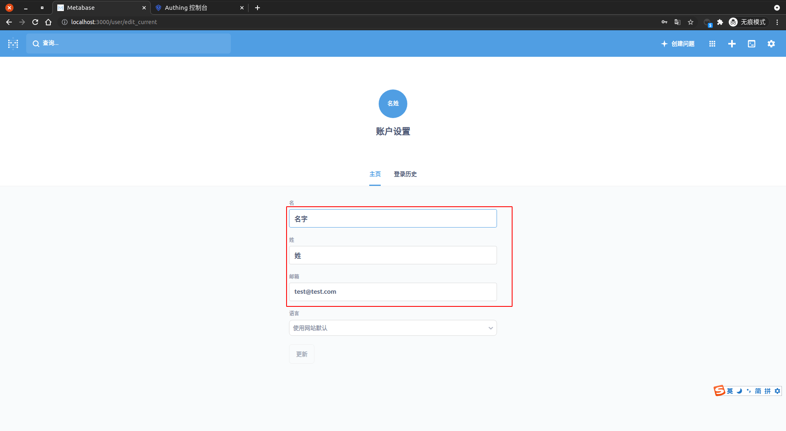

<IntegrationDetailCard :title="`Use ${$localeConfig.brandName} login Metabase`">

Enter **MetaBase** Log in to page, enter the corresponding **Test the confidential information**，**click** login.

Log in **Success**, you can see the relevant prompt information.

Click on `Settings -> Account Settings` to see the current **user information**.

View **Current login user** related information.

</IntegrationDetailCard>
