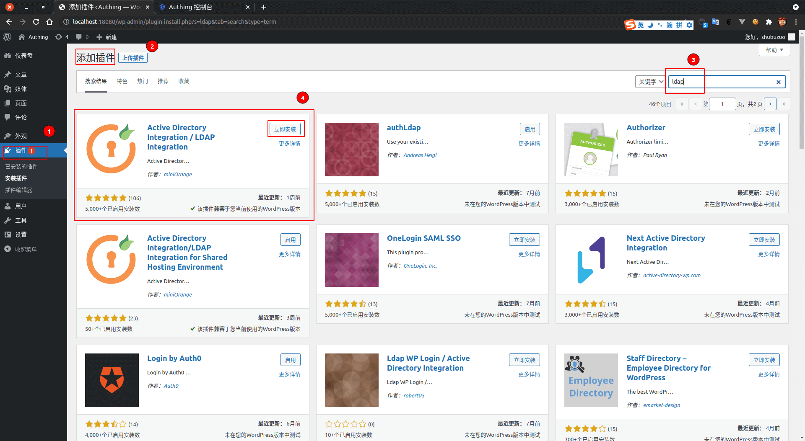
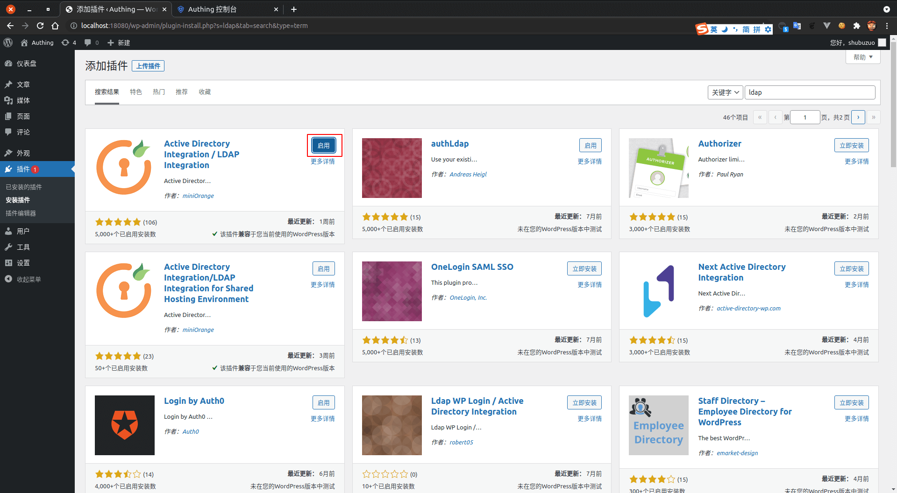
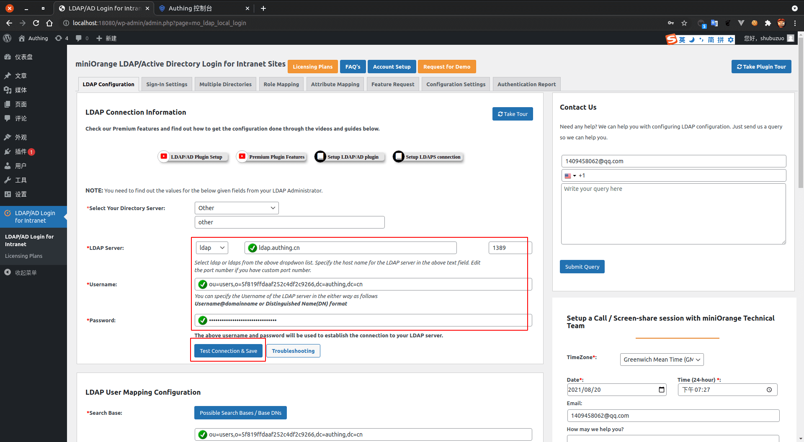
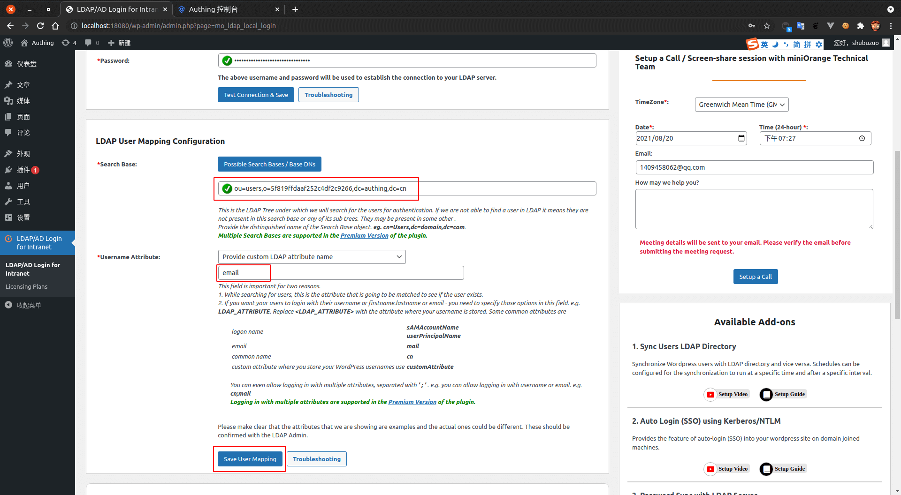
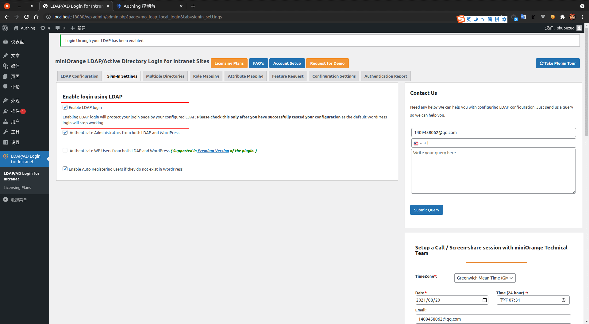

<IntegrationDetailCard :title="`In Wordpress Configure LDAP`">

Configure WordPress LDAP login, you need to have administrator privileges. Enter **Wordpress**, enter the administrator page. Click `Plug-in -> Add a plugin -> search`, Input **LDAP** Keywords, Choose **Figure plugin**, Click **install now**.

Click **Enable**.

Click on the left navigation bar **LDAP/AD Login for intranet**, Enter **LDAP Configuration**。`Directory Server` choose **other**. Fill in the corresponding related information, in `LDAP server`、`username（Corresponding to the console LDAP BindDN）` Information can be **{{$localeConfig.brandName}}** View on the console, the corresponding position is shown. `Password` is **{{$localeConfig.brandName}}** Console `set up -> Userpool key`. After clicking **Test Connection & Save**。

Fill in `Search Base` (Corresponding to BaseDN）, `Username Attribute`. Click **Save User Mapping**.

Fill in test **account password**, Click **Test Authentication**。

Enter **Sign-in Settings** allow LDAP Login.

Enter **Attribute Mapping** Fill in the relevant configuration item and save it. Here use `email` As the primary mapping field. After filling out **Save**。

</IntegrationDetailCard>
