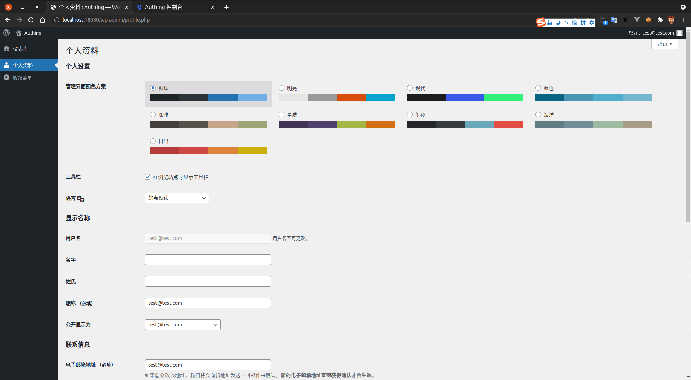

<IntegrationDetailCard :title="`Use ${$localeConfig.brandName} login Wordpress`">

Enter **Wordpress** Log in to page, enter the corresponding **Test the confidential information**, **Click** Log in.

Log in **Success**, you can see the relevant prompt information.

</IntegrationDetailCard>
