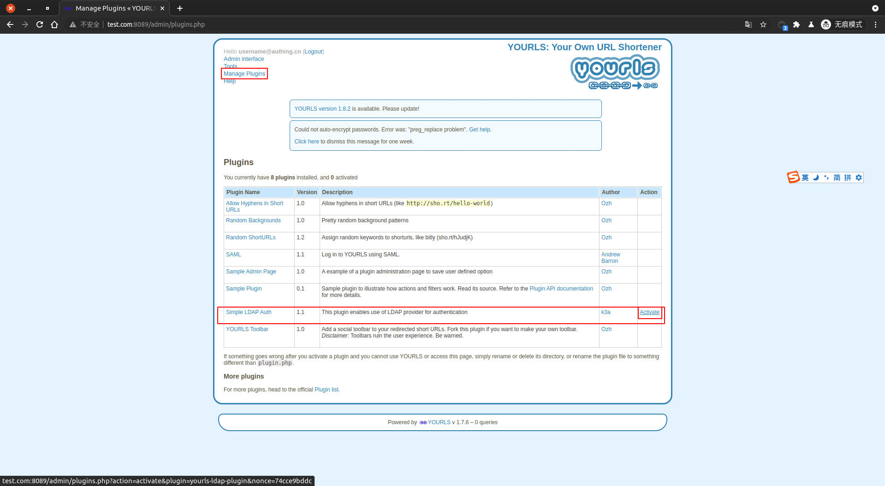

<IntegrationDetailCard :title="`In Yourls Configure LDAP`">

assumed **Yourls** Operating environment **docker**, Deployment **system** The operation is basically consistent. Here **docker** The environment is a demo.
enter **Yourls**. Need to install first [Yourls LDAP Plug-in](https://github.com/k3a/yourls-ldap-plugin), Note that the PHP LDAP plugin needs to be installed.

```bash
# Find your Yourls container
docker ps | grep yourls
# 6a83a3ffa9c7   yourls:1.7.6    "docker-entrypoint.s…"   40 minutes ago   Up 9 minutes   0.0.0.0:8089->80/tcp, :::8089->80/tcp     yourls_yourls_1

# Enter the container
docker exec -it 6a83a3ffa9c7 /bin/bash
vi user/config.php
```

**Add** the configuration is configured as follows. in `LDAPAUTH_HOST`、`LDAPAUTH_PORT`、`LDAPAUTH_SEARCH_USER`、`LDAPAUTH_BASE` Information can be **{{$localeConfig.brandName}}** View on the console, the corresponding position is shown. `LDAPAUTH_SEARCH_PASS` is **{{$localeConfig.brandName}}** Console `set up -> Userpool key`. have to be aware of is Yourls LDAP Port attributes do not take effect, even if other ports are configured, the 389 port will remain.

```php
/*
 ** Personal settings would go after here.
 */
define( 'LDAPAUTH_HOST', 'ldap://ldap.authing.cn' ); // LDAP Service address => Console -> User Management -> LDAP -> Use documentation Hostname
define( 'LDAPAUTH_PORT', '389' ); // This configuration item is indispensable, configuring other values will not take effect, will only request 389 port
define( 'LDAPAUTH_BASE', 'ou=users,o=611b62944c0d199eee1d98a2,dc=authing,dc=cn' ); // Inquire BaseDN => Console -> User Management -> LDAP -> Use documentation BaseDN
define( 'LDAPAUTH_USERNAME_FIELD', 'email'); // Set this attribute, the username of the user logs in should also be the attribute, and corresponding thereafter LDAPAUTH_SEARCH_FILTER
define( 'LDAPAUTH_SEARCH_USER', 'ou=users,o=611b62944c0d199eee1d98a2,dc=authing,dc=cn' ); // BindDN => Console -> User Management -> LDAP -> Use documentation BaseDN
define( 'LDAPAUTH_SEARCH_PASS', '25b34fe6cf1f66b0cf61e5464cf76f31'); // Synchronize user information account password => Console -> Setting -> userpool key
define( 'LDAPAUTH_SEARCH_FILTER', '(&(email=%s)(objectclass=posixAccount))' ); // Query template
```

Corresponding to {{$localeConfig.brandName}}.


Restart **Yourls**, Make it a configuration take effect.

Log in with an administrator account Yourls.


Enter the plugin page, then enable the LDAP authentication plugin.



</IntegrationDetailCard>
