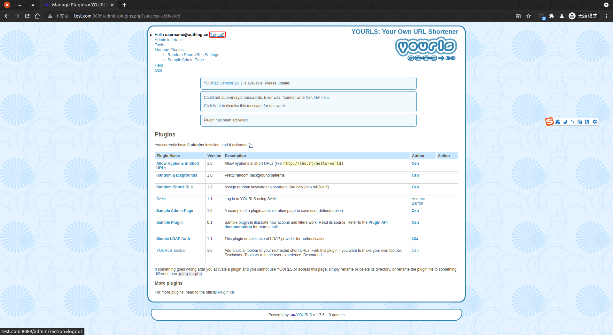
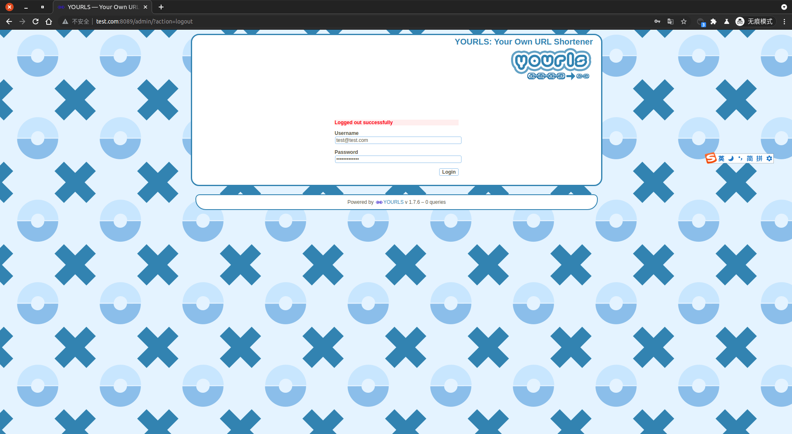

<IntegrationDetailCard :title="`Use  ${$localeConfig.brandName} 登录 Yourls`">

进入 **Yourls** 登录页面，登出当前用户。

跳转到 **Yourls** 登录页面，输入对应的 **测试账密信息**，**点击** 登录。

登录 **成功**，即可看到相关提示信息。

</IntegrationDetailCard>
