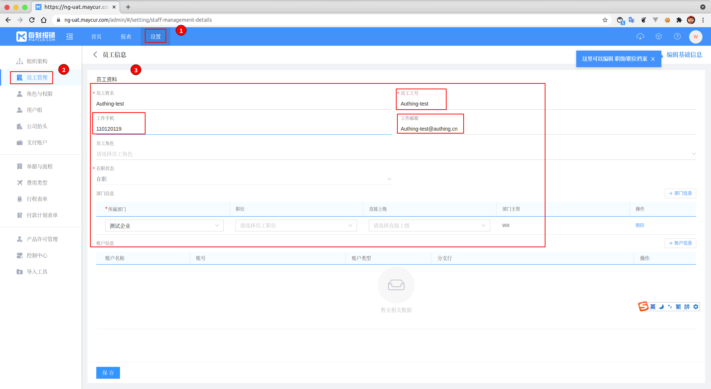

<IntegrationDetailCard :title="`Create a user in maycur`">

Enter **maycur** Management interface, click `set up` -> `Employee management` -> `Add user`, in **maycur** Create a user, here **User mailbox**, **Job number**, **phone number** Need to pay attention, this corresponds to your choice **Login properties**(Here is still **Mail**).

click **save**, successfully created a user.

</IntegrationDetailCard>
