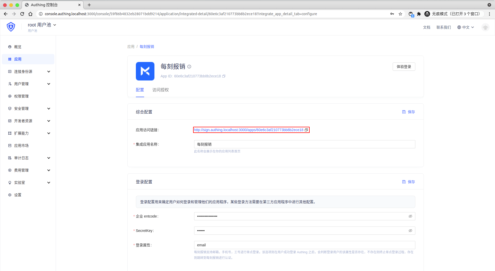
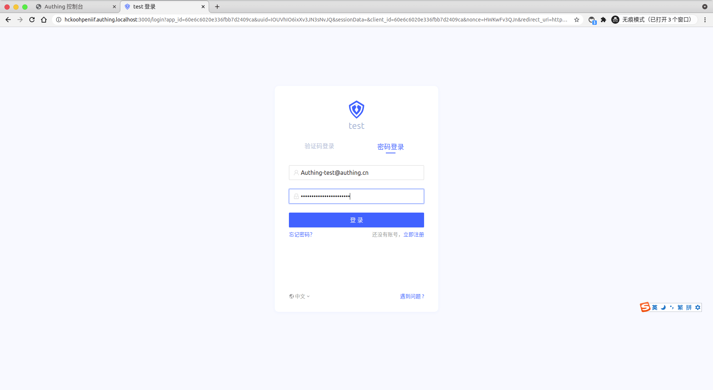

<IntegrationDetailCard title="Experience login">

Enter the created app, copy the application access link, open in the new browser stealth window.

Enter **{{$localeConfig.brandName}}** log in page.

You can successfully log in to **maycur**.

</IntegrationDetailCard>
