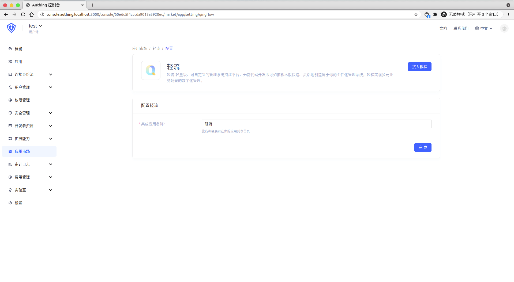
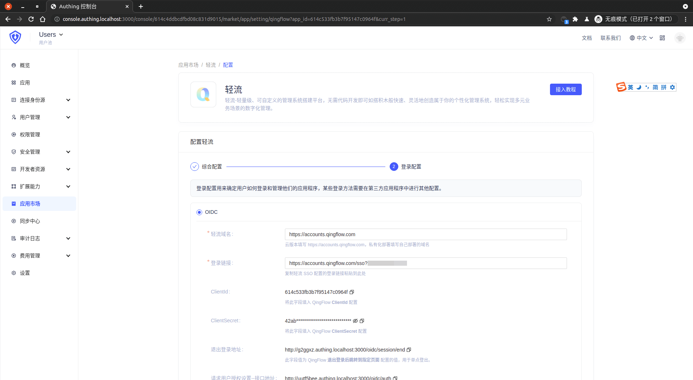
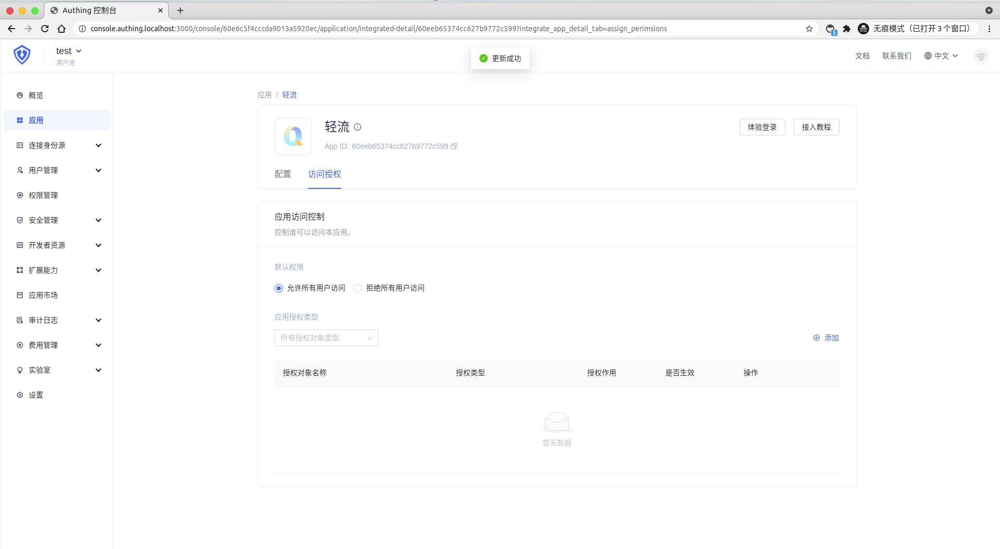

<IntegrationDetailCard :title="`Create an app in ${$localeConfig.brandName}`">

Enter[**console**](https://console.authing.cn) > **Application market**, turn up **Qingflow**, Click to enter the details, then click Get Apply.

Enter the app name and click Next.

Fill in **Qingflow SSO Configuration** `Qingflow Basin Name` (Privatization Deployment Need to Fill in Deployment Domain Name, Cloud Platform User Fill in the Light Basin Name) and `Login Links`, check the corresponding configuration content, these content will Use when configuring **Qingflow stream SSO**.

Click Finish, click "Allow all user access" on the Access Authorization Page.

</IntegrationDetailCard>
