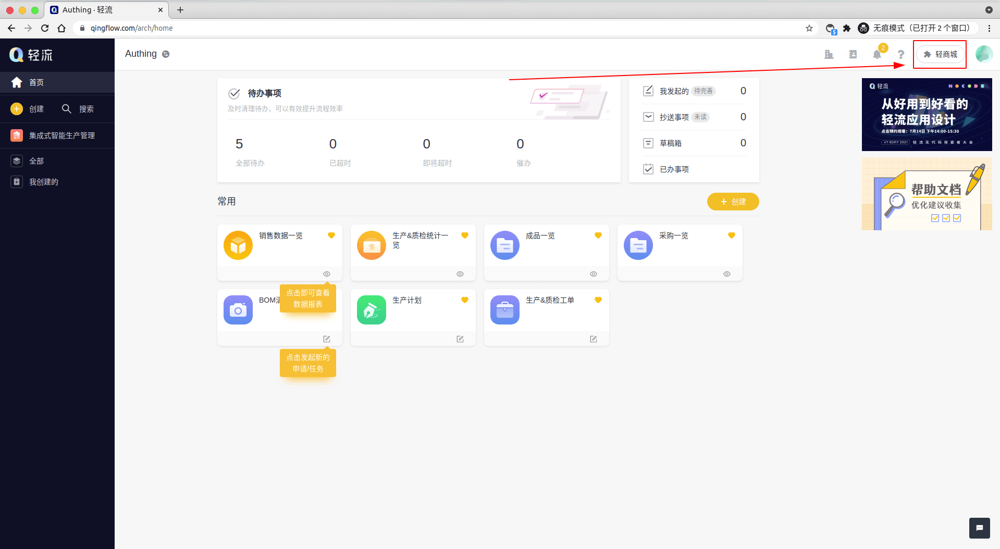
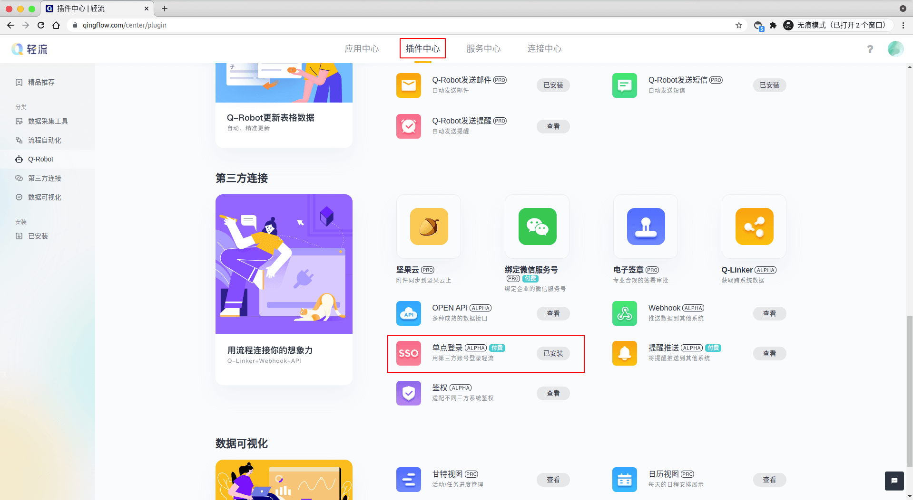
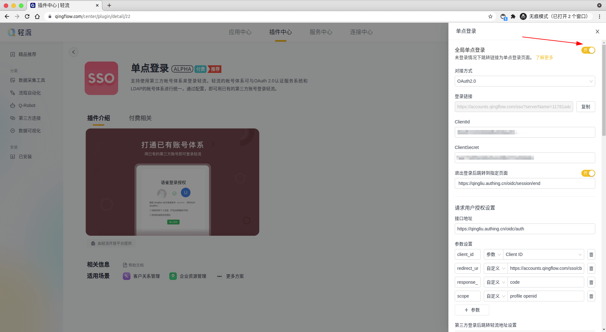
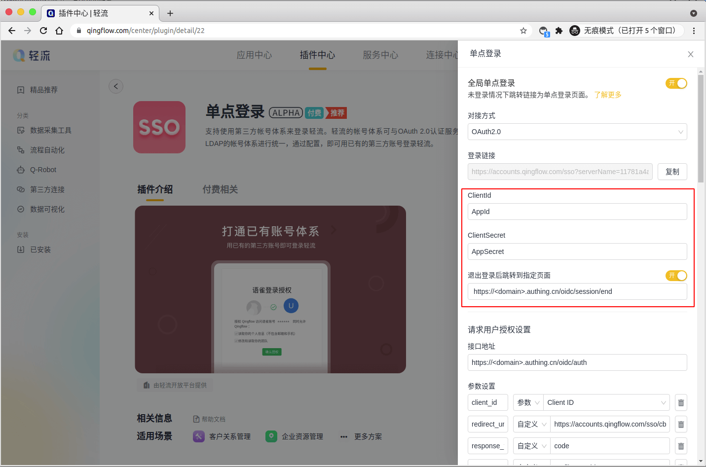
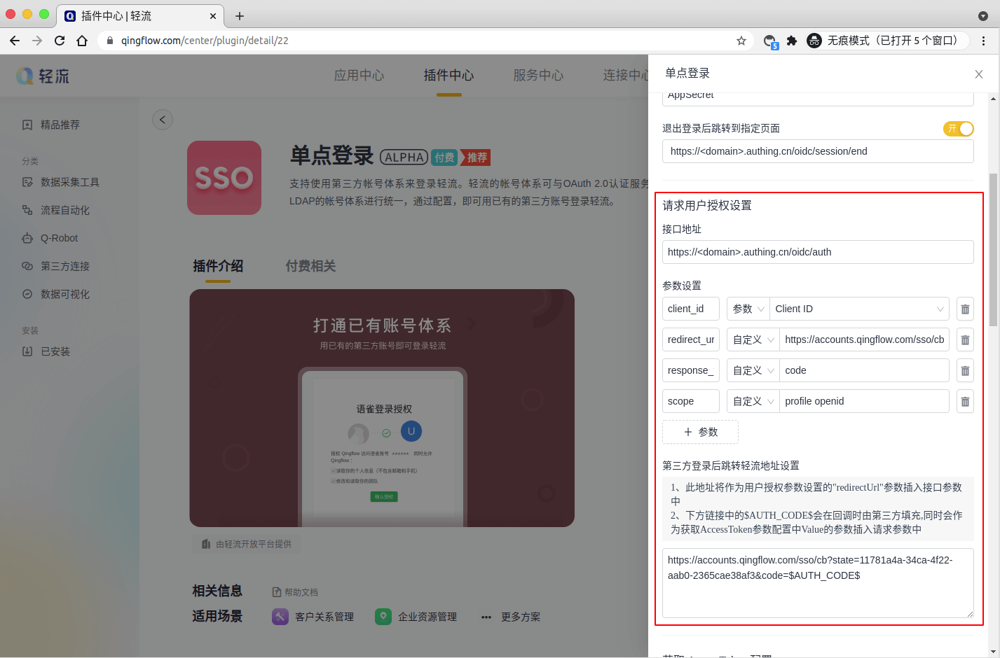
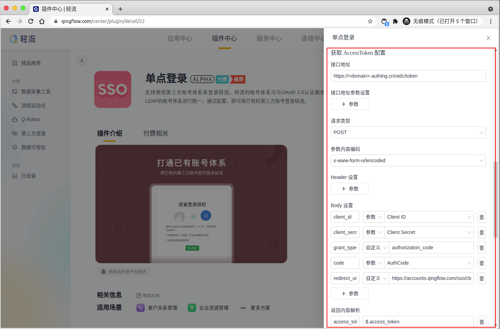
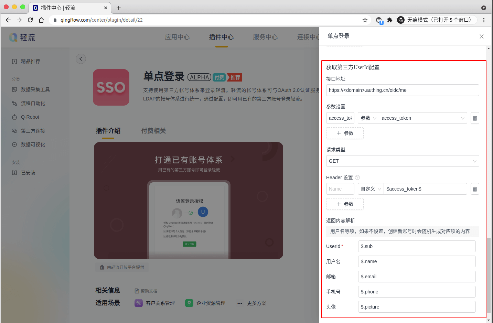
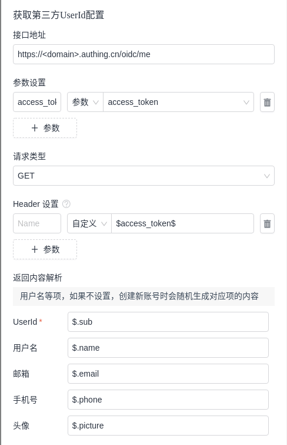

<IntegrationDetailCard title="Configure Qingflow stream SSO login">

Configure Qingflow SSO login, you need to have administrator privileges. Enter **Qingflow Mall**.

Find the **plugin center** -> **Single Sign-On**.

Click **Configure**, open **global single sign-on**.

The configuration interface fills in the corresponding information, where the ClientId corresponds to the AppID, and the ClientSecret corresponds to AppSecret. Exit Sign in and jump to the specified page Enter the `https://<domain>.authing.cn/oidc/session/end`, where **domain** is applied to the application domain name (Paste the content corresponding to the application configuration page).

Next fill in **Request user authorization settings**, The various items are filled in the following:

- **interface address**: `https://<domain>.authing.cn/oidc/auth`(Paste the contents of the {{$localeConfig.brandName}} application configuration page)
- **parameter settings**:
  - **client_id** : type `parameter`, value `Client ID`
  - **redirect_uri** : type `customize`, value `https://accounts.qingflow.com/sso/cb`
  - **response_type** : type `customize`, value `code`
  - **scope** : type `customize`, value `profile openid`
- **Third-party login to turn light-flow address settings** the default is **Qingflow** automatic generation, no need to change

Next fill in **Get AccessToken Configure**, The various items are filled in the following:

- **interface address**: `https://<domain>.authing.cn/oidc/token`(将 {{$localeConfig.brandName}} 应用配置页面对应的内容粘贴即可)
- **Interface address parameter setting**: Not fill in
- **Request type**: choose **POST**
- **Parameter content encoding**: choose **x-www-form-urlencoded**
- **Header set up**: Not fill in
- **Body set up**:
  - **client_id** : type `parameter`, value `Client ID`
  - **client_secret** : type `parameter`, value `Client Secret`
  - **grant_type** : type `customize`, value `authorization_code`
  - **code** : type `parameter`, value `AuthCode`
  - **redirect_uri** : type `customize`, value `https://accounts.qingflow.com/sso/cb`
- **Return content analysis**
  - **access_token** : value `$.access_token`

Next fill in **Get third-party UserId configuration**, The various items are filled in the following:

- **interface address**: `https://<domain>.authing.cn/oidc/me`(Paste the contents of the {{$localeConfig.brandName}} application configuration page)
- **parameter settings**:
  - **access_token** : type `parameter`, value `access_token`
- **Request type**: choose **GET**
- **Header set up**: `Name` can be empty, type `customize`, value `$access_token$`
- **Return content analysis**:
  - **UserId** : value `$.sub`
  - **username** : value `$.name`
  - **Mail** : value `$.email`
  - **phone number** : value `$.phone`
  - **Avatar** : value `$.picture`

Click **to save**, complete the configuration information saved.

</IntegrationDetailCard>
