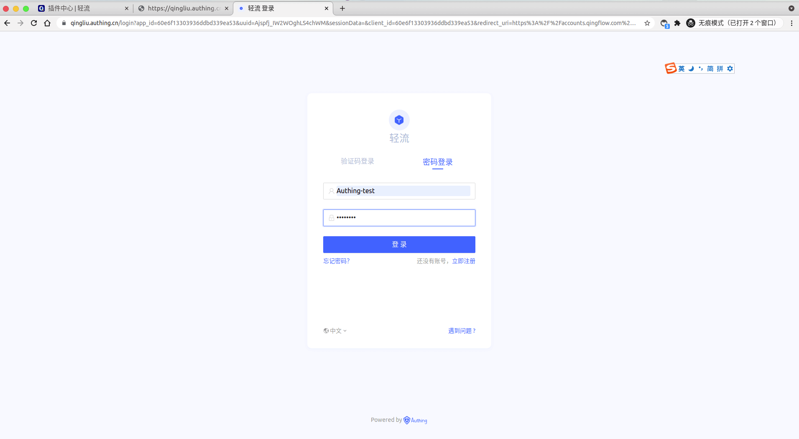
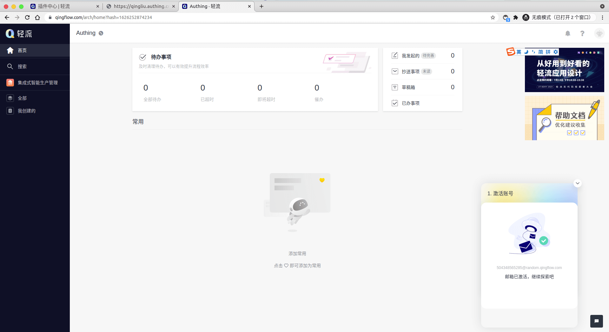
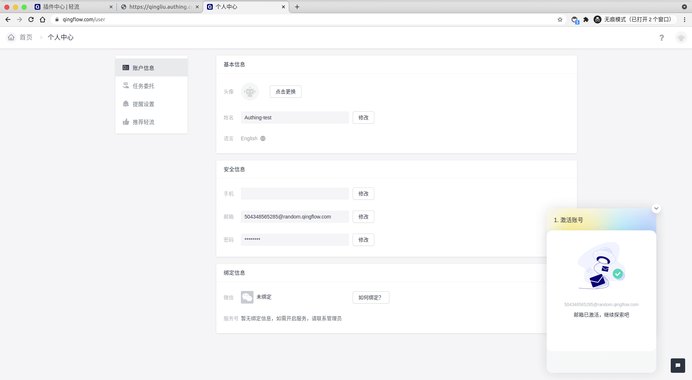

<IntegrationDetailCard title="Experience login">

Copy the Qingflow SSO link, open in the new browser stealth window.

Jump to the Authing login page, enter **account**, complete the login.

Then you will jump to the **Qingflow** home page.

Move to the upper right corner user avatar, click on the **Personal Center** to view the current user information.

</IntegrationDetailCard>
