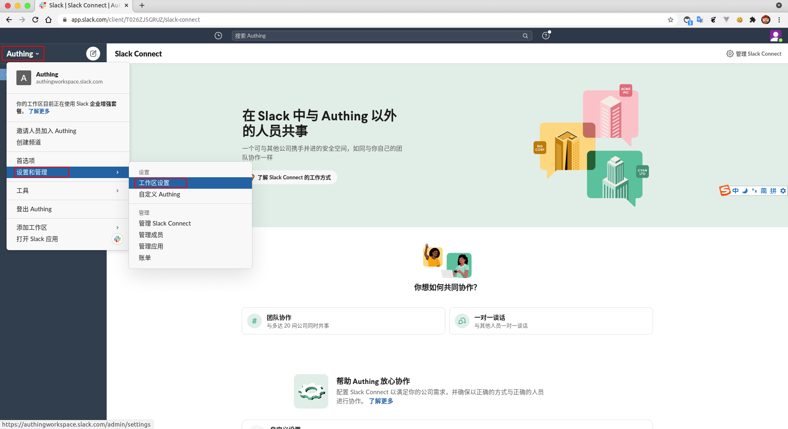
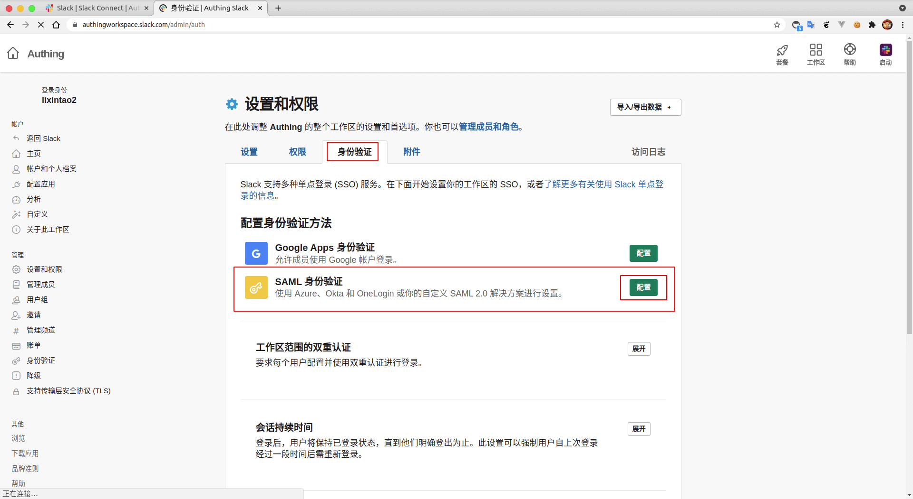
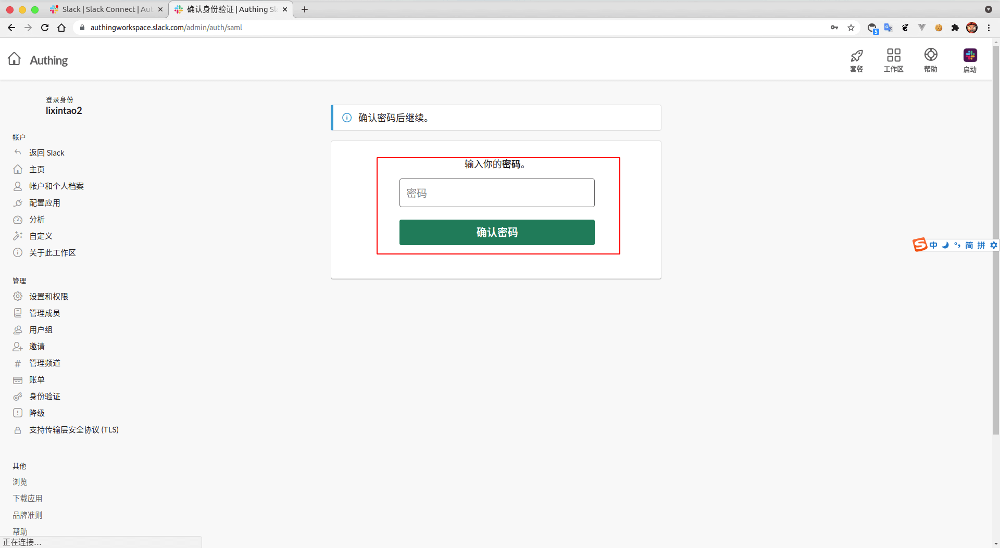
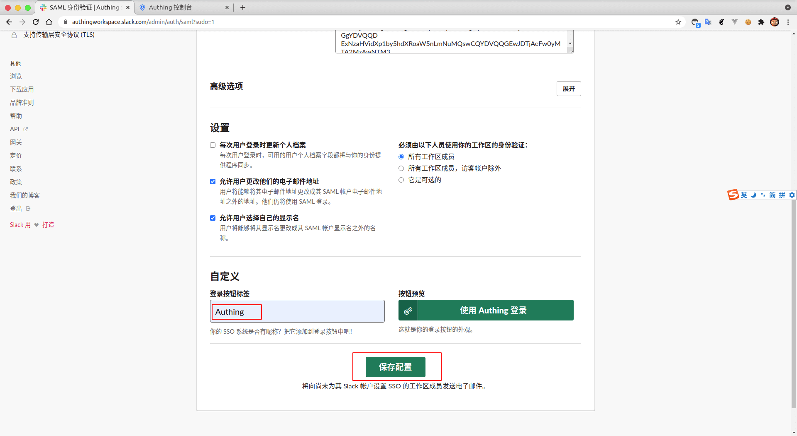
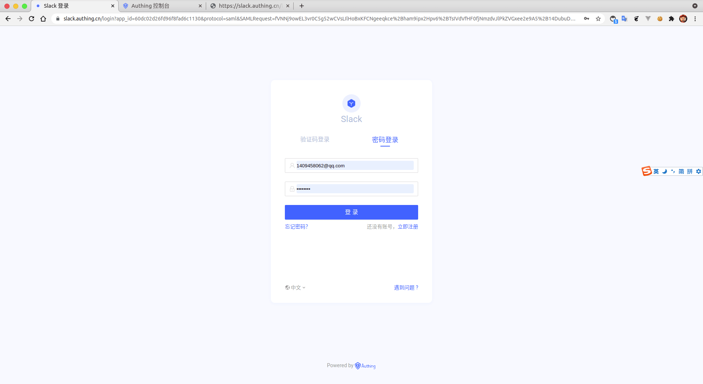
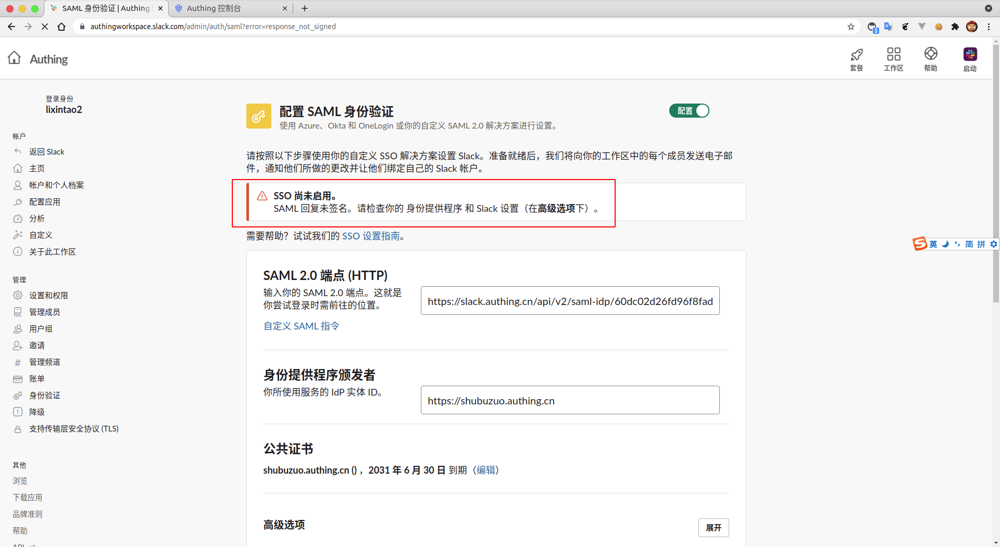

<IntegrationDetailCard title="Configure Slack SSO Log in">

Configure Slack SSO login, You need to have administrator privileges. Enter **Management console**, enter **Setting and management**, find **Workspace setting**.

Enter **authentication**, click **configuration**.

Enter **current user password**.

Fill in {{$localeConfig.brandName}} **SAML 2.0 Endpoint (HTTP)**, **identity provider issuer**; additional, downloaded **SAML visa book**, copy it Content to **Public Certificate**.

Fill in needed **Custom label**, Click **save Configure**.

Enter **login interface**, Complete the login.

redirect to `Slack`, Check the relevant tips.

According to the **prompt**, adjust the relevant options.

**Save Setup**, view relevant prompts, display configured success.

</IntegrationDetailCard>
