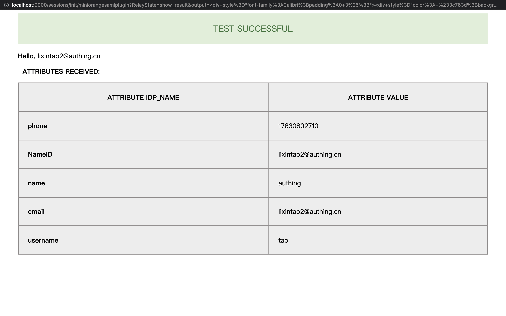

<IntegrationDetailCard title="Configure Sonarqube SSO Log in">

Configure Sonarqube SAML SSO login, You need administrator privileges(And need [install miniOrange SAML Support Plug-in](<https://www.miniorange.com/sonarqube-single-sign-on-(sso)#:~:text=SonarQube%20Single%20Sign%20On%20%28SSO%29%20Plugin%20SAML%20Single,securely%20authenticate%20the%20user%20to%20the%20SonarQube%20application.>)). Click on the navigation **Administration**, select **Configuration**, Click**miniOrange SAML Support**.

In **Configure** fill in your **IDP Name**, **IDP Entity ID**, **Login URL**. in **IDP Entity ID**, **Login URL** from {{$localeConfig.brandName}} corresponding application, **copy and paste** complete fill in.

In addition, copy the **SAML visa message** content to **X.509 Certificate**.

**Property map** can be filled in the `email`.

**Save** to fill in the item, at the same time **Click** `Enable Saml login`, enable **SAML Login**.

Enter **miniOrange SAML Configuration option page**.

select **Test Configuration**. click **Test Configuration**.

Enter {{$localeConfig.brandName}} Log in to page, enter the corresponding **account password**, Complete the login.

After the login is successful, the configuration is successful.

</IntegrationDetailCard>
