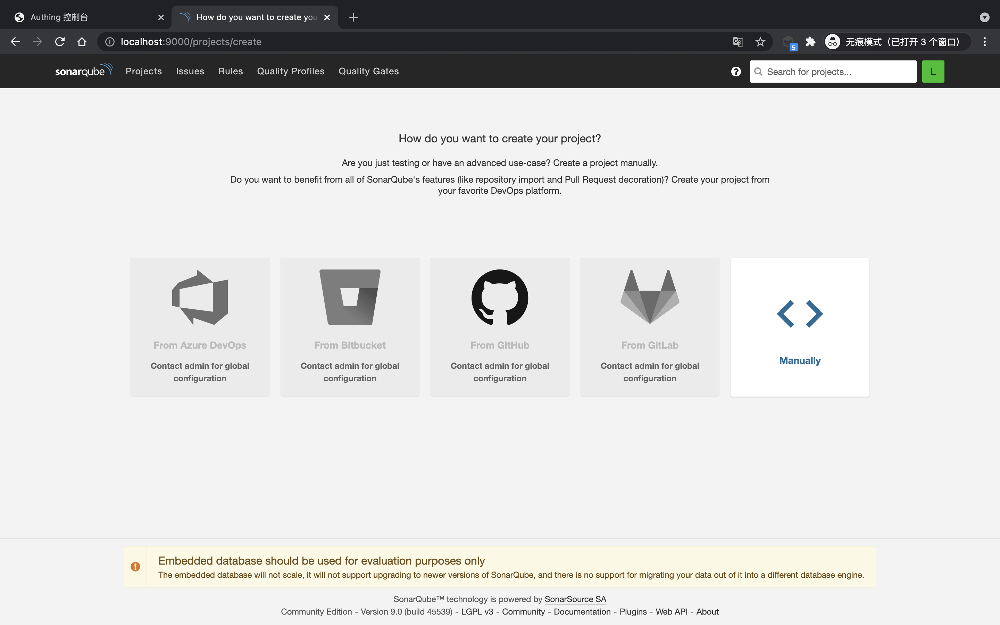

<IntegrationDetailCard title="Experience login">

Exit the current user, enter the login interface, select **Login with Authing** (name may depend on the SAML configured `IDP Name`).

Enter {{$localeConfig.brandName}} log in page.

You can successfully log in to **Sonarqube** on the login interface.

View **User information**.

</IntegrationDetailCard>
