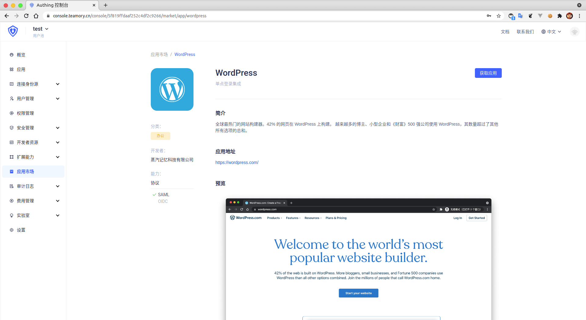
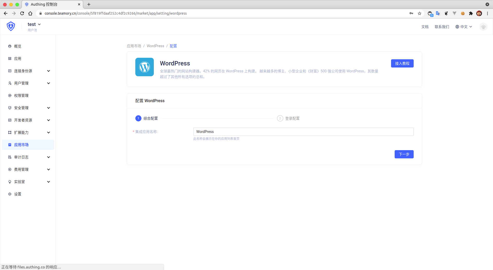
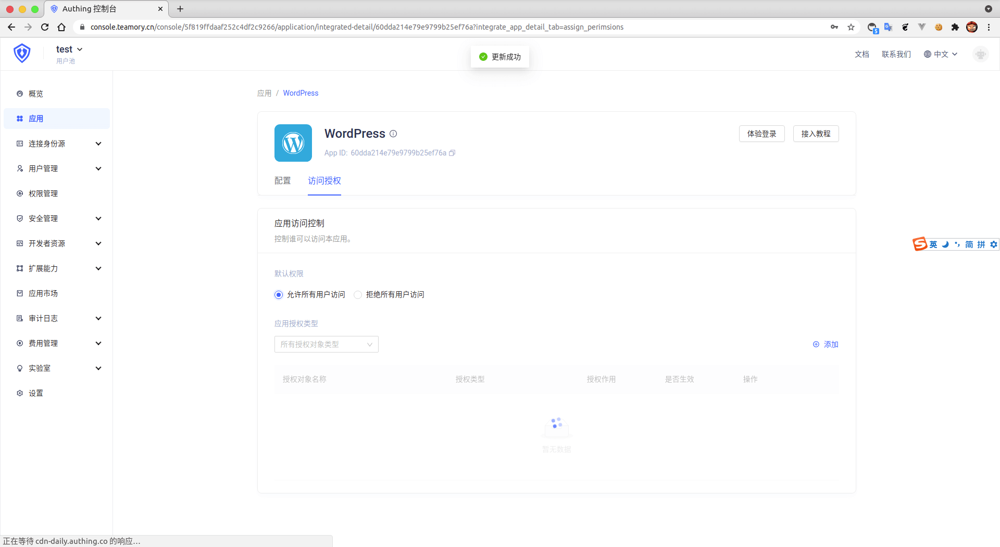

<IntegrationDetailCard :title="`Create an app in ${$localeConfig.brandName}`">

Enter [**Console**](https://console.authing.cn) > **Application market**, turn up **Wordpress** , Click to enter the details, then click Get Apply.

Enter the app name and click Next.

Enter your **Wordpress domain name** 。

Click Finish, click "Allow all user access" on the Access Authorization Page.

</IntegrationDetailCard>
